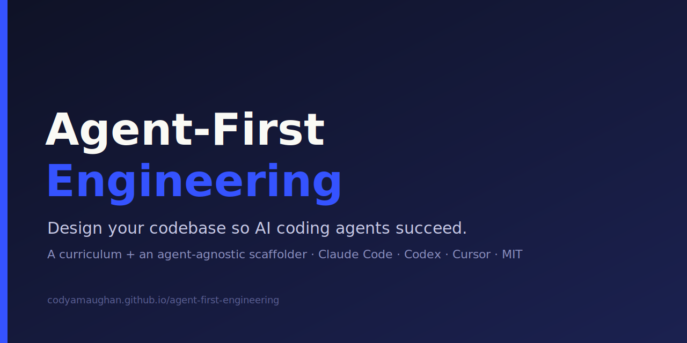

  

  
  
  
  

> Stop coding with AI agents "loosey-goosey." Design your codebase so agents *succeed* —
> the way a systems engineer would.

> 📖 **Read it online → [codyamaughan.github.io/agent-first-engineering](https://codyamaughan.github.io/agent-first-engineering/)**

This repository has **two deliverables that are two views of one body of knowledge**:

- **A — The Curriculum** *(`specs/001-curriculum/`)* — a phased, visual course that takes you
  from informal "vibe coding" to designing agent-first codebases. Modeled structurally on the
  well-organized [*AI Engineering from Scratch*] approach: one concept at a time, diagrams,
  ELI5, a real artifact at the end of every lesson.
- **B — The Scaffolder** *(`specs/002-scaffolder/`)* — an **agent-agnostic**, `SKILL.md`-first
  tool that *interviews* you about a project, then generates a proper agent-first setup:
  `AGENTS.md`, a `SKILL.md` library, and lifecycle-hook guardrails — wired to work across
  **Claude Code, Codex, and Cursor** (more agents via adapters). Think *create-react-app for
  agent-first repos*, but a conversation instead of a fixed form, and it runs *inside* your
  agent. Modes: `init` (new repo), `adopt` (clean up an existing one).

**Teach and generate in lockstep:** every layer the curriculum teaches, the scaffolder
generates; every artifact the scaffolder generates, the curriculum explains.

## Who this is for

- **Developers already using AI agents** who want to level up from "vibe coding" to designing repos
  where agents succeed by default.
- **Tech leads** deciding how their team should adopt AI coding tools.

It assumes you've used an AI coding agent before. It is **not** an intro-to-AI course.

## What you'll get

- A **6-phase course** (read it free at [the site](https://codyamaughan.github.io/agent-first-engineering/))
  — from prompting and context engineering through verification, memory, spec-driven development, and
  harness engineering.
- A **scaffolder** that interviews you and sets up a new (or existing) repo to be agent-ready —
  `AGENTS.md`, a skills library, and guardrail hooks — for Claude Code, Codex, and Cursor.

## Principles

The project is governed by its [Constitution](.specify/memory/constitution.md). In brief:

1. **Open Standards First** — `AGENTS.md` + `SKILL.md` are the source of truth; vendor formats
   are optional adapters.
2. **Agent-Agnostic by Construction** — author once, render per-agent. Claude Code is the
   *reference*, not the requirement.
3. **Teach and Generate in Lockstep** — A and B stay in sync, by rule.
4. **Guardrails Over Vibes** — correctness is enforced by hooks/tests/CI, not prose.
5. **Minimal Context, Progressive Disclosure** — short, command-first, machine-parseable.
6. **Adopt, Don't Reinvent** — build *alongside* mature, permissive tools (esp. GitHub
   Spec Kit), don't fork them.
7. **Specs Are the Source of Truth** — spec → plan → tasks → implement.

## What we build on (all permissive, all current)

| Layer | Adopted standard / tool | License |
|---|---|---|
| Context file | [`AGENTS.md`](https://agents.md/) | Open standard |
| Reusable skills | [Agent Skills / `SKILL.md`](https://agentskills.io/) | Apache-2.0 |
| Spec workflow | [GitHub Spec Kit](https://github.com/github/spec-kit) (complement, not fork) | MIT |
| Principles | [`12-factor-agents`](https://github.com/humanlayer/12-factor-agents) | Apache-2.0 |

See [`meta/prior-art.md`](meta/prior-art.md) for the full landscape and why this project's
niche is currently unfilled.

## The Curriculum

Six phases, from vibe coding to systems engineer for agents. Full index in
[`docs/curriculum/`](docs/curriculum/index.md). Quiz yourself with `/check-understanding <phase>` (the
[`check-understanding`](.claude/skills/check-understanding/SKILL.md) skill generates an interactive
quiz from each phase's lessons).

| # | Phase | # | Phase |
|---|---|---|---|
| 1 | [Fundamentals](docs/curriculum/01-fundamentals/index.md) | 4 | [Session & Memory](docs/curriculum/04-session-and-memory/index.md) |
| 2 | [Context Engineering](docs/curriculum/02-context-engineering/index.md) ★★★ | 5 | [Spec-Driven Development](docs/curriculum/05-spec-driven-development/index.md) |
| 3 | [Verification & TDD](docs/curriculum/03-verification-and-tdd/index.md) ★★★ | 6 | [Orchestration & Harness](docs/curriculum/06-orchestration-and-harness/index.md) |

## Project status

Early and active. The **foundations** tier is complete and published; the **Advanced Patterns** tier is
on the [Roadmap](docs/roadmap.md). Built (and dogfooded) using GitHub Spec Kit.

Repo internals (for contributors)

- [`docs/translation-matrix.md`](docs/translation-matrix.md) — Claude→Codex→Cursor feature research
- [`.specify/memory/constitution.md`](.specify/memory/constitution.md) — governing principles
- [`specs/`](specs/) — Spec Kit specs/plan/tasks for the curriculum (A) and scaffolder (B)
- [`meta/`](meta/) — executive summary, prior-art, curriculum outline, and the authoring rubric

## FAQ

<strong>Do I need Claude Code?</strong>

No. It's agent-agnostic — Claude Code is the reference implementation, not a requirement. Lessons show
the open-standard form plus Codex and Cursor equivalents.

<strong>Is it free?</strong>

Yes — MIT-licensed and open source.

<strong>Did you write all of this yourself?</strong>

No, and I'm upfront about it: it's a curation and synthesis of the best blogs, posts, and documentation
from the top AI labs, their contributors, and other thought leaders — cited throughout. It was drafted
primarily with AI (fitting, given the topic) and reviewed by me. What's mine is the direction, the
structure, and the review.

<strong>Curriculum vs. scaffolder — what's the difference?</strong>

The curriculum *teaches* the practice; the scaffolder *generates* it. Each lesson ends by showing what
the scaffolder produces.

<strong>How can I help?</strong>

See [Contributing](#contributing) — fixes, diagrams, better sources, and new topics from the
[Roadmap](docs/roadmap.md) are all welcome.

## Contributing

Contributions are welcome — fix a lesson, add a diagram, propose a topic from the
[Roadmap](docs/roadmap.md), or improve the scaffolder. Start with [CONTRIBUTING.md](CONTRIBUTING.md)
and our [Code of Conduct](CODE_OF_CONDUCT.md).

## License

[MIT](LICENSE) © 2026 CodyAMaughan. Redistributed dependencies are MIT / Apache-2.0 / BSD.

[*AI Engineering from Scratch*]: https://github.com/rohitg00/ai-engineering-from-scratch
