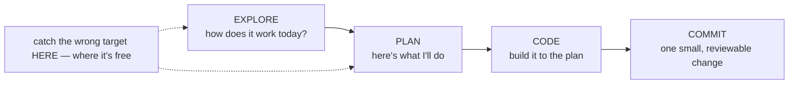

# Lesson 1.1 — The loop: explore → plan → code → commit

> _The agent is fast at the_ how _and blind to the_ what — _so pin the_ what _first._

_TL;DR: Run every non-trivial task through **explore → plan → code → commit**, in that order. Skipping **explore** is how an agent confidently builds the wrong thing._

## ELI5: the contractor who never walked the site
_A fast contractor who never saw your house builds a real deck — bolted to the wrong wall._

You hire a fast contractor who has **never seen your house**. Say "build me a deck" and you get *a* deck: square, solid, blocking the door you use daily. They weren't bad at building. They never **walked the site**.

The agent is that contractor: it writes code faster than you can read it, but starts every task blind. The loop forces it to walk the site, agree on a blueprint, build, and hand you one reviewable unit — *in that order* [^1].

## The four steps
_Each step is the cheapest place to catch a specific kind of mistake._



| Step | What the agent does | What it costs to be wrong here |
|---|---|---|
| **Explore** | Reads real files, traces call sites, reports back. *No edits.* | One more question |
| **Plan** | Proposes *what* it will change as a short, editable artifact | One sentence of correction |
| **Code** | Implements against the agreed plan; stops improvising | A re-read + re-write |
| **Commit** | One small, logical, reviewable change | A revert + a confusing history |

The cost of a wrong target grows at every arrow. The loop pushes the catch left, to where it's cheapest.

> 🧠 **Test Yourself:** Why is *explore* placed before *plan*, not merged into it?
> <details><summary>Answer</summary>Planning without first reading the real code just plans against the agent's *guess* of your codebase. Explore corrects that guess before it becomes a plan you approve.</details>

## Why skipping *explore* is the expensive mistake
_Skip it and the agent invents the unseen parts — plausibly, so the bug hides until review._

Letting the agent jump straight to coding produces code that solves the wrong problem [^1]. It invents the parts of reality it can't see, and invents them *plausibly* — which is worse, because the bug survives a quick eyeball.

```
   With explore:                    Without explore:
   reads auth.ts, sees you          assumes a generic auth setup,
   already have requireRole()       writes new middleware,
   → reuses it                      duplicates logic, drifts from
                                    your conventions
```

The failure isn't "it doesn't compile." It usually *does*. The failure is **it solved the wrong problem** — fixed a symptom you didn't ask about, ignored an existing helper, broke an unstated invariant. Exploration corrects the agent's mental model *before* it's load-bearing.

## Worked example
_Same task, two runs. The only difference is letting it look first._

**Task:** "Add rate limiting to the login endpoint."

| | ❌ Skip the loop | ✅ Run the loop |
|---|---|---|
| **Prompt** | "Add rate limiting to login." | "**Explore first:** how does login work, and is any shared store (Redis) already wired up? Report before changing anything." |
| **What happens** | Adds an in-memory counter. Looks fine. | Finds the Redis client + existing `loginHandler`. |
| **At review** | You run **3 instances** behind a load balancer — in-memory is useless, and Redis was already there. | **Plan:** Redis-backed sliding-window limiter on `POST /login`, 5/min/IP, reuse `redisClient`. You approve → code → commit. |
| **Cost** | 2 hours, wrong target | One tight, correct change |

## Your turn (exercise)
Take your next real task and write a prompt that does *only* step 1:

> "Before writing any code, read [the relevant files] and tell me how X works today, plus anything that would constrain how I add Y."

Read the report. Note **one thing it found that you'd never have put in your original prompt.** That found-fact is the wrong-target bug you just avoided.

---
← [Phase 1 home](index.md) · next → [Lesson 1.2 — Prompt specificity](02-prompt-specificity.md)

[^1]: [Best practices for Claude Code](https://code.claude.com/docs/en/best-practices) — Anthropic
