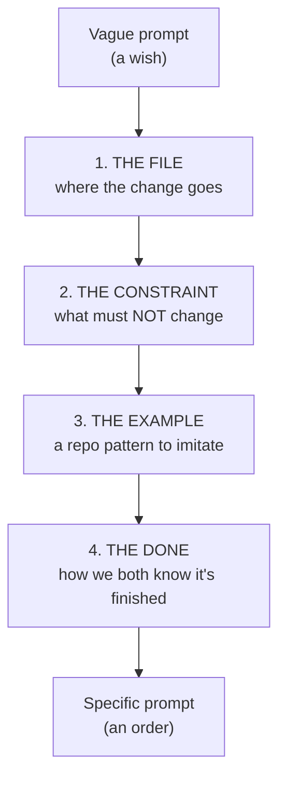

# Lesson 1.2 — Prompt specificity

> _A vague prompt is a wish. A specific prompt is an order._

_TL;DR: Name four things — **file, constraint, example, done** — and the agent stops guessing. The more precise the instruction, the fewer corrections you need [^1]._

## ELI5: wish vs. order
_"Make the kitchen nicer" gets you their idea of nice. Name the wall, the color, and "done" — and you get yours._

"Make the kitchen nicer" → *their* idea of nice and a surprise bill. "Paint the north wall #F5F5DC, keep the cabinets, done when the trim is clean and there's no overspray" → the kitchen *you* wanted, and you both know the moment it's finished.

Agents fill ambiguity with a confident guess. **Specificity removes the guess.**

## The four things to pin down
_Every strong prompt names these four — explicitly, not by implication._



| Element | Vague | Specific | Why it's load-bearing |
|---|---|---|---|
| **File** | "fix the bug" | "the off-by-one in `src/pagination.ts`" | Sends the agent straight there; stops it reading half your repo [^1] |
| **Constraint** | (unsaid) | "don't touch the public API / no new deps" | Unstated = fair game to change |
| **Example** | "validate input" | "like we do in `getUser`" | Anchors style + naming to *your* repo, not generic defaults [^1] |
| **Done** | "make it work" | "`npm test -- pagination` passes" | A checkable finish line, not "ran out of ideas" |

The **example** is the highest-leverage word in most prompts — "follow the pattern in `HotDogWidget.php`" beats three paragraphs describing the pattern [^1]. Pointing the agent at an existing pattern in your repo is one of the most reliable ways to anchor its output [^2].

> 🧠 **Test Yourself:** A teammate says "specificity is just typing more — longer prompts are better." Where's the flaw?
> <details><summary>Answer</summary>It's not length, it's *naming the four load-bearing elements*. A long, rambling prompt that never names the file or the done-condition is still vague.</details>

## Why vague prompts cost more than they look
_A vague prompt fails quietly and expensively — round after round of "no, not like that."_

```
   Vague:    prompt → guess → "no" → guess → "no" → guess → ok   (4 rounds)
   Specific: prompt(file+constraint+example+done) → ok           (1 round)
```

Each "no, not like that" is slower than naming the constraint once, up front — and each round fills the context window with dead ends (Phase 2).

> Vague prompts have one good use: *exploration*. "What would you improve in this file?" surfaces things you wouldn't have thought to ask [^1]. Use vague when you want options; use specific when you want a result.

## Worked example
_Same task, nothing left to guess._

❌ **Vague:** "Add validation to the signup form."
> Agent invents a validation library, picks its own error format, validates fields you don't care about, misses the one you do.

✅ **Specific (all four pinned):**
> "In `src/routes/signup.ts` (**file**), add input validation using the same `zod` pattern as `src/routes/login.ts` (**example**). Validate `email` and `password` only; **no new dependencies**, **don't change the response shape** (**constraint**). Done when `npm test -- signup` passes and an invalid email returns `400` with our standard error body (**done**)."

## Your turn (exercise)
Rewrite a prompt you'd normally type to name all four. Then run the **subtraction test**: remove one element and ask, *"could the agent now reasonably do the wrong thing?"* If yes, it was load-bearing — put it back. Repeat until every element earns its place.

---
← [Lesson 1.1](01-the-loop.md) · next → [Lesson 1.3 — Feeding context](03-feeding-context.md)

[^1]: [Best practices for Claude Code](https://code.claude.com/docs/en/best-practices) — Anthropic
[^2]: [Best practices for coding with agents](https://cursor.com/blog/agent-best-practices) — Cursor
