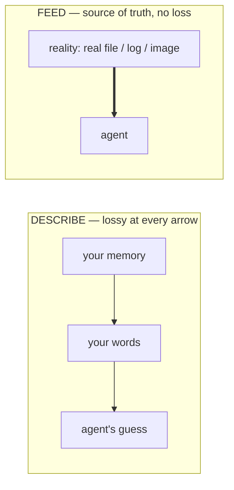

# Lesson 1.3 — Feeding context, not describing it

> _Don't describe the photo. Hand over the photo._

_TL;DR: When the agent needs to know something, **feed the source verbatim** — `@file`, a screenshot, piped output, a doc URL — instead of paraphrasing it from memory [^1]._

## ELI5: describe vs. feed
_Describe your house and they draw their guess. Hand them a photo and they draw your house._

| | What you give | What they draw |
|---|---|---|
| **Describe** | "two stories, beige-ish, weird window on the left" | their *guess* of your house |
| **Feed** | a photo | *your* house |

Typing *"the error looks like a null pointer in the user service"* is describing — your fuzzy memory, for the agent to guess from. Pasting the **actual stack trace** or `@`-mentioning the **actual file** is feeding the photo. Always feed the photo.



## The four ways to feed real context
_Reference files, paste images, pipe data, give URLs — the source of truth, verbatim [^1]._

| Channel | Use it for | Looks like |
|---|---|---|
| `@file` / `@folder` | the actual code, not your paraphrase | `@src/auth.ts` |
| Screenshot / image | UI bugs, layout, anything visual | paste/drag the broken screen |
| Piped data | logs, test failures, command output | `npm test 2>&1 \| <agent>` |
| URL / docs | the exact API/library version you use | paste the doc link |

The rule across all four: **the source of truth beats your summary of it.** Your summary is lossy and *confidently* lossy — you omit the one detail that mattered because you didn't know it mattered.

> 🧠 **Test Yourself:** Your careful prose description of a bug is grammatically perfect. Why is `@`-ing the file still better?
> <details><summary>Answer</summary>Perfect prose can still be *factually* stale — you describe the function as you remember writing it; `@file` shows what's actually there after three other people touched it.</details>

## Why feeding beats describing
_Three failure modes of prose, each fixed by the verbatim source._

| Failure of describing | Why feeding fixes it |
|---|---|
| **Transcription loss** — "a 400-ish error on submit" drops the failing field name | the raw log keeps every field |
| **Stale memory** — you describe the code as you *remember* it | `@file` shows what's *actually* there now |
| **Wrong version** — "use the Stripe SDK" (which one?) | the pinned doc page stops code for a dead API |

## Worked example
_A button is misaligned on mobile._

❌ **Describe:** "The submit button looks off on small screens, kind of pushed right."
> Agent guesses at margins it can't see and fixes a layout it's imagining.

✅ **Feed:**
> "Screenshot of the broken layout at 375px [attach] and the component `@src/components/SubmitBar.tsx`. The button overflows the container on mobile — fix it without changing desktop."

For a failing test, skip retyping entirely — pipe the genuine output [^1]:
```
   npm test -- checkout 2>&1 | <your-agent>
   "this is the real failure — diagnose and fix the root cause."
```

## Per-agent mechanics (universal move, different syntax)
_The "feed it" move is agent-agnostic; only the keys differ._

| | Claude Code | Codex | Cursor |
|---|---|---|---|
| Reference a file | `@path` | `@path` | `@file` / `@folder` |
| Images | paste / drag | paste / attach | paste into chat |
| Pipe in data | `cmd \| claude -p` | `cmd \| codex` | terminal capture |

> If the agent can't see something you're *describing*, that's the signal to **feed** it — a file, image, or piped log — not to describe harder. (Cursor: tag the file if you know it; otherwise let the agent find it [^2].)

## Your turn (exercise)
Find a recent prompt where you *described* something — an error, a UI glitch, an API. Redo it by **feeding the source**. Note how much of your original description turned out slightly wrong. That gap is the bug you'd have sent the agent chasing.

---
← [Lesson 1.2](02-prompt-specificity.md) · next → [Lesson 1.4 — Plan mode first](04-plan-mode.md)

[^1]: [Best practices for Claude Code](https://code.claude.com/docs/en/best-practices) — Anthropic
[^2]: [Best practices for coding with agents](https://cursor.com/blog/agent-best-practices) — Cursor
