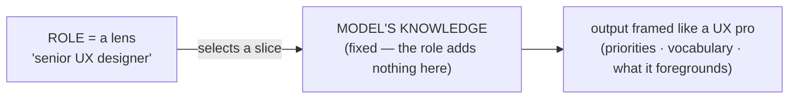
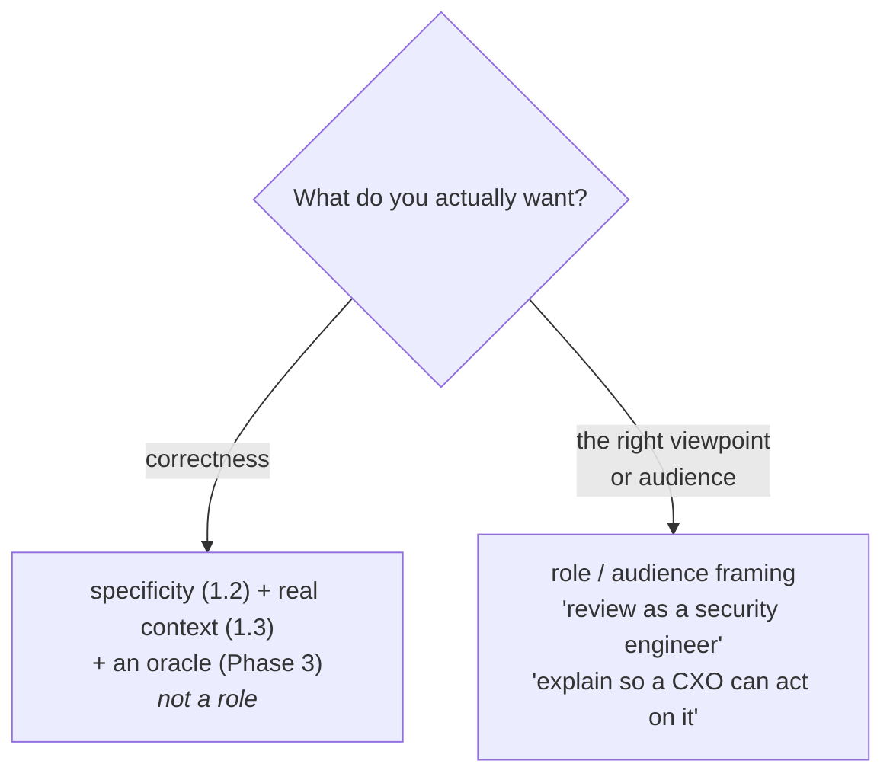
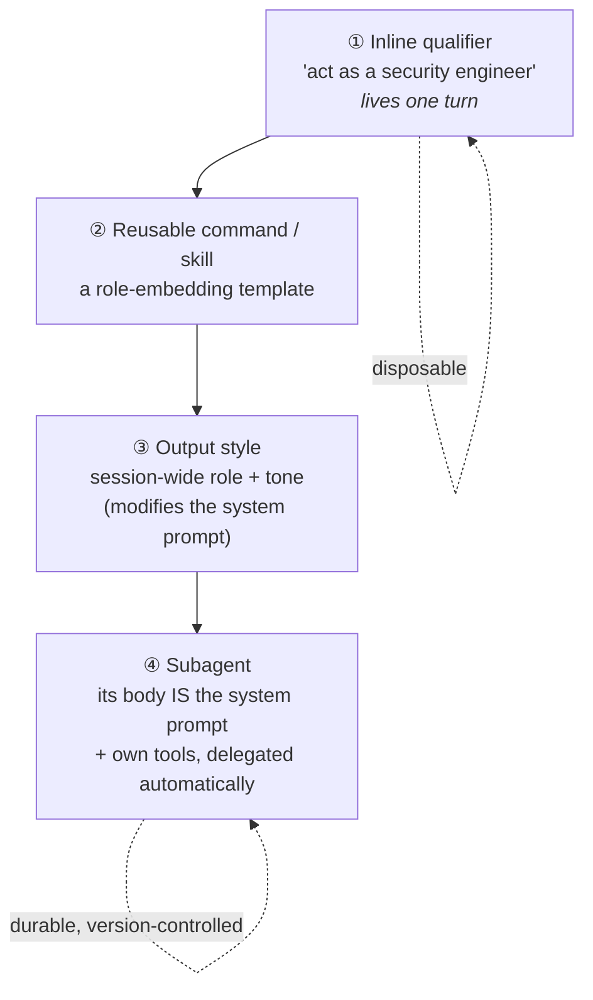

# Lesson 1.4 — Personas & perspective

> _A role isn't a costume that adds skill — it's a lens that picks a viewpoint._

_TL;DR: "Act as a Principal Engineer" doesn't add knowledge the model lacks — it shifts **perspective, priorities, and tone** [^1][^2]. Use it to aim output at the right viewpoint and audience, **not** as an accuracy boost — and when a perspective is worth reusing, encode it as a subagent or style, not a one-off line [^6][^7]._

## ELI5: the lens, not the brain
_A role is a colored lens over a camera, not a better sensor._

Snapping a "senior UX designer" lens onto the camera doesn't upgrade the sensor — the model knows what it knows. The lens changes what comes into **focus**: accessibility, user flows, the edge cases a UX pro foregrounds. Same brain, different framing [^1].

## What a persona does — and doesn't
_Roles condition perspective and tone, not capability — and the evidence splits cleanly by task type._

| You're hoping for… | Does a persona deliver? | What the evidence says |
|---|---|---|
| **Factual accuracy / knowledge** | **No** — roughly noise, sometimes mildly harmful | 162 roles × 4 model families × 2,410 questions: personas don't beat the no-persona control, and the best one isn't predictable [^1] |
| **Better reasoning** | **Fragile** — wins are smuggled-in chain-of-thought, and it backfires | Role-play gains act as an *"implicit chain-of-thought trigger"* [^3]; personas *degrade* reasoning on **7 of 12 datasets** in one study [^4] |
| **Perspective · priorities · tone · audience · format** | **Yes — the legitimate use** | Both labs frame roles as *focus + tone*, not accuracy: "Even a single sentence makes a difference" [^2][^8] |

> 🧠 **Test Yourself:** You prefix "Act as a 10x engineer" to get a failing test fixed. What does that actually buy you?
> 

Answer
Not more correctness — that's exactly where personas are ~noise [^1]. It nudges tone/priorities. If you want a *better fix*, feed the failing test and ask for step-by-step reasoning — that's the lever the costume was only accidentally pulling [^3].

## The honest rule
_Aim, don't inflate: a role chooses a **viewpoint and audience**; correctness comes from specificity (1.2), context (1.3), and verification (Phase 3)._

- **Use it for:** audience framing ("explain so a CXO can act on it"), perspective coverage ("review this as a security engineer would"), and register/depth.
- **Don't expect:** knowledge it lacks or reliable reasoning gains. When a role *seems* to help reasoning, it's usually triggering chain-of-thought — ask for that directly instead [^3].
- **"Be 99% confident / CXO-ready"** mostly tunes **calibration, hedging, and verbosity** plus audience — useful framing, not a correctness lever.
- **Stakes/emotional phrasing** ("this is important to my career") is a real, *published* technique with measured gains — but fragile and model-dependent. A/B test it; don't treat it as doctrine [^5].

## Lightweight → durable: from qualifier to specialist
_A one-off "act as X" is the disposable bottom rung; the professional move is to encode the persona where the tool **keeps** it [^6][^7]._

This is where persona prompting stops being a folk trick and becomes engineering — and it rides the same lightweight→durable spine the rest of this curriculum uses (prose → hooks in Phase 4, one-off → subagent in Phase 6).

| Rung | Mechanism | Persists? | Reach for it when… |
|---|---|---|---|
| ① | Inline qualifier | one turn | exploring; you'll course-correct anyway |
| ② | Command / skill template | reusable | a role-embedding prompt you re-run |
| ③ | **Output style** | whole session | you want a different role/tone *every* response [^6] |
| ④ | **Subagent** | reusable, isolated | a specialist (e.g. `security-reviewer`) Claude delegates to automatically [^7] |

> ⚠️ **Anti-pattern:** don't dump "You are a Principal Engineer who values…" into `CLAUDE.md`/`AGENTS.md`. That fires on *every* session whether relevant or not and dilutes your real instructions. A *sometimes*-true persona belongs in a skill or subagent — see Phase 4 (memory) and Phase 6 (small, focused agents).

The durable rungs exist in every major tool — the persona is just authored once and reused:

=== "Claude Code"
    **Output styles** (`.claude/output-styles/*.md`) set a session-wide role/tone [^6]. **Subagents** (`.claude/agents/*.md`) give a persona its *own* system prompt, tools, and model; Claude delegates by the `description` field [^7].

=== "Codex"
    The persona lives in **`AGENTS.md`** (the open standard) or, in the Agents SDK, an agent's `instructions` — "used as the system prompt when an agent is invoked" [^8].

=== "Cursor"
    **Project rules** (`.cursor/rules/*.mdc`) and **custom modes** bundle a role + tool selection that's prepended to context — the same author-once pattern.

> 🧠 **Test Yourself:** You keep typing "review this as a security engineer" at the start of every session. What's the durable fix — and what's the wrong one?
> 

Answer
Promote it up the ladder: a reusable **subagent** (its body becomes the system prompt) or an **output style** [^6][^7]. The *wrong* fix is pasting it into `CLAUDE.md`/`AGENTS.md` — it then fires on every session whether you're touching security or not, bloating context.

## Worked example
_Same intent, two moves: aim the lens, then make it durable._

❌ **Costume, no aim:** "You are a 10x rockstar engineer. Fix the bug." — expects magic, names no viewpoint, no audience, no done.

✅ **Aim the viewpoint + audience:**
> "Review `@auth.ts` **as a security engineer would** — threat-model the session handling and explain the residual risk **so a CTO can sign off**."

✅ **Then make it durable** — if that lens is one you reach for on every PR, encode it once:
> Save it as a `security-reviewer` **subagent** (body: *"You are a senior security engineer. Review changes for authn/z, injection, and secrets…"*) so every diff gets the same lens automatically — no retyping, version-controlled, shared with the team [^7].

## Your turn (exercise)
Take a prompt where you'd reflexively write "act as a senior X." **(1) Split it:** are you actually after *correctness* or a *viewpoint/audience*? Route correctness to specificity + context (1.2 / 1.3); keep the role only for the viewpoint. **(2) Promote it:** if it's a lens you reach for repeatedly, encode it as a subagent or output style and delete the one-off line. Notice which qualifiers were doing real work — and which were just costume.

---
← [Lesson 1.3](03-feeding-context.md) · [Phase 1 home](index.md) · next → [Lesson 1.5](05-plan-mode.md)

[^1]: [When "A Helpful Assistant" Is Not Really Helpful: Personas in System Prompts Do Not Improve Performances of LLMs](https://aclanthology.org/2024.findings-emnlp.888/) — Findings of EMNLP 2024
[^2]: [Prompting best practices ("Give Claude a role")](https://platform.claude.com/docs/en/build-with-claude/prompt-engineering/system-prompts) — Anthropic
[^3]: [Better Zero-Shot Reasoning with Role-Play Prompting](https://aclanthology.org/2024.naacl-long.228/) — NAACL 2024
[^4]: [Persona is a Double-edged Sword: Mitigating the Negative Impact of Role-playing Prompts in Zero-shot Reasoning](https://arxiv.org/abs/2408.08631) — arXiv 2024
[^5]: [Large Language Models Understand and Can be Enhanced by Emotional Stimuli (EmotionPrompt)](https://arxiv.org/abs/2307.11760) — arXiv 2023
[^6]: [Output styles](https://code.claude.com/docs/en/output-styles) — Anthropic (Claude Code docs)
[^7]: [Subagents](https://code.claude.com/docs/en/sub-agents) — Anthropic (Claude Code docs)
[^8]: [Prompt engineering ("adopt a persona" / Identity)](https://developers.openai.com/api/docs/guides/prompt-engineering) — OpenAI
