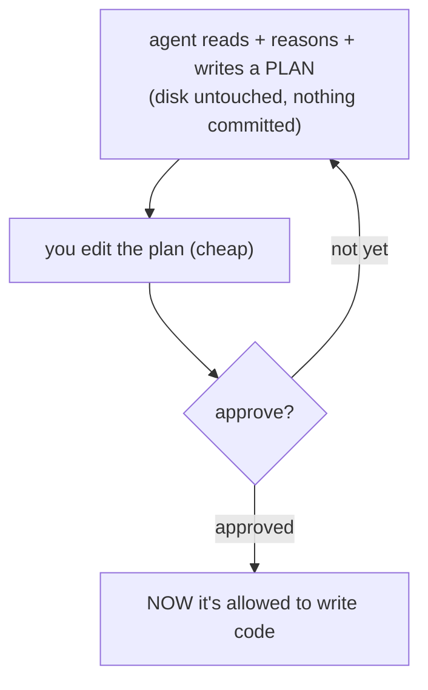

# Lesson 1.4 — Plan mode first (and when to skip it)

> _Measure twice, cut once — but don't measure to cut a thread._

_TL;DR: Plan mode is read-only thinking — the agent proposes a plan **without touching the disk** so you correct cheap words, not expensive code [^1]. Skip it for one-line diffs._

## ELI5: the tape measure
_Plan mode is the measuring. You don't get out the tape measure to cut a single thread._

The agent walks the problem and writes down what it intends to do — **without editing files** — so you correct the *plan* (cheap) instead of the *code* (expensive edits + a polluted context window). But one-line diffs don't need a plan. The skill is knowing which cut you're making.



## Why plan first
_A plan is the cheapest possible place to be wrong._

A wrong *plan* costs one sentence. A wrong *implementation* costs a re-read, a re-write, and a context window full of dead-end code you now have to reset (Phase 2). Plan mode also makes the agent **show its target** — half the time the plan reveals it misunderstood the goal, and you caught it in three lines of text instead of three files of code [^1].

> 🧠 **Test Yourself:** You're tempted to "just plan everything to be safe." Why is that wrong?
> <details><summary>Answer</summary>Planning a trivial change is its own waste — ceremony that costs more than the fix. Plan mode adds overhead; it earns its keep only when approach or blast radius is uncertain [^1].</details>

## When to skip it
_If you can already picture the exact diff, skip the plan and just ask [^1]._

| PLAN IT | SKIP THE PLAN |
|---|---|
| touches multiple files | one-line / one-file change |
| changes an interface or contract | obvious, mechanical edit |
| you're unsure of the approach | typo, version bump, rename |
| risky / hard to reverse | you can read the whole diff at a glance |

Rule of thumb: plan mode earns its keep when the **approach** is uncertain or the **blast radius** is wide — not when you're fixing a typo. If you could describe the diff in one sentence, skip the plan [^1]. Agents that support a dedicated plan or read-only mode make this think-then-build split a first-class step [^2].

## Worked example
_Multi-file migration → plan. Constant bump → don't._

✅ **Plan it** — multi-file, an interface changes:
> "**Plan only, don't edit:** migrate date handling from `moment` to `date-fns`. List affected files, helpers you'll add, and any public signature that changes."

The plan reveals it wants to change a function other modules import. You catch it: *"keep `formatDate`'s signature identical — wrap internally."* One sentence saved a painful multi-file rework.

❌ **Don't plan it** — one-line, obvious:
> ~~"Plan how to bump the timeout in `config.ts` from 3000 to 5000."~~ Pure ceremony. Just say: *"In `config.ts`, change the request timeout from 3000 to 5000 ms."*

## What the scaffolder automates for you
_Lockstep: Phase 1's habit — confirm the target before generating — is the scaffolder's `init` interview._

When you run the companion scaffolder's **`init`**, it doesn't spray files at your repo. It **interviews you first** (which agents? what conventions? which hooks?), then generates from your answers. That's explore→plan→generate at the tool level [^1].

```
   You, by hand:   explore  ──► plan    ──► code
   The scaffolder: interview ──► confirm ──► generate   (same loop, automated)
```

You graduate by recognizing the automation as the loop you already understand: `init` interviewing you *is* plan-mode-first, productized — the tool refuses to build the wrong thing for the same reason you do.

## Your turn (exercise)
For your next two tasks, predict **before you start** whether each needs a plan, using the rule of thumb. Then run them. Did the "skip it" task stay trivial, or surprise you and deserve a plan after all? Calibrating that prediction — *blast radius vs. ceremony* — is the whole skill.

---
← [Lesson 1.3](03-feeding-context.md) · [Phase 1 home](index.md) · → [Check your understanding](quiz.json)

[^1]: [Best practices for Claude Code](https://code.claude.com/docs/en/best-practices) — Anthropic
[^2]: [Best practices for coding with agents](https://cursor.com/blog/agent-best-practices) — Cursor
