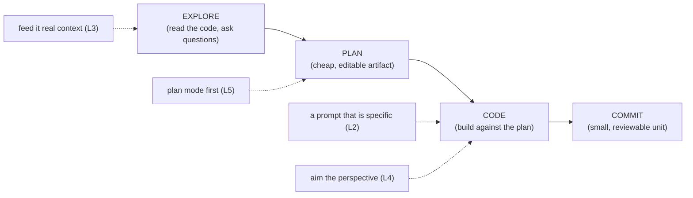

# Phase 1 — Fundamentals: the agentic loop

> **The on-ramp.** The leap from *"ask for code and hope"* to **driving** an agent through a
> repeatable loop. Everything later — context engineering, verification, spec-driven dev — is a
> refinement of the loop you learn here.

## Executive summary
_What this phase makes you able to do, and why it matters._

Most bad agent sessions aren't a *coding* failure — they're a **target** failure: the agent confidently built the wrong thing because it never looked at your codebase or confirmed the goal [^1]. This phase makes you able to drive any task through **explore → plan → code → commit** with **specific, context-rich** prompts, so you catch the wrong target while it's still cheap text instead of expensive code [^1]. The loop is the same across Claude Code, Codex, and Cursor — only the buttons differ [^2][^3]. Master it and the rest of the curriculum is just refinement.

**Prerequisite:** You already "vibe code" with an agent and can run a task end-to-end, even if results are hit-or-miss.

### Learning objectives
By the end of this phase you can:
- **Run the loop** — drive a task through explore → plan → code → commit, in order.
- **Write specific prompts** — name the file, the constraint, the example, the definition of done.
- **Feed context** instead of describing it — `@file`, screenshots, piped logs, doc URLs.
- **Set the perspective** — use a role/audience to aim output, not to fake expertise, and make a useful lens durable.
- **Use plan mode** to align on *what* before *how* — and skip it for one-line diffs.

---

## The big idea (in one sentence)

> The agent is fast at the *how* and blind to the *what* — so your job is to **pin down the what
> first** (explore, then plan), and only then let it run.

```
   "Just ask for code":              "Run the loop":
   prompt ──► code ──► surprise      explore ──► plan ──► code ──► commit
              (wrong target,                     (aligned target,
               found at review)                   small, reviewable)
```

---

## Lessons (one concept each)

| # | Lesson | The one idea |
|---|---|---|
| 1 | [The loop](01-the-loop.md) | Explore→Plan→Code→Commit; skipping *explore* solves the wrong problem. |
| 2 | [Prompt specificity](02-prompt-specificity.md) | Name the file, the constraint, the example, the definition of done. |
| 3 | [Feeding context](03-feeding-context.md) | *Feed* context (`@file`, screenshots, pipes, URLs) — don't *describe* it. |
| 4 | [Personas & perspective](04-personas-and-perspective.md) | A role sets viewpoint & audience, not expertise — make a useful one durable. |
| 5 | [Plan mode first](05-plan-mode.md) | Plan before you build — and skip it for one-line diffs. |

---

## Phase diagram



---

## Phase exercise (do this for real)

Pick a task you'd normally one-shot. Run it through the loop *out loud*:

1. **Explore.** Ask the agent to read the relevant files and report how the thing works today — no code yet.
2. **Plan.** Have it propose a short plan (plan mode if available). Read it. Correct the *plan*, not the code.
3. **Code.** Approve the plan, let it implement.
4. **Commit.** Keep the change small enough to review in one sitting.

Write one sentence on where the *plan* was wrong — catching it there, not at review, is the entire point.

---

## Cheatsheet
_Print this. The loop is universal; the buttons differ per agent._

### Key terms

| Term | What people say | What it actually means |
|---|---|---|
| **The loop** | "explore-plan-code-commit" | A fixed order that pushes the catch of a wrong target left, to where it's cheapest [^1]. |
| **Explore** | "let it look at the code" | Read-only research so the agent's mental model is corrected *before* it's load-bearing [^1]. |
| **Plan mode** | "the thinking mode" | Agent proposes a plan with **no disk writes**, so you edit cheap words not code [^1]. |
| **Specific prompt** | "a detailed prompt" | One that names the **file, constraint, example, done** — not just more words [^1]. |
| **Feed context** | "give it context" | Hand over the **verbatim source** (`@file`, screenshot, log), not your paraphrase [^1]. |
| **Definition of done** | "when it's finished" | A *checkable* finish line (a passing test), not "ran out of ideas" [^1]. |
| **Persona / role** | "act like a senior X" | A lens that sets viewpoint, priorities, and tone — *not* added knowledge or accuracy [^4]. |
| **Read-only sandbox** | "Codex can't edit" | Codex's equivalent of plan mode — think + propose, no writes [^3]. |

### The four to pin in every prompt

| # | Element | Example phrase |
|---|---|---|
| 1 | **File** | "in `src/pagination.ts`" |
| 2 | **Constraint** | "don't change the public API / no new deps" |
| 3 | **Example** | "like we do in `getUser`" |
| 4 | **Done** | "`npm test -- pagination` passes" |

### Agent translation (same idea, different buttons)

| Step | Claude Code | Codex | Cursor |
|---|---|---|---|
| Explore (no edits) | plan mode / ask to read | read-only sandbox | Plan/Ask mode |
| Enter plan mode | Shift-Tab, or `Ctrl+G` to edit plan | read-only sandbox ≈ plan | Shift-Tab → plan |
| Feed a file | `@path` | `@path` | `@file` / `@folder` |
| Pipe data in | `cmd \| claude -p` | `cmd \| codex` | terminal capture |
| Code against plan | accept the plan | switch to workspace-write | accept the plan |

> A **read-only sandbox** (Codex) and **plan mode** (Claude / Cursor) are the same idea in
> different clothes: *let the agent think and propose without touching the disk yet* [^2][^3].

---

→ **[Check your understanding](quiz.json)**

---
← [Curriculum home](../index.md) · next phase → [Context Engineering ★★★](../02-context-engineering/index.md)

[^1]: [Best practices for Claude Code](https://code.claude.com/docs/en/best-practices) — Anthropic
[^2]: [Best practices for coding with agents](https://cursor.com/blog/agent-best-practices) — Cursor
[^3]: [AGENTS.md — Codex guide](https://developers.openai.com/codex/guides/agents-md) — OpenAI
[^4]: [When "A Helpful Assistant" Is Not Really Helpful: Personas in System Prompts Do Not Improve Performances of LLMs](https://aclanthology.org/2024.findings-emnlp.888/) — Findings of EMNLP 2024
