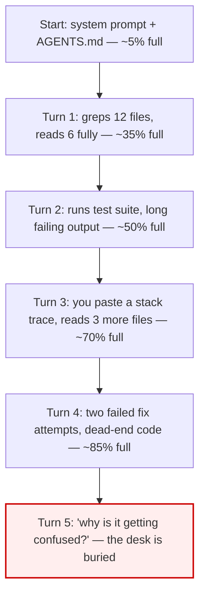

# Lesson 2.1 — The context window is a desk

> _It's a desk, not a filing cabinet — only so much fits, and new papers bury old ones._

_TL;DR: The context window is finite working space the agent actively reasons over — not storage it can query. Everything competes for the same token budget, and most of what lands there is incidental._

## ELI5: desk, not filing cabinet
_The agent works at a small desk, not an endless cabinet._

| | Filing cabinet | Desk (the context window) |
|---|---|---|
| Size | Effectively infinite | **Finite** — a fixed token budget |
| Access | Query any file later | Only what's *physically on it* right now |
| When full | Add another drawer | New papers **bury** old ones; nothing's found |

The context window is the **desk**. Everything the agent "knows" right now has to fit on that desk.
It is *not* a database it can query — it's the finite surface it's actively looking at [^1].

```
   ┌───────────────── THE DESK (context window) ─────────────────┐
   │ system prompt | AGENTS.md | files you opened | tool outputs │
   │ | every message in this conversation | the agent's replies  │
   └─────────────────────────────────────────────────────────────┘
        ↑ all of this competes for the same finite space
```

> 🧠 **Test Yourself:** If the agent read a file 20 turns ago and "forgot" a detail in it, where did that detail go?
> <details><summary>Answer</summary>Nowhere it can retrieve on its own — it's still on the desk, just buried/diluted among everything since. The window isn't searchable storage [^1].</details>

## What's actually on the desk
_Five things eat the same budget; files and tool output are the silent hogs._

| # | What's on the desk | Notes |
|---|---|---|
| 1 | **System prompt** | The agent's built-in instructions — always there. |
| 2 | **Steering files** | `AGENTS.md` / `CLAUDE.md` / `.cursor/rules` — loaded each session. |
| 3 | **Files the agent read** | Full contents — even the parts it didn't need. ⚠️ silent hog |
| 4 | **Tool output** | Test logs, `grep` results, build errors, stdout. ⚠️ silent hog |
| 5 | **The whole conversation** | Your messages *and* every prior agent reply. |

Rows 3–4 are the budget-eaters. Ask the agent to "read the codebase" and it can drop tens of
thousands of tokens of file contents onto the desk — most of it irrelevant. Anthropic notes tool
results alone can consume **50,000+ tokens** before the agent even starts on your request [^1].

## Worked example: watch the desk fill
_One bug fix, five turns, desk goes from 5% to buried._



Nothing went wrong with the *model*. The **desk filled with junk** — six fully-read files it no
longer needs, a giant test log, and two abandoned approaches still in view.

> 🧠 **Test Yourself:** By Turn 5, what's the single biggest category of waste on the desk?
> <details><summary>Answer</summary>The fully-read files and the long test log (rows 3–4) — incidental content the current task no longer needs. That's what you'll learn to clear in Lesson 3.</details>

## Why this matters
_You can't manage what you can't see. Stay aware of how full the desk is, and with what._

Before the *moves* in Lesson 3 make sense, internalize this: **the agent always reasons over a
finite, fillable surface, and most of what lands there is incidental.** Good operators keep a
constant background awareness of "how full is the desk, and with what?" [^1].

## Your turn (exercise)

In your next session, after ~10 turns, ask the agent:

> "Roughly what's taking up most of your context right now — files, tool output, or our
> conversation?"

Then identify **one thing on the desk the current task doesn't need.** That noticing is the skill.
(Lesson 3 is what you *do* about it.)

---
← [Phase 2 home](index.md) · next → [Lesson 2.2 — Context rot](02-context-rot.md)

[^1]: [Effective context engineering for AI agents](https://www.anthropic.com/engineering/effective-context-engineering-for-ai-agents) — Anthropic
