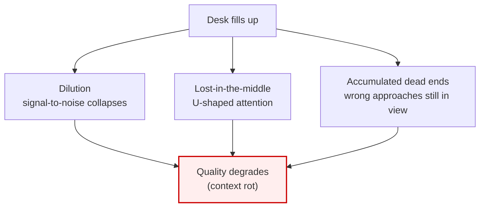

# Lesson 2.2 — Context rot

> _More context past a point makes the output worse, not better._

_TL;DR: A full desk doesn't just risk overflow — it actively degrades reasoning. Three mechanisms (dilution, lost-in-the-middle, dead ends) rot the context. The fix is to **remove**, not explain harder._

## The counterintuitive idea
_More tokens stop helping and start hurting — even with perfect retrieval._

"The agent has all the information now — surely that helps?" No. Anthropic calls this **context
rot**: as the window fills, the model's effective attention thins and quality degrades [^1]. It's not
just an overflow risk — a 2025 study found performance drops **13.9%–85%** as input length grows
*even when retrieval of the relevant fact is perfect* [^3].

```
  output
  quality
    │      ╭──────────╮
    │     ╱            ╲___
    │    ╱                 ╲____
    │   ╱                       ╲______
    │  ╱                               ╲____
    └────────────────────────────────────────► context fullness
        ↑ too little        ↑ sweet spot      ↑ rot: dilution,
          (under-specified)   (focused)         dead ends, drift
```

> 🧠 **Test Yourself:** The 13.9%–85% finding controlled for retrieval. Why does that make it surprising?
> <details><summary>Answer</summary>It rules out "the model just couldn't find the fact." Length *itself* degrades reasoning — so adding context to "be safe" can hurt even when nothing is lost [^3].</details>

## Three ways context rots
_Dilution, lost-in-the-middle, and accumulated dead ends._



| Mechanism | What happens | Source |
|---|---|---|
| **Dilution** | The one rule that matters ("never touch the public API") is one line in 40k tokens. Signal-to-noise collapses; the agent "forgets" because it's buried. | [^1] |
| **Lost-in-the-middle** | Models attend most to the **start and end** of context; facts in the middle of a long session get under-weighted (U-shaped attention). | [^2] |
| **Accumulated dead ends** | Two failed fixes still sit in view. The agent keeps "seeing" its wrong approaches and circles back — like thinking while staring at crossed-out drafts. | [^1] |

> 🧠 **Test Yourself:** You have a critical invariant to preserve across a long session. Given lost-in-the-middle, where should you keep restating it?
> <details><summary>Answer</summary>Near the **end** (your latest message) — recency gets high attention. Burying it in the middle of a long thread under-weights it [^2].</details>

## Worked example: "it was working, then it got worse"
_A classic arc — and the wrong instinct that deepens the rot._

```
  Turns 1–5:   sharp. Agent nails the structure, writes clean code.
  Turns 6–12:  you hit a tricky edge case. Two fixes fail. Logs pile up.
  Turns 13+:   agent re-suggests an approach it already tried,
               ignores a constraint from turn 2, "feels dumber."
```

The instinct is to *explain harder* — add detail, paste more logs. That makes it **worse**: you're
adding to the very thing that's rotting. The right instinct is the opposite: **remove**. Reset the
desk and restate the task crisply (Lesson 3).

## The operator's rule of thumb
_After ~2 failed corrections, stop adding — reset._

> **After ~2 failed correction attempts, stop adding. Reset.** Anthropic recommends restarting once
> corrections exceed two attempts [^4].

A clean session with a *better* prompt beats a long session carrying the scar tissue of every failed
approach. This is exactly two 12-factor-agents principles:

| Factor | Principle | Why it applies here |
|---|---|---|
| **#3** | Own your context window | *You* decide what's in it, deliberately — don't dump everything [^5]. |
| **#10** | Small, focused agents | Keep each unit of work to ~3–20 steps; as context grows, models lose the plot [^6]. |

## Your turn (exercise)

Find a session that "went bad." Scroll back and identify **the turn where it tipped**. Ask:

- What was on the desk then that the task didn't need?
- Would a `/clear` + one-paragraph restatement have been faster than the next five turns of digging out?

Nine times out of ten, yes. Recognizing the tipping point *in real time* is the goal — Lesson 3
gives you the tools to act on it.

---
← [Lesson 2.1](01-context-window-is-a-desk.md) · next → [Lesson 2.3 — The three moves](03-the-three-moves.md)

[^1]: [Effective context engineering for AI agents](https://www.anthropic.com/engineering/effective-context-engineering-for-ai-agents) — Anthropic
[^2]: [Lost in the Middle: How Language Models Use Long Contexts](https://arxiv.org/abs/2307.03172) — arXiv (Liu et al., 2023)
[^3]: [Context Length Alone Hurts LLM Performance Despite Perfect Retrieval](https://arxiv.org/abs/2510.05381) — arXiv (2025)
[^4]: [Best practices for Claude Code](https://code.claude.com/docs/en/best-practices) — Anthropic
[^5]: [Factor 3 — Own Your Context Window](https://github.com/humanlayer/12-factor-agents/blob/main/content/factor-03-own-your-context-window.md) — humanlayer / 12-factor-agents
[^6]: [Factor 10 — Small, Focused Agents](https://github.com/humanlayer/12-factor-agents/blob/main/content/factor-10-small-focused-agents.md) — humanlayer / 12-factor-agents
