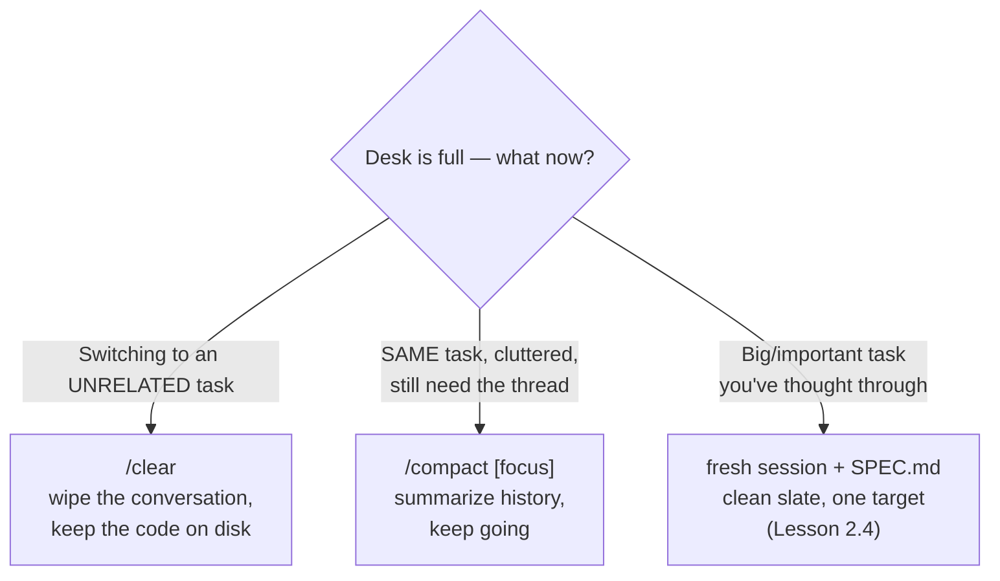

# Lesson 2.3 — The three moves

> _Three buttons. The craft is knowing which to reach for, and when._

_TL;DR: You manage a finite, rotting desk with exactly three moves — `/clear`, `/compact`, and a fresh session + spec. Match the move to the situation._

You know the desk is finite (2.1) and that a full desk rots (2.2). Here's what you *do* about it.

## The three moves
_Reset, summarize-and-keep, or start fresh from a plan._

> Compaction isn't all-or-nothing. Clearing stale **tool results** is "one of the safest, lightest
> forms of compaction" — drop the giant logs, keep the decisions [^1].

## The decision rule
_One lookup table for "which move now?"_

| Situation | Move |
|---|---|
| Done with this task / switching topics | `/clear` |
| Same task, desk cluttered, need the narrative | `/compact [focus]` |
| Big task, want a clean run from a plan | fresh session + spec |
| Stuck after ~2 failed fixes | `/clear` and restate crisply [^2] |

Two common mistakes:

- **Never resetting** — treating one endless chat as the unit of work.
- **`/compact` when you meant `/clear`** — if you've moved to a new task, you don't want a summary of
  the old one on the desk; you want it *gone*.

> 🧠 **Test Yourself:** You're on the *same* feature but the desk is full of exploration you no longer need — though you still want the narrative of decisions. `/clear` or `/compact`?
> 

Answer
`/compact [focus]`. `/clear` would wipe the thread you still need; compaction keeps decisions/bugs and drops the raw file dumps [^1].

## Worked example
_Right vs. wrong on a topic switch, plus mid-task clutter._

You finished a feature (tests green). Next: refactor an *unrelated* module.

| | Action | Result |
|---|---|---|
| ❌ Wrong | Keep typing in the same session | Old files, logs, discussion dilute the refactor |
| ✅ Right | `/clear`, then: *"Refactor `src/payments/retry.ts` to exponential backoff. Keep the public signature. Run `npm test -- retry` to verify."* | Clean desk, sharp prompt |

**Mid-task clutter:** deep in one bug, desk full of exploration, but you still need the narrative →
`/compact focus on the auth bug and the two approaches that failed` → tight summary, raw dumps gone.

## Per-agent mechanics
_The move is universal; the button differs._

| | Claude Code | Codex | Cursor |
|---|---|---|---|
| Reset | `/clear` | `/clear` | New chat / new tab |
| Compact | `/compact [focus]` | `/compact` (+ auto-compaction) | auto-summarizes long threads |
| Selective recall | `@`-mention files · `/rewind` | session resume | `@Past Chats` |

> ⚠️ **Watch-out:** Codex auto-compacts aggressively, and auto-compaction can quietly drop a subtle
> constraint you stated 30 turns ago. **Don't trust auto-compaction with invariants** — when you
> compact (or it compacts for you), *restate the non-negotiables* in your next message [^2].

## Your turn (exercise)

Name the move for each (answers below — don't peek):

1. Tests just passed; now you'll write docs for the same feature.
2. Debugging one issue for 15 turns; the agent is circling old wrong fixes.
3. About to start a large multi-file feature you've already thought through.
4. Finished the API work; now touching a completely separate CSS file.

Answers

1. `/compact` (same feature, keep the thread) — or `/clear` + a crisp docs prompt if you don't need the history.
2. `/clear` and restate the bug crisply (past the 2-failed-fixes line; history is now scar tissue).
3. Fresh session + a `SPEC.md` (Lesson 2.4).
4. `/clear` (unrelated task).

---
← [Lesson 2.2](02-context-rot.md) · next → [Lesson 2.4 — The spec handoff](04-the-spec-handoff.md)

[^1]: [Effective context engineering for AI agents](https://www.anthropic.com/engineering/effective-context-engineering-for-ai-agents) — Anthropic
[^2]: [Best practices for Claude Code](https://code.claude.com/docs/en/best-practices) — Anthropic
