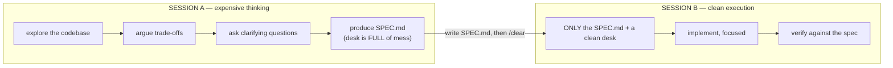

# Lesson 2.4 — The spec handoff

> _Think in one session, implement in a clean one — with a spec as the bridge._

_TL;DR: The highest-leverage habit in agentic coding: distill a messy thinking session into a self-contained `SPEC.md`, `/clear`, then implement from it on a clean desk._

## The single most useful context move
_Separate expensive thinking from clean execution._



This mirrors Anthropic's recommended **explore → plan → code → commit** loop — separate *what/why*
from *how* before writing code [^2].

## Why a *fresh* session to implement?
_Session A's mess was useful for thinking but is pure rot for coding._

| | Session A's desk | Effect on implementation |
|---|---|---|
| Contents | Exploration, dead ends, half-ideas, big file dumps | Rot — the agent codes while staring at every tangent [^1] |
| The `SPEC.md` | The distilled ~1% worth keeping | A sharp, self-contained target |

Hand the spec to a clean Session B and the agent implements against a near-empty desk. It's also
**robust**: the spec is a durable artifact — if Session B goes sideways, `/clear` and hand it the
same spec again. You never lose the thinking.

> 🧠 **Test Yourself:** Why not just `/compact` Session A and implement there, instead of `/clear` + fresh session?
> <details><summary>Answer</summary>Compaction keeps a *summary of the mess* on the desk. The spec handoff replaces it with one clean target and a near-empty desk — far less rot for the coding phase [^1].</details>

## What makes a good handoff spec
_Self-contained: Session B has no memory of Session A._

| Section | Contents |
|---|---|
| **Goal** | One paragraph — what we're building and why. |
| **Files to touch** | Exact paths; and explicitly, what's **out of scope**. |
| **Interfaces/contracts** | Signatures, schemas, the public API that must not change. |
| **Constraints** | Non-negotiables ("no new deps", "keep < 200ms"). |
| **Verification** | Exactly how to know it's done (`npm test -- retry; all green`). |

If Session B has to *ask* "where is X?" or "can I change Y?", the spec was incomplete.

## Worked example
_Messy thinking in A; one-line implement in B._

**Session A** (messy thinking):
> "Explore how we do retry/backoff today, look at the 3 call sites, weigh fixed vs exponential, ask
> me anything unclear, then write `SPEC.md` for the change."

It reads 9 files, you discuss, it asks two questions, and writes:

```markdown
# SPEC: Exponential backoff for payment retries
Goal: Replace fixed 1s retry with exponential backoff in the payments client.
Files: src/payments/retry.ts (only). Out of scope: the 3 call sites (signature unchanged).
Contract: retry(fn, opts) signature stays identical; add opts.maxDelayMs (default 30000).
Constraints: no new deps; jitter required; cap at 5 attempts.
Verify: `npm test -- retry` all green; add a test for the cap.
```

**Then:** `/clear`.

**Session B** (clean execution):
> "Implement `@SPEC.md`."

Near-empty desk, one crisp target. It implements and verifies — no tangents.

> 🧠 **Test Yourself:** Why must the spec restate constraints from Session A like "no new deps" rather than assume the agent remembers?
> <details><summary>Answer</summary>Session B is a fresh, stateless session — zero memory of A. Anything not in the spec doesn't exist for it [^1].</details>

## Connection to the rest of the curriculum
_This pattern is the seed of Phase 5 (Spec-Driven Development)._

GitHub's **Spec Kit** productizes exactly this handoff into
`constitution → specify → plan → tasks → implement` [^3]. Here you learn it as a *context* technique;
later as a *methodology*. Same idea, bigger scale.

## Your turn (exercise)

Next non-trivial task: force the split. End Session A with *"now write a self-contained `SPEC.md`;
assume the implementer has never seen this conversation."* `/clear`. Implement from the spec in
Session B. Then check: did B ever ask a question the spec should have answered? Tighten the template.

---
← [Lesson 2.3](03-the-three-moves.md) · next → [Lesson 2.5 — What the scaffolder automates](05-scaffolder-memory-loop.md)

[^1]: [Effective context engineering for AI agents](https://www.anthropic.com/engineering/effective-context-engineering-for-ai-agents) — Anthropic
[^2]: [Best practices for Claude Code](https://code.claude.com/docs/en/best-practices) — Anthropic
[^3]: [Spec Kit — Spec-Driven Development toolkit](https://github.com/github/spec-kit) — GitHub
