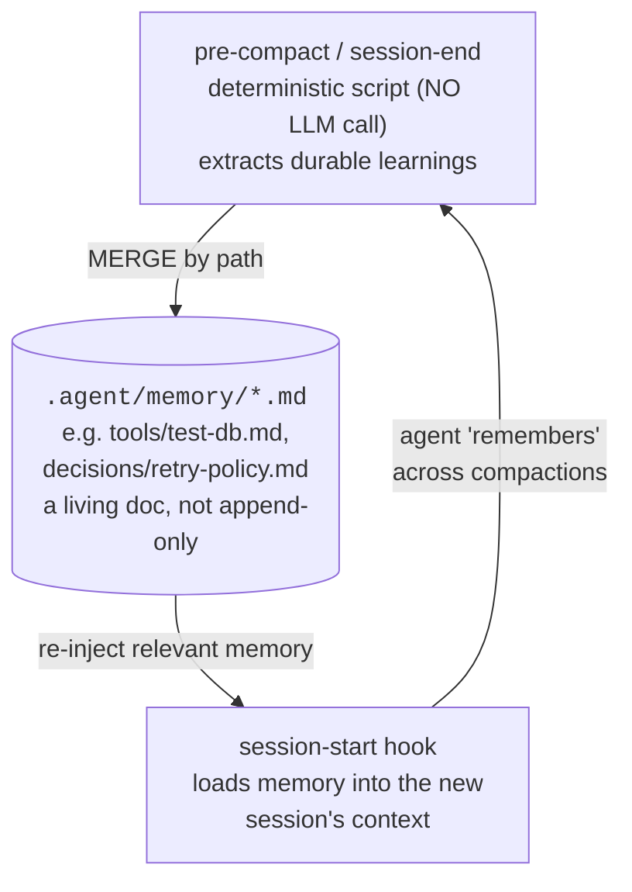

# Lesson 2.5 — What the scaffolder automates for you

> _Lockstep lesson: the scaffolder turns this phase's discipline into a deterministic memory loop._

_TL;DR: Compaction summarizes away hard-won learnings. The scaffolder generates a **deterministic** (non-LLM) hook that captures durable learnings into a markdown wiki and re-injects them next session._

> **Lockstep lesson.** Every phase ends by showing what the companion *scaffolder* generates so you
> don't do it by hand. Phase 2's artifact is the **capture-learnings memory loop**.

## The problem this solves
_Learnings live in the context window — so compaction loses them._

You can manage context manually now. But when context is **compacted** (manually or automatically),
this session's learnings — "the test DB needs `--no-sandbox`", "errors are swallowed in this module"
— get **summarized away** [^1]. Next session rediscovers the same gotchas. Anthropic's own fix is
**structured note-taking**: persist learnings *outside* the window (a `NOTES.md`-style file) and
re-read them when needed [^1].

Manually writing those notes every session is exactly the must-happen-every-time chore humans forget.
So we **don't** trust prose to remind the agent — we make it **deterministic** (a hook; you'll learn
hooks properly in Phase 4 — here's the payoff preview).

## The loop the scaffolder generates
_Capture on compaction/end → merge into a markdown wiki → re-inject at session start._



### Why these design choices (interview-grade detail)
_Deterministic, path-merged, and it makes the verification loop concrete._

| Choice | Why |
|---|---|
| **Deterministic hook, not an LLM call** | Runs on every event, fast, free, reliable — doesn't rely on the agent deciding what's worth saving. |
| **Merged by semantic path, not appended** | `tools/test-db.md` is a *living document*; memory stays small and curated, not an unreadable transcript. |
| **It's the verification loop, concrete** | *mistake blocked → reason captured → rule reinforced.* This loop **is** the "reason captured" step. |

> 🧠 **Test Yourself:** Why a deterministic hook instead of just telling the agent "remember to save learnings before compaction"?
> <details><summary>Answer</summary>A prose instruction relies on the agent's judgment and can itself be compacted away. A hook fires on the event every time, guaranteeing the capture *runs* (determinism guarantees it runs — not that the content is correct).</details>

## Why it's portable (Claude / Codex / Cursor)
_The loop binds to canonical events; each agent's adapter renders its native hook._

| Canonical event | Claude | Codex | Cursor |
|---|---|---|---|
| `pre-compact` | `PreCompact` ✅ | `PreCompact` ✅ | `preCompact` ✅ |
| fallback | `SessionEnd` | `Stop` | `sessionEnd` |
| `session-start` | `SessionStart` | `SessionStart` | `sessionStart` |

`PreCompact` exists natively on all three. Where an agent lacks it, the loop falls back to
`SessionEnd`/`Stop` — and the scaffolder **records the downgrade** rather than silently dropping it.

> ⚠️ **Trap:** Cursor hooks fail **open** by default. A security/capture hook there needs
> `failClosed: true`, or a failure passes silently. The scaffolder sets this for you.

## You could build this by hand — but you shouldn't
_The scaffolder emits a correct, portable, tested version in one command._

Hand-writing this per agent means getting fail-open/fail-closed semantics subtly wrong and re-doing
it three times. When you reach the **capstone (Phase 6)**, you'll run the scaffolder and recognize
this loop as "oh — that's the thing Lesson 2.5 taught me, automated."

## Your turn (exercise)

Design one memory entry by hand. Pick a real gotcha from a recent session and write what the loop
*would* capture:

```markdown
<!-- .agent/memory/tools/<topic>.md -->
## <the gotcha, as a heading>
<one or two sentences: the rule, and why>
```

Keep it to ~3 lines. If you can't say it in 3, it's probably two memories. Small, path-organized,
living — that's what keeps agent memory useful instead of bloated.

---
← [Lesson 2.4](04-the-spec-handoff.md) · [Phase 2 home](index.md) · → [Check your understanding](quiz.md)

[^1]: [Effective context engineering for AI agents](https://www.anthropic.com/engineering/effective-context-engineering-for-ai-agents) — Anthropic
