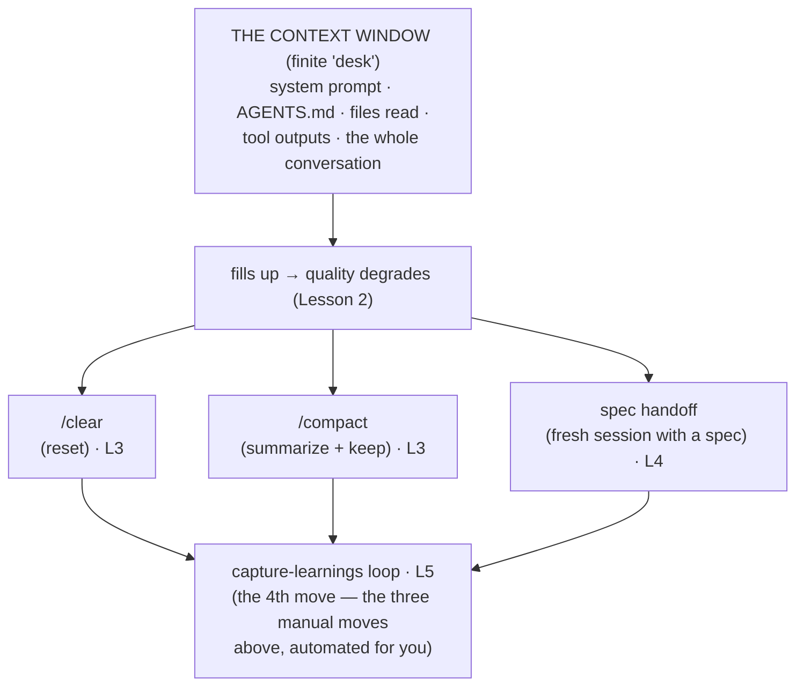

# Phase 2 — Context Engineering ★★★

> _The model didn't get dumber. Your context got worse._

## Executive Summary

_Treat the context window as the **scarce resource** and manage it on purpose._

Across every source we researched — Anthropic, OpenAI's harness engineering, Cursor, and the
12-factor-agents principles — this is named the single biggest leap from "vibe coding" to
engineering [^1][^5]. An LLM is a **stateless function**: it has no memory between calls except the
context you feed it, and that context is **finite and degrades as it fills** [^1][^2][^3]. After this
phase you can recognize *context degradation* as the primary failure mode of agentic coding and use
the four moves — `/clear`, compaction, the spec handoff, and an automated memory loop — to keep the
agent sharp. If you master one phase, master this one.

**Prerequisite:** Phase 1 (the agentic loop).

### Learning objectives

| # | After this phase you can… |
|---|---|
| 1 | Explain *why* the context window is finite working space, not storage. |
| 2 | Name the three mechanisms of **context rot** and spot the turn where a session tips. |
| 3 | Pick the right move — `/clear` vs `/compact` vs fresh session — for a given situation. |
| 4 | Run a **spec handoff**: think in one session, implement in a clean one. |
| 5 | Describe the **capture-learnings memory loop** the scaffolder generates, and why it's a deterministic hook. |

---

## The big idea (in one sentence)

> An LLM is a **stateless function**: same inputs → same quality of output. The agent has no memory
> between calls except the context you feed it — so **the quality of your work is the quality of
> your context management** [^1].

| Most people think | Reality [^1] |
|---|---|
| "Better model = better results — just keep going." | "Better *context* = better results. The window is finite and fills with junk." |
| "The agent got dumber three hours in." | "The context got worse — diluted with dead ends and stale file dumps." |
| "More information always helps." | "Past a point, more tokens *hurt* — even with perfect retrieval [^3]." |

---

## Lessons (one concept each)

| # | Lesson | The one idea |
|---|---|---|
| 1 | [The context window is a desk](01-context-window-is-a-desk.md) | Finite working space, not infinite storage. |
| 2 | [Context rot](02-context-rot.md) | Past a point, more context makes output *worse*, not better [^3]. |
| 3 | [The three moves](03-the-three-moves.md) | `/clear`, `/compact`, fresh session — and when to use each [^4]. |
| 4 | [The spec handoff](04-the-spec-handoff.md) | Think in one session; implement in a clean one. |
| 5 | [What the scaffolder automates](05-scaffolder-memory-loop.md) | The capture-learnings memory loop, so context survives compaction [^1]. |

---

## Phase diagram

---

## Phase exercise (do this for real)

Take a task you'd normally one-shot in a long chat. Instead:

1. **Explore + plan** in one session; have the agent write a short `SPEC.md`.
2. `/clear` (or open a fresh session).
3. Implement from the `SPEC.md` in the clean session.
4. Note the difference in how focused the agent stays.

Write 3 sentences on what changed. That muscle — *deliberately resetting context* — is the whole phase.

---

## Cheatsheet

_Everything in this phase, compressed. Steal it._

### Key terms — what people say vs. what it actually means

| Term | What people say | What it actually means |
|---|---|---|
| **Context window** | "The agent's memory." | A finite token budget holding *everything* the agent sees right now — system prompt, steering files, files read, tool output, the whole chat [^1]. Not a database it can query. |
| **Context rot** | "The model got dumber." | Output quality *degrades* as the window fills — dilution, lost-in-the-middle, accumulated dead ends — often *before* it's full [^1][^2][^3]. |
| **Lost in the middle** | "It ignored what I told it." | Models attend most to the **start and end** of context; facts buried in the middle get under-weighted [^2]. |
| **Compaction** | "It summarizes the chat." | Replaces history with a short summary that *keeps* decisions/bugs and *drops* redundant tool output [^1]. Auto-compaction can silently drop invariants [^4]. |
| **Spec handoff** | "Write a plan." | Think in a messy session → distill to a self-contained `SPEC.md` → `/clear` → implement in a clean session. |
| **Memory loop** | "The agent remembers." | A *deterministic* hook that merges durable learnings into a markdown wiki and re-injects them next session [^1]. |

### The four moves — decision table

| Situation | Move | Why |
|---|---|---|
| Switching to an **unrelated** task | `/clear` | Cheapest, cleanest reset; old task is pure noise now. |
| **Same** task, desk cluttered, need the thread | `/compact [focus]` | Keeps the narrative, drops raw file dumps [^1]. |
| **Big/important** task you've thought through | Fresh session + `SPEC.md` | Clean desk + one sharp target (Lesson 4). |
| Stuck after **~2 failed fixes** | `/clear` + restate crisply | History is now scar tissue [^4]. |

### Per-agent mechanics (agent-agnostic move, different button)

| Move | Claude Code | Codex | Cursor |
|---|---|---|---|
| Reset context | `/clear` | `/clear` | New chat / tab |
| Summarize + keep | `/compact [focus]` | `/compact` (+ auto) | auto-summarize long threads |
| Recall selectively | `@`-mention · `/rewind` | session resume | `@Past Chats` |

> ⚠️ Don't rely on **auto**-compaction to preserve subtle constraints — restate critical invariants.
> Codex auto-compacts aggressively; treat it as a backstop, not a strategy [^4].

---
→ **[Check your understanding](quiz.json)**

[^1]: [Effective context engineering for AI agents](https://www.anthropic.com/engineering/effective-context-engineering-for-ai-agents) — Anthropic
[^2]: [Lost in the Middle: How Language Models Use Long Contexts](https://arxiv.org/abs/2307.03172) — arXiv (Liu et al., 2023)
[^3]: [Context Length Alone Hurts LLM Performance Despite Perfect Retrieval](https://arxiv.org/abs/2510.05381) — arXiv (2025)
[^4]: [Best practices for Claude Code](https://code.claude.com/docs/en/best-practices) — Anthropic
[^5]: [Factor 3 — Own Your Context Window](https://github.com/humanlayer/12-factor-agents/blob/main/content/factor-03-own-your-context-window.md) — humanlayer / 12-factor-agents
