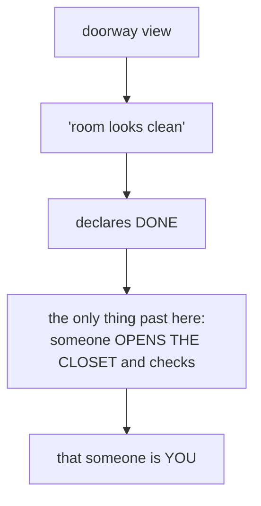
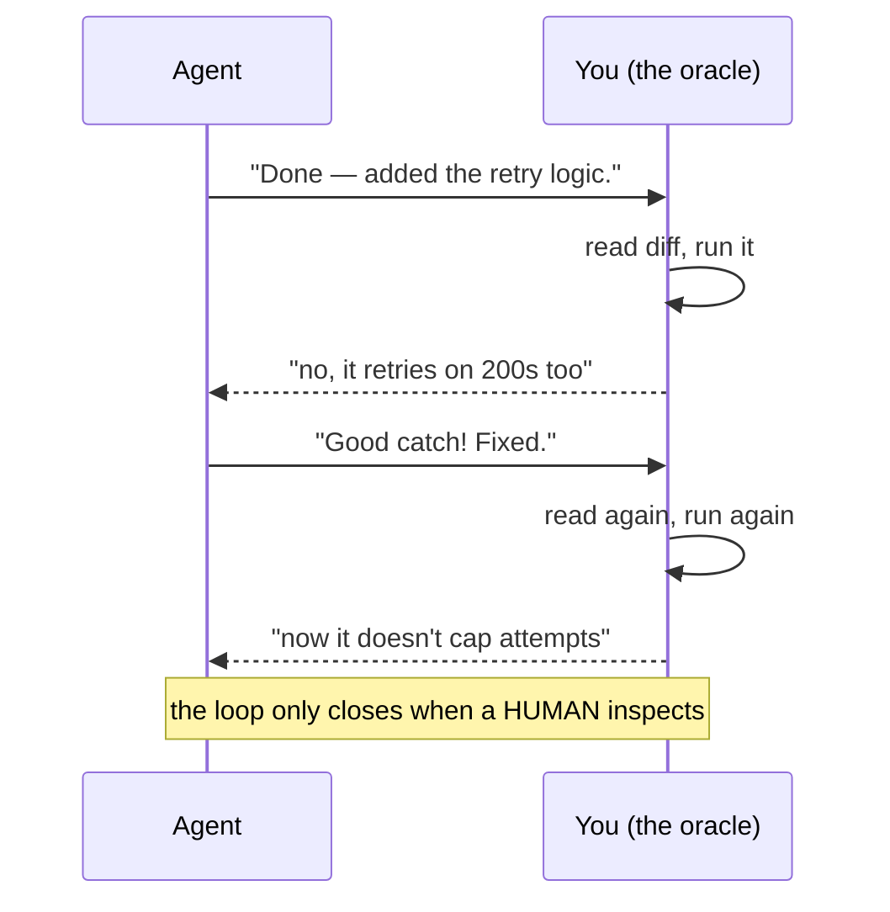

# Lesson 3.1 — "Looks done" isn't done

> _The agent stops when the work looks done — and "looks done" is the only signal it has._

_TL;DR: An agent halts at plausible-looking code because it has no native correctness check. Without an external oracle, **you** are the verification loop and you can't walk away [^1]._

## ELI5: the kid and the closet
_The agent is the kid who shoves toys under the bed and announces "done!"_

An agent writes code that *looks* like working code — because looking-like-working-code is literally
what it was trained to produce — then stops. It has no built-in way to open the closet. Unless you
give it one, the closet-opener is **you** [^1].

## Why "looks done" is the natural stopping point
_The model halts on plausibility, not correctness — those are different things._

| The agent's signal | What it actually means |
|---|---|
| "this resembles complete code" | high probability, given training data |
| "a task usually ends here" | a **plausibility** judgment |
| — | **not** a correctness judgment |

A next-token predictor halts when output pattern-matches millions of examples of finished code. That
signal is about *plausibility, not correctness* [^1]. The agent doesn't *lie* about being done — it
genuinely can't distinguish "looks right" from "is right" unless it can **run a check** [^2].

> 🧠 **Test Yourself:** Why doesn't "explain the task more clearly" fix an agent that stops at wrong-but-plausible code?
> 

Answer
The gap isn't understanding — it's verification. No amount of prompt detail gives the agent a way to *check* its own output; only a runnable oracle does [^1].

## The trap: you become the loop
_Every "done" without an oracle routes back to a human inspecting output by hand._

You are the test runner. You are the regression check. You **cannot leave the keyboard** — this is
the ceiling that keeps people stuck babysitting. Every source points at the same exit: **move the
check out of your head into something the agent can run itself** [^1][^3]. Anthropic names this exact
failure the **trust-then-verify gap** — "Claude produces a plausible-looking implementation that
doesn't handle edge cases" — and the fix is always: *provide verification; if you can't verify it,
don't ship it* [^1].

> 🧠 **Test Yourself:** A teammate says "I just review every diff carefully." Why is that still the bottleneck this phase removes?
> 

Answer
Reviewing every diff *is* being the verification loop — it's human attention per change. The phase replaces it with a check the agent runs itself, so you only review evidence, not re-run everything [^1].

## Worked example
_Plausible diff, wrong behavior — only running something reveals it._

Task: *"Fix the bug where empty carts charge $0 shipping but should be free-shipping-blocked."*

| | What you see | What's true |
|---|---|---|
| **Looks done** | new `if (cart.items.length === 0)` branch — plausible | the diff *reads* correct |
| **Isn't done** | returns `'free'` instead of throwing `EmptyCartError` | 3 call sites that expect a throw silently proceed |

The only way to know is to **run something** — the existing checkout test, or a new one. The agent
won't unless told, so you do it by hand, forever. That hand-check is what the next lessons replace.

## Your turn (exercise)
Next session, give the agent a task and — when it says "done" — **don't fix anything and don't check
it yourself.** Type exactly:

> "How do you *know* it's done? Run something that would fail if it weren't, and show me."

Watch it scramble for a check it should have run from the start. That gap — between *claiming* done
and *proving* done — is the gap this phase closes. (Lesson 3.2 is the ladder of checks you can hand it.)

---
← [Phase 3 home](index.md) · next → [Lesson 3.2 — The oracle gradient](02-the-oracle-gradient.md)

[^1]: [Best practices for Claude Code](https://code.claude.com/docs/en/best-practices) — Anthropic
[^2]: [Best practices for coding with agents](https://cursor.com/blog/agent-best-practices) — Cursor
[^3]: [Building an AI-Native Engineering Team](https://developers.openai.com/codex/guides/build-ai-native-engineering-team) — OpenAI
