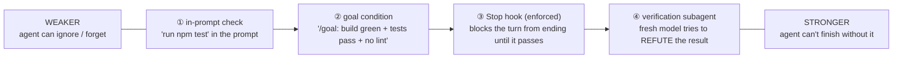

# Lesson 3.2 — The oracle gradient

> _An oracle is a pass/fail the agent can run itself — and the stronger ones are harder to skip._

_TL;DR: There's a four-rung ladder from "name the check in your prompt" to "a fresh-context subagent reviews the diff." You climb it as the stakes rise; each rung removes one way the check gets skipped [^1]._

## ELI5: a ladder of locks
_Four ways to keep a door shut — from an ignorable sticky note to a guard who re-checks; the higher the stakes, the higher the rung you climb._

Think of four ways to keep a door shut. Rung ① is a **sticky note** on the door saying "please check
this is locked" — easy to ignore or forget. Rung ③ is a **door that won't open until the lock is
actually engaged** — you *can't* leave it unlocked. Rung ④ is a **second guard** who never watched
you lock it and tries the handle anyway. Higher rungs = harder to skip.

## The one idea
_An **oracle** = anything that returns a pass/fail signal the agent can read in the conversation [^1]._

A test suite, a build exit code, a linter, a script that diffs output against a fixture, a browser
screenshot compared to a design — all oracles [^1]. They're not equally strong.



## The four rungs
_Each rung trades a bit of setup for a bit less of your attention [^1]._

| # | Rung | What it is | Still relies on… | Anthropic's name |
|---|---|---|---|---|
| ① | **In-prompt check** | name the oracle in the instruction: *"…then run `npm test -- cart`, make it green"* | agent *choosing* to run it + *honestly* reporting | "in one prompt" [^1] |
| ② | **Goal condition** | define "done" as a checkable predicate, re-checked after every turn | agent running it (auto-evaluator helps) | `/goal` condition [^1] |
| ③ | **Stop hook (enforced)** | a deterministic hook runs the check on turn-end; **blocks the stop** until it passes | nothing — the harness enforces it | Stop hook [^1] |
| ④ | **Verification subagent** | a fresh-context agent reviews the diff; *"the agent doing the work isn't the one grading it"* | independent judgment | second opinion [^1] |

**Why ④ is special:** a reviewer in a fresh subagent "sees only the diff and the criteria you give
it, not the reasoning that produced the change" — so it can't rationalize *"well, I meant to do
that"* [^1]. Cursor frames the same risk: AI code "can look right while being subtly wrong" [^2].

> 🧠 **Test Yourself:** Rungs ① and ③ can run the *exact same command* (`npm test`). So what makes ③ stronger?
> <details><summary>Answer</summary>Enforcement, not the command. ① relies on the agent choosing to run it (and reporting honestly); ③ is run by the harness on turn-end and **blocks** finishing — the agent can't skip it [^1].</details>

## Why the gradient matters
_Climbing it removes failure modes one at a time._

```
  rung ①  can be forgotten as context rots          (agent-dependent)
  rung ②  can't be ambiguous, but can be skipped     (agent-dependent)
  rung ③  can't be skipped — enforced by the harness (deterministic)
  rung ④  can't be rationalized — fresh eyes         (independent judgment)
```

You climb as the **stakes** rise. Throwaway script → rung ①. Billing change you want to walk away
from → rung ③, ideally ④ before merge. Anthropic puts it plainly: the `/goal` and Stop-hook versions
"are what let an unattended run finish correctly without you" [^1].

> 🧠 **Test Yourself:** You want to *leave the keyboard* during a refactor of payment code. Which rung is the minimum, and why not ① or ④ alone?
> <details><summary>Answer</summary>Rung ③. ① depends on the agent choosing to check (erodes as context fills); ④ runs *after* the agent already stopped — it can't stop the agent finishing on a broken state mid-run. Only ③ enforces correctness *during* the unattended run [^1].</details>

## Worked example
_Same task, three rungs._

- **① :** *"Add validation to `parseConfig`, then run `npm test -- config`."* — works if it obliges; on turn 30 it may say "tests pass" without running them [^1].
- **③ :** A `Stop` hook runs `npm test` on every turn-end. Agent writes validation → tries to stop → hook runs suite → one fails → **stop blocked**, failure pasted in → agent fixes → green → *now* allowed to finish. You watched none of it [^1].
- **④ :** Before merge, a subagent gets only the diff + spec: *"Does this fully satisfy the spec? Run the tests. List anything missing."* It notices the spec said "reject unknown keys" and the diff silently ignores them [^1].

## Your turn (exercise)
Write one real task's **goal condition (rung ②)** as a single line, *before* you start:

> `Done = ______ exits 0 AND ______ passes AND ______.`

Fill the blanks with actual commands. If "done" resists being written as runnable commands, that's a
signal the task is under-specified *or* needs a different oracle (Lesson 3.4 handles the genuinely
un-testable). Getting fluent at the goal condition first is what makes rungs ③ and ④ possible.

---
← [Lesson 3.1](01-looks-done-isnt-done.md) · next → [Lesson 3.3 — TDD with agents](03-tdd-with-agents.md)

[^1]: [Best practices for Claude Code](https://code.claude.com/docs/en/best-practices) — Anthropic
[^2]: [Best practices for coding with agents](https://cursor.com/blog/agent-best-practices) — Cursor
