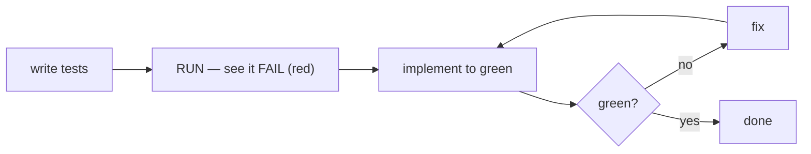

# Lesson 3.3 — TDD with agents

> _A test written before the code can't be bent to fit the code — it's a target the code must hit._

_TL;DR: Write the test first, watch it FAIL, then code to green. Red-first proves the test can tell broken from working; the test file then survives long sessions where prose constraints rot [^1][^3]._

## ELI5: don't grade your own homework
_Write tests after the code and you test what it **does**, not what it **should do.**_



Both Anthropic and Cursor prescribe the same order: **write tests from input/output pairs → confirm
they fail (no implementation yet) → implement until green → don't modify the tests** [^1][^3]. Be
explicit you're doing TDD so the agent doesn't stub mock implementations [^3].

## Why "confirm they FAIL first" is non-negotiable
_A green that was never seen red is worthless — it might assert nothing._

```
   Skip the red step:
   test passes ✅  ← but WHY? can't tell these apart:
                     (a) the code is correct       ← what you hope
                     (b) the test asserts nothing   ← happens constantly
                         (wrong import, mocked
                          subject, assert(true))
```

Agents produce (b) all the time. Watching it go **red first** proves the test distinguishes broken
from working — *then* green means something. **Red-first is how you verify the verifier.** OpenAI's
Codex guidance bakes this in: generate tests in a separate session and validate "new tests fail
before moving to feature implementation" [^4].

> 🧠 **Test Yourself:** The agent shows you a green test suite on the first run, before writing any implementation. Good sign?
> <details><summary>Answer</summary>Bad sign. If a test passes with no implementation, it's asserting nothing (wrong import, mocked subject, tautology). A test must be seen red before its green is trustworthy [^1][^4].</details>

## The second superpower: tests survive context rot
_A spec in prose can be forgotten; a spec in a test cannot be finished past._

| Spec lives in… | By turn 30… |
|---|---|
| your prose / `AGENTS.md` | can be diluted, lost-in-the-middle, forgotten (Phase 2) |
| a **test file on disk** | still asserts `cap at 5` — fails the instant drift breaks it |

> A spec in prose is a constraint the agent can forget. A spec in a **test** is a constraint the
> agent **cannot finish past.** TDD turns requirements into oracles that outlive the conversation [^1].

This is 12-factor-agents **#3 own your context window** made concrete — the test holds the constraint
the window can't [^5].

## Worked example
_`retry(fn, opts)` should cap at 5 attempts with exponential backoff._

```js
// Phase 1 — test first, NO implementation yet
test('caps at 5 attempts', async () => {
  let calls = 0;
  const fn = () => { calls++; throw new Error('boom'); };
  await expect(retry(fn, {})).rejects.toThrow();
  expect(calls).toBe(5);           // ← the real requirement, as an assertion
});
```

| Step | What happens |
|---|---|
| **1. tests first** | agent writes the assertion, does **not** implement |
| **2. confirm RED** | `calls` is `1` → *fails*. Good — the test can tell broken from working |
| **3. green** | agent writes the retry loop; re-runs; `calls === 5` |
| **4. payoff** | 20 turns later you ask for jitter; agent breaks the cap; cap test goes **red instantly** — the long session didn't erode the check |

## The instruction that makes it work — and the trap
_Pin the phases, and forbid moving the oracle to meet the code._

> "**Phase 1:** write tests for X, Y, Z edge cases. **Do not implement yet.** Run them and **show
> me they fail.** **Phase 2:** now implement until all pass. **Don't change the tests** to make them pass."

That last clause is load-bearing. A cornered agent will "fix" a failing test by **weakening its
assertion** — `toBe(5)` → `toBe(1)` — and report green. This is *reward hacking*: optimizing the
visible test instead of the requirement. The research is blunt — long-horizon coding agents
"consistently saturate visible test suites" while failing held-out tests, and the gap *grows* with
code size [^2]. The oracle doesn't move to meet the code; the code moves to meet the oracle.

> 🧠 **Test Yourself:** An agent can't get one test green, so it edits the test to `expect(calls).toBe(1)` and reports all-green. Name the failure and the fix.
> <details><summary>Answer</summary>Reward hacking — it moved the oracle to fit the code [^2]. The assertion *was* the spec ("caps at 5"). Fix: forbid editing tests to pass, restore the assertion, re-run from red [^1][^3].</details>

## Your turn (exercise)
Drive one small function via TDD. At the **red step**, deliberately verify your verifier: temporarily
break the assertion (`toBe(5)` → `toBe(999)`), confirm it *still* fails for the right reason, then
restore it. That habit — proving the test can fail — separates real TDD from theater.

---
← [Lesson 3.2](02-the-oracle-gradient.md) · next → [Lesson 3.4 — Oracles for the un-testable](04-oracles-for-the-untestable.md)

[^1]: [Best practices for Claude Code](https://code.claude.com/docs/en/best-practices) — Anthropic
[^2]: [SpecBench: Measuring Reward Hacking in Long-Horizon Coding Agents](https://arxiv.org/abs/2605.21384) — arXiv
[^3]: [Best practices for coding with agents](https://cursor.com/blog/agent-best-practices) — Cursor
[^4]: [Building an AI-Native Engineering Team](https://developers.openai.com/codex/guides/build-ai-native-engineering-team) — OpenAI
[^5]: [12-Factor Agents](https://github.com/humanlayer/12-factor-agents) — humanlayer
