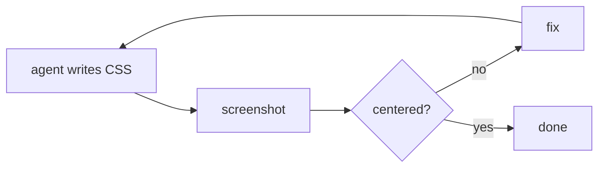

# Lesson 3.4 — Oracles for the un-testable

> _When you can't write `expect()`, give the agent eyes: render, screenshot, compare, fix._

_TL;DR: UI work has no clean assertion for "looks right." The oracle becomes an image the agent looks at — screenshot vs. baseline (regression) or screenshot vs. intent (build loop). Same closed loop as TDD [^1]._

## ELI5: a passing suite can sit on a broken page
_"Center the button, make errors red" has no meaningful unit test._

```
   testable logic            un-testable surface (UI)
   ┌──────────────┐          ┌──────────────────────────┐
   │ run assert   │          │ render ─► screenshot ─►   │
   │ pass / fail  │          │ compare to baseline/spec  │
   └──────────────┘          │ → "looks wrong" = fail    │
                             └──────────────────────────┘
```

You can assert `color === '#ff0000'`, but not *"it looks right."* A green suite can sit on a page
with overlapping text, an off-screen button, a modal behind the backdrop. The oracle becomes **an
image the agent can look at** — Anthropic lists "a browser screenshot compared against a design" as a
first-class check, right next to tests and build exit codes [^1].

## The two flavors of visual oracle
_One guards against regressions; one drives the build toward intent._

| Flavor | Baseline? | Loop | Catches |
|---|---|---|---|
| **Screenshot-diff** (regression) | yes — known-good image | render → diff pixels → over threshold = fail | "changed the header, broke the footer" |
| **Visual feedback** (matches intent?) | no — you're building it | render → look → "centered?" → fix | "plausible CSS that renders wrong" |



Same self-correcting loop as TDD — **render-look-fix** instead of **run-fail-fix.** Anthropic's
prescribed prompt is literally: *"implement this design. take a screenshot of the result and compare
it to the original. list differences and fix them"* [^1].

> 🧠 **Test Yourself:** Your unit tests are green but the dashboard looks broken in the browser. What does that tell you?
> <details><summary>Answer</summary>Logic tests pass over a visually broken surface — "equal height" is a render-time property assertions can't capture. This work needs a screenshot/visual oracle, not more unit tests [^1].</details>

## Worked example
_"Make pricing cards equal height, align CTA buttons to the bottom."_

| | |
|---|---|
| **Logic test** | can't express "equal height" — flexbox computes it at render time |
| **Visual oracle** | agent renders `/pricing`, screenshots, *looks*: middle card taller, button floats mid-card → adds `align-items: stretch` + `margin-top: auto` → screenshots again → three equal cards. Proved by looking, not guessing [^1] |
| **Regression guard** | that final screenshot becomes the **baseline**; next week's padding change is diffed against it |

## Per-agent note (capability differs — degrade gracefully)
_Where the agent can't see, route the image to you — the loop is the same; the eyes move._

| Capability | Claude Code | Codex | Cursor |
|---|---|---|---|
| Agent views screenshots | ✅ native (paste / browser MCP) | partial | ✅ native |
| Drive a real browser | via browser tool / Playwright MCP | via tools | via MCP |

> Visual feedback is strongest on **Claude/Cursor**, which ingest the image directly [^1][^2]. Where an
> agent can't *see*, the oracle downgrades: still render and screenshot, but route the image to
> **you** for the look-fix step — you become rung ① of the gradient *for the visual layer only.* The
> trap is having *no* visual check and trusting CSS because it parsed.

> 🧠 **Test Yourself:** An agent can't view images. Does that mean you skip the visual oracle?
> <details><summary>Answer</summary>No — you downgrade it. Still render and screenshot, but you do the look-fix step. The loop survives; the eyes are temporarily yours. No visual check at all is the real failure [^1].</details>

## Your turn (exercise)
On your next UI tweak, force the loop: have the agent **screenshot before and after** and put the two
side by side. Find one thing the change broke that you weren't thinking about — a wrapped label, a
shifted neighbor. That "I wouldn't have caught that by reading the diff" moment is exactly why visual
work needs a visual oracle — code review can't see pixels [^2].

---
← [Lesson 3.3](03-tdd-with-agents.md) · next → [Lesson 3.5 — What the scaffolder automates](05-scaffolder-test-gate.md)

[^1]: [Best practices for Claude Code](https://code.claude.com/docs/en/best-practices) — Anthropic
[^2]: [Best practices for coding with agents](https://cursor.com/blog/agent-best-practices) — Cursor
