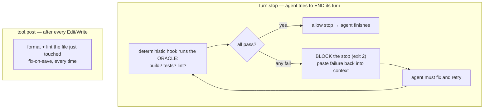

# Lesson 3.5 — What the scaffolder automates for you

> _Don't ask "please run the tests." Make the build a gate the agent literally can't finish past._

_TL;DR: Phase 3's scaffolder artifact is the **`Stop`-gate** — a deterministic hook that blocks the turn from ending until build/test/lint pass — plus **post-edit lint/format** hooks. This is rung ③, generated portably across agents [^1][^3]._

> **Lockstep lesson.** Every phase ends by showing what the companion *scaffolder* generates so you
> don't hand-build it. Phase 3's artifact is the **`Stop`-gate** + **post-edit hooks.**

## ELI5: a turnstile, not a reminder
_A reminder you can ignore; a turnstile you can't — the `Stop`-gate is the turnstile at the exit._

Imagine telling someone "please check the lights are off on your way out" — they might, they might
not. A **`Stop`-gate** is instead a **turnstile at the exit**: it won't let the agent leave the
building until the build, tests, and lint are all green. No asking, no trusting — the door simply
stays locked while anything is red.

## The problem this solves
_Rungs ① and ② rely on the agent choosing to check — and that reliance rots._

Lesson 3.2 climbed the gradient and stopped at the line that matters: rungs ① and ② **depend on the
agent choosing to run the check.** As context rots (Phase 2), that fails — on turn 30 the agent says
"tests pass" without running them. You need the check **enforced by the harness, not requested in
prose.** Anthropic is explicit: hooks "are deterministic and guarantee the action happens," unlike
advisory `CLAUDE.md` instructions — use them "for actions that must happen every time with zero
exceptions" [^1].

So we don't write *"please remember to run the tests"* in `AGENTS.md`. We make it **deterministic.**

## The gate the scaffolder generates
_Two layers: continuous hygiene on every edit, a hard gate on every turn-end._



| Layer | Canonical event | Job |
|---|---|---|
| **Post-edit** | `tool.post` | *continuous hygiene* — format + lint each edited file so style never piles up |
| **Stop-gate** | `turn.stop` | *the hard gate* — agent **may not end its turn** while build is broken or tests red |

The Stop-gate is "looks done isn't done" (Lesson 3.1) **enforced in code.**

## The design choices (interview-grade)
_Deterministic, feeds failure back, and is literally the verification loop._

| Choice | Why it matters |
|---|---|
| **Deterministic, not an LLM call** | shells out to `npm test` / `cargo build`, reads the exit code — fast, free, unfoolable; no model judgment about "probably fine" [^1] |
| **Feeds the failure back into context** | exit 2 surfaces stderr to the agent, so its next turn has the exact error to fix — the gate *teaches as it blocks* [^2] |
| **It IS the verification loop, concrete** | *mistake blocked → reason captured → rule reinforced* — the broken build **is** the blocked mistake |

> **Exit-code semantics (Claude):** a `Stop` hook that exits **2** prevents Claude from stopping and
> continues the turn; stderr is fed back as the error to fix [^2]. One guardrail worth knowing: Claude
> Code overrides the Stop hook and ends the turn after **8 consecutive blocks**, so the gate can't
> trap the agent in an infinite loop on a genuinely unfixable failure [^1].

> 🧠 **Test Yourself:** Why does the gate **paste the failing output back** instead of just blocking the stop?
> <details><summary>Answer</summary>Blocking alone tells the agent "no" without telling it *what's wrong*. Feeding stderr back (exit 2) gives the next turn the exact error to fix — the gate teaches as it blocks [^2].</details>

## Why it's portable (Claude / Codex / Cursor)
_The gate binds to canonical events; the adapter renders each agent's native hook._

| Canonical event | Claude | Codex | Cursor |
|---|---|---|---|
| `tool.post` (post-edit lint/format) | `PostToolUse` (Edit\|Write) ✅ | `PostToolUse` ✅ | `afterFileEdit` ✅ |
| `turn.stop` (the test/build gate) | `Stop` (exit 2 blocks) ✅ | `Stop` ✅ | `stop` ⚠️ |

> **The Cursor trap the scaffolder handles for you:** Claude and Codex fail **closed** on a non-zero
> exit, but **Cursor hooks fail *open* by default** — if the `stop` hook errors or isn't marked
> blocking, the agent finishes *anyway*, broken build and all. The scaffolder sets
> **`failClosed: true`** so a failure blocks, matching Claude/Codex semantics. Get this wrong by hand
> and your "gate" silently waves everything through.

> 🧠 **Test Yourself:** You copy a working Claude `Stop` hook into Cursor and the build still "finishes" red. Why?
> <details><summary>Answer</summary>Cursor hooks **fail open by default** — a non-blocking/erroring `stop` hook lets the agent finish anyway. Set `failClosed: true` to match Claude/Codex fail-closed semantics.</details>

## You could build this by hand — but you shouldn't
_Three places to get it subtly wrong; the scaffolder gets all three right, portably._

Hand-writing a Stop hook means getting **exit-code semantics** (2 blocks, 0 allows), the
**feed-failure-back** wiring, *and* each agent's **fail-open/fail-closed default** correct — three
places to ship a gate that doesn't actually gate. The scaffolder emits a correct, portable, tested
version in one command. At the **capstone (Phase 6)** you'll run it and recognize this gate as "oh —
that's rung ③ from Lesson 3.2, automated across all three agents."

## Your turn (exercise)
Write the **goal condition** (Lesson 3.2, rung ②) for a real project as the exact shell the gate runs:

```sh
# the Stop-gate runs this; non-zero exit = block the agent from finishing
npm run build && npm test && npm run lint
```

Run it now. Exit 0? If not, you just found work the agent could currently "finish" on top of. That
one-line pass/fail is precisely what the scaffolder wires into `turn.stop` so the agent can never
again stop above a red build.

---
← [Lesson 3.4](04-oracles-for-the-untestable.md) · [Phase 3 home](index.md) · → [Check your understanding](quiz.md)

[^1]: [Best practices for Claude Code](https://code.claude.com/docs/en/best-practices) — Anthropic
[^2]: [Hooks reference](https://code.claude.com/docs/en/hooks) — Anthropic
[^3]: [Building an AI-Native Engineering Team](https://developers.openai.com/codex/guides/build-ai-native-engineering-team) — OpenAI
