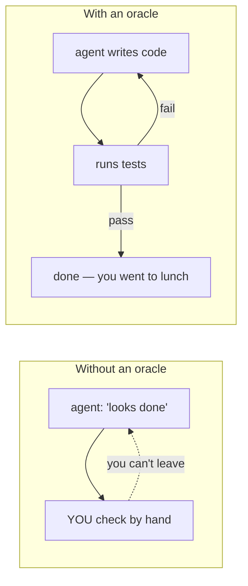
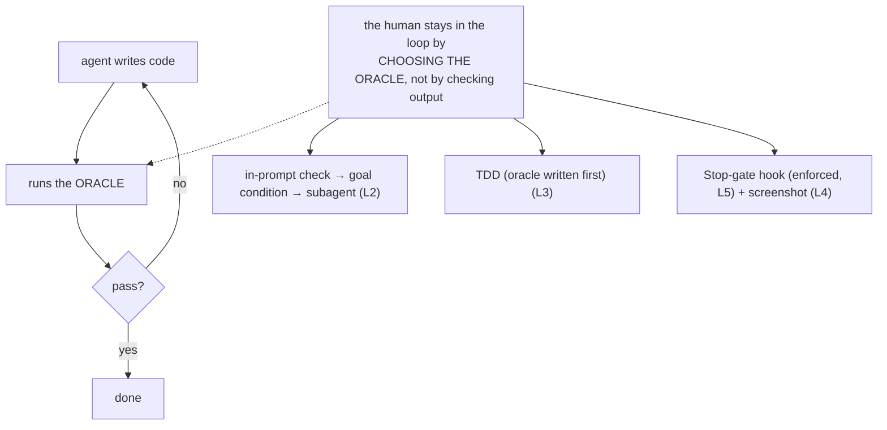

# Phase 3 — Verification & TDD ★★★

> **Load-bearing phase.** Context engineering (Phase 2) decides how *sharp* the agent is.
> Verification decides whether you can ever *trust* its output. Across every source — Anthropic,
> OpenAI's harness engineering, Cursor, 12-factor-agents — an **external oracle** is named the single
> highest-leverage practice [^1][^3][^4]. It is the gate between *watching the agent* and *walking away*.

## Executive summary
_What this phase makes you able to do, and why it matters._

An agent stops when the work **looks done**, because "looks done" is the only signal it has without a
check it can run [^1]. This phase teaches you to hand the agent an **external oracle** — a test, a
build exit code, a linter, a screenshot-diff — so it **closes its own loop** instead of routing every
"done" back through you. You'll learn the **four-rung oracle gradient** (from a prompt line to an
enforced Stop-gate to a fresh-eyes subagent), why **TDD** is the strongest oracle (a test written
*before* the code can't be bent to fit it, and survives long sessions where prose constraints rot
[^1][^3]), and how to verify the genuinely un-testable (UI) with **screenshots**. The payoff: you stop
being the verification loop and start *engineering* it.

**Prerequisite:** Phase 2 (context engineering).

### Learning objectives
By the end you can:
- Explain *why* "looks done" is an agent's natural stopping point — plausibility, not correctness [^1].
- Place any check on the **oracle gradient** (in-prompt → goal condition → Stop hook → subagent) and pick the right rung for the stakes [^1].
- Drive **TDD with an agent**: tests first, confirm-red, code-to-green, and forbid weakening the tests [^1][^3][^4].
- Build a **visual oracle** (screenshot-diff / render-look-fix) for work no `expect()` can check [^1].
- Describe the **`Stop`-gate** the scaffolder generates and the cross-agent fail-open/closed trap it handles [^2].

---

## The big idea (in one sentence)

> An agent keeps going until *something* tells it to stop. If that something is **you eyeballing the
> output**, you are the verification loop — and you can't walk away. If it's an **external oracle the
> agent can run itself**, the loop closes without you [^1].

---

## Lessons (one concept each)

| # | Lesson | The one idea |
|---|---|---|
| 1 | ["Looks done" isn't done](01-looks-done-isnt-done.md) | Without an oracle, *you* are the verification loop. |
| 2 | [The oracle gradient](02-the-oracle-gradient.md) | Four strengths of oracle, from a prompt line to a subagent. |
| 3 | [TDD with agents](03-tdd-with-agents.md) | Tests written first are an oracle the code can't fake. |
| 4 | [Oracles for the un-testable](04-oracles-for-the-untestable.md) | Screenshot-diffs give UI work a pass/fail check. |
| 5 | [What the scaffolder automates](05-scaffolder-test-gate.md) | The `Stop`-gate + post-edit hooks that enforce all of it. |

---

## Phase diagram

---

## Phase exercise (do this for real)

Take a small task you'd normally one-shot ("add a `slugify` helper").

1. **First, the wrong way.** Ask the agent to implement it. When it says "done," resist checking —
   just notice the urge. *You* are the oracle right now.
2. **Now the right way.** `/clear`. Ask the agent to **write failing tests first** (edge cases: empty
   string, unicode, leading/trailing spaces), **confirm they fail**, then implement until they pass.
3. Watch it run the tests itself, see red, fix, see green — with you doing nothing.

Write 3 sentences on how the second run *felt* different. That feeling — handing the agent a check it
can run without you — is the entire phase.

---

## Cheatsheet

### Key terms
_What people say vs. what it actually means._

| Term | What people say | What it actually means |
|---|---|---|
| **Oracle** | "the tests" | *any* pass/fail signal the agent can read in the conversation — test, build exit code, linter, screenshot-diff [^1] |
| **"Looks done"** | "the agent finished" | the agent halted on **plausibility** (resembles complete code), which is *not* correctness [^1] |
| **TDD** | "writing tests" | tests written **before** code, **confirmed red first**, never weakened — an oracle the code can't fake [^1][^3] |
| **Confirm-red** | "an optional nicety" | the load-bearing step: a green never-seen-red could assert nothing — it's how you *verify the verifier* [^4] |
| **Stop-gate** | "a pre-commit hook" | a `turn.stop` hook that **blocks the agent from finishing** until build/test/lint pass [^2] |
| **Verification subagent** | "a second pass" | a **fresh-context** reviewer that sees only the diff — "the agent doing the work isn't the one grading it" [^1] |
| **Reward hacking** | "the agent cheated" | optimizing the *visible* check (e.g., weakening an assertion) instead of the requirement [^2] |
| **Fail-open / fail-closed** | "the hook ran" | on a hook error: fail-**open** lets the agent finish anyway; fail-**closed** blocks it. Cursor defaults open [^2] |

### The oracle gradient (rung → strength)

| Rung | Oracle | Enforced by | Removes |
|---|---|---|---|
| ① | in-prompt check | agent's choice | ambiguity about *what* to run |
| ② | goal condition (`/goal`) | agent + auto-evaluator | ambiguity about *what "done" is* |
| ③ | **Stop hook** | the harness | the ability to *skip* the check |
| ④ | verification subagent | independent model | the ability to *rationalize* the result |

### Agent cheat-sheet (the oracle is universal; enforcement differs)

| Move | Claude Code | Codex | Cursor |
|---|---|---|---|
| Name the oracle in the prompt | "run `npm test`, all green" | same | same |
| Post-edit lint/format | `PostToolUse` (Edit\|Write) | `PostToolUse` | `afterFileEdit` |
| Refuse to finish until green | `Stop` hook (exit 2 blocks) | `Stop` hook | `stop` hook (set `failClosed`) |
| Fresh-eyes verification | verification **subagent** | subagent | subagent |
| See UI changes | screenshot via browser tool/MCP | partial | native screenshot/MCP |

> The oracle is *universal*; only the **enforcement mechanism** differs. Lesson 5 shows the scaffolder
> generating the right hook per agent — including Cursor's fail-**open** default, which silently lets
> a broken build "finish" unless you flip `failClosed` [^2].

---

→ **[Check your understanding](quiz.json)**

---
← [Phase 2 — Context Engineering](../02-context-engineering/index.md) · next phase → [Phase 4 — Session & Memory Discipline](../04-session-and-memory/index.md)

[^1]: [Best practices for Claude Code](https://code.claude.com/docs/en/best-practices) — Anthropic
[^2]: [Hooks reference](https://code.claude.com/docs/en/hooks) — Anthropic
[^3]: [Best practices for coding with agents](https://cursor.com/blog/agent-best-practices) — Cursor
[^4]: [Building an AI-Native Engineering Team](https://developers.openai.com/codex/guides/build-ai-native-engineering-team) — OpenAI
