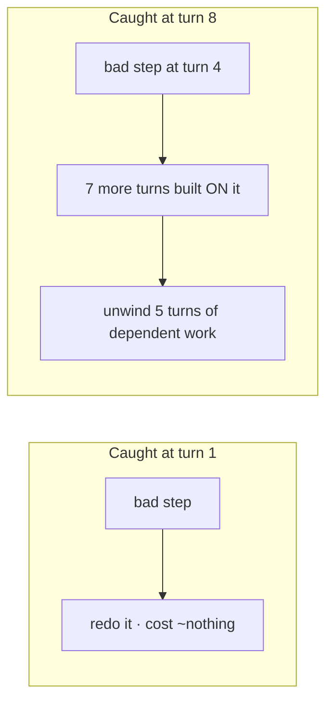
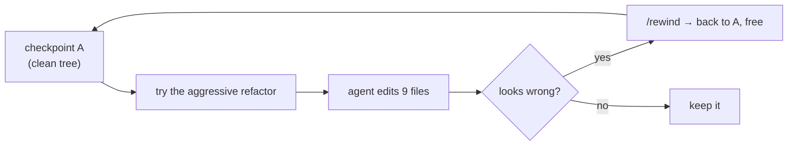

# Lesson 4.1 — Course-correct early

> _Catch the wrong turn at turn 1, not turn 8._

_TL;DR (1–2 lines): The instant the agent states a wrong assumption or makes a wrong edit, **interrupt and redirect** — and keep a cheap checkpoint so risky attempts cost seconds, not hours._

## ELI5 — the driving directions
_Correcting a wrong turn immediately is always cheaper than untangling ten minutes of wrong driving._

You're giving a friend directions. They miss the turn. Do you (a) wait ten minutes then untangle where you both ended up, or (b) say "wrong turn — pull over" the instant it happens? (b) wins every time. Same with an agent: the moment its first edit goes the wrong way, **stop it.**

## Why people *don't* interrupt (and why they should)
_The agent builds on the bad step, so waiting multiplies the cleanup — interrupting early is the highest-leverage live-steering habit._

There's a sunk-cost reflex: "it's almost done, let me just let it finish and fix it after." But the agent doesn't pause at the wrong turn — it **builds on it.** By the time it "finishes," the bad decision is load-bearing under four other changes. This is why you own your control flow and don't let a bad step compound silently [^2]. Anthropic's own guidance is blunt: *"correct Claude as soon as you notice it going off track"* — tight feedback loops produce better solutions faster [^1].

> **The rule:** the instant the agent states a wrong assumption or makes a wrong edit, **interrupt and redirect.** Don't wait for the turn to complete.

> 🧠 **Test Yourself:** Why is interrupting at turn 1 disproportionately cheaper than at turn 8 — beyond just "less code written"?
> 

Answer
Because the agent **builds later edits on the bad step**, so the wrong decision becomes load-bearing under everything after it. The cleanup isn't linear — you unwind the bad step *and* every dependent change stacked on top.

## Checkpoints make risk cheap
_If reverting is one keystroke, you'll happily license bold attempts you'd never dare on a precious working tree._

Interrupting is reactive. The proactive half is making the wrong path **cheap to abandon entirely.** If reverting is one keystroke, you'll let the agent attempt a risky refactor — worst case, you rewind and lose seconds.

> _Risk is licensed BECAUSE undo is cheap._

Checkpoints aren't a net you hope never to use — they're an **enabler.** Claude snapshots files before each change so `/rewind` (or `Esc Esc`) can restore conversation, code, or both [^1]. **But its own docs warn: checkpoints only track changes made *by Claude*, not external processes — this is not a replacement for git** [^1].

## Worked example
_One sentence at turn 1 beats reverting a dependency plus three call sites at turn 8._

You ask: "add caching to the API client." It announces:

> "I'll add a Redis dependency and a new `CacheManager` service…"

You wanted a tiny in-memory map. Two responses:

| | Action | Cost |
|---|---|---|
| ❌ Let it run | Adds Redis to `package.json`, writes a 200-line service, wires 3 call sites | Revert a dependency **and** untangle call sites |
| ✅ Interrupt now | *"Stop — no new deps. Plain in-memory `Map` with a TTL, in the existing client file only."* | One sentence, zero wasted edits |

And the safety layer: before any multi-file attempt you've got a checkpoint. If even the redirected attempt drifts, `/rewind` (Claude) or `git restore` puts you back on a clean tree instantly.

> 🧠 **Test Yourself:** Claude's checkpoints exist — so why still `git commit` before a risky run?
> 

Answer
Checkpoints only track edits made **by Claude**, not by external processes (your build, a script, another agent), and only Claude ships them. **Git is the universal, complete checkpoint** that works in every agent and captures everything.

## Per-agent mechanics (the instinct is universal; undo differs)
_Interrupt + redirect is portable; only Claude has a built-in conversational rewind, so git is the universal fallback._

| | Claude Code | Codex | Cursor |
|---|---|---|---|
| Interrupt | `Esc` / stop [^1] | `Esc` / stop | stop button |
| Rewind a step | auto-checkpoint + `/rewind` [^1] | **none** — use git | IDE / git history |
| Portable fallback | `git commit` before risk | `git commit` before risk | `git commit` before risk |

> Only Claude ships a built-in conversational `/rewind` [^1]. **Git is the universal checkpoint** that works in every agent: commit (or stash) before a risky run; `git restore` / `git reset` is your rewind. Make it a reflex before any large, speculative change.

## Your turn (exercise)

Next time you hand the agent a non-trivial task:

1. **Before** it starts: `git add -A && git commit -m "checkpoint"` (or rely on `/rewind`).
2. Watch the **first** response only. The moment it states an assumption you didn't intend, interrupt with a one-line correction — don't read further.

Notice how small the correction is at turn 1 versus the mess it would've been at turn 8. That gap is the lesson.

---
← [Phase 4 home](index.md) · next → [Lesson 4.2 — AGENTS.md done right](02-agents-md-done-right.md)

[^1]: [Best practices for Claude Code](https://code.claude.com/docs/en/best-practices) — Anthropic
[^2]: [12-Factor Agents — own your control flow](https://github.com/humanlayer/12-factor-agents) — humanlayer
