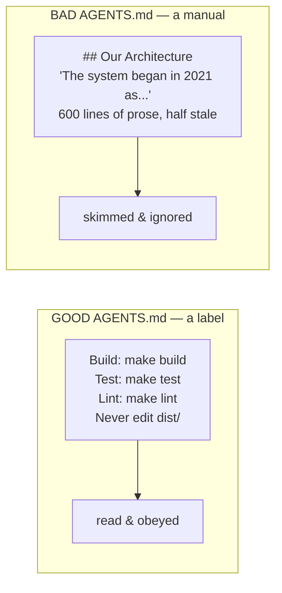

# Lesson 4.2 — AGENTS.md done right

> _A label, not a manual. Every wasted line is rot you pay for every session._

_TL;DR (1–2 lines): `AGENTS.md` is loaded on the desk every session, so keep it short, imperative, and command-first — and apply one test to every line: "would removing this cause a mistake? If not, cut it."_

## ELI5 — the note on the toolbox
_A good steering file is a few crisp lines a contractor actually reads; a 40-page history gets skimmed and the one line that mattered gets missed._

`AGENTS.md` is the note you tape to a new contractor's toolbox on day one. Good note: "build with `make`, tests in `/test`, never touch generated `dist/`." Bad note: a 40-page company history — skimmed, and they drill into `dist/` anyway.

The note loads onto the desk (Phase 2) **every single session.** So every wasted line is rot you pay for forever.



## The counterintuitive law
_Longer steering files measurably *reduce* adherence — the rule that matters drowns in the rules that don't._

> **Bloated `AGENTS.md` files cause the agent to ignore your actual instructions.** [^1]

That's not folklore — it's Anthropic's documented warning [^1]. Dilution is real (Phase 2's context rot) and it applies to your own config. So every line earns its place by one test, verbatim from the docs:

> **"Would removing this line cause the agent to make a mistake? If not, cut it."** [^1]

Apply it line by line. Most real-world files lose 30–60% on the first pass — and the agent gets *more* obedient, not less. The docs add the tell: *"If the agent keeps doing something you don't want despite a rule against it, the file is probably too long and the rule is getting lost."* [^1]

> 🧠 **Test Yourself:** A teammate adds five rules to `AGENTS.md` to "make the agent more reliable," and adherence gets *worse*. What happened?
> <details><summary>Answer</summary>**Dilution.** Every added line lowers the signal-to-noise ratio, so the rules that matter get buried and ignored. More steering ≠ more control — past a point it's *less*. The fix is to prune, not to add.</details>

## What goes IN vs OUT
_Commands, imperatives, and non-obvious facts go in; stale narratives, anything inferable from code, and every-time rules stay out._

| ✅ Include [^1] | ❌ Exclude [^1] |
|---|---|
| Bash commands the agent can't guess (`Run tests: pnpm test`) | Anything the agent can learn by reading the code |
| Code style that differs from defaults | Standard conventions the model already knows |
| Test instructions + preferred runner | Detailed API docs (link instead) |
| Repo etiquette (branch naming, PR rules) | Info that changes frequently / stale narratives |
| Project-specific gotchas, required env vars | Self-evident advice ("write clean code") |
| Hard boundaries ("out of scope: `vendor/`") | **Things that must happen *every* time → that's a hook (Lesson 4)** |

Keep it **command-first and imperative.** "Use tabs." "Never commit to `main`." Short, directive, scannable. And keep it **short** — Codex caps the instruction chain (~32 KiB) and walks nearest-file-wins; a fat root file just crowds everything out [^3].

> A sentence saying "always run the formatter" is a *wish*; a format-on-edit hook is a *guarantee* (Lesson 4). If a rule must hold every time, it's the wrong tool — promote it.

## Worked example
_Cut the stale, the inferable, and the every-time rules — what's left is a label._

**Before** (drifting toward a manual):

```markdown
# AGENTS.md
This project is a payments service we started in 2021. It uses a hexagonal
architecture with ports and adapters. The team prefers clean code and we
care a lot about quality, so please always write tests and run them, and
also format your code, and our CI is quite strict about linting...
```

**After** (a label):

```markdown
# AGENTS.md
Build: make build
Test:  make test       # must pass before any commit
Lint:  make lint
Stack: Node + Postgres. Migrations in /db/migrations (never edit applied ones).
Out of scope: vendor/, generated/.
```

Everything cut was **stale** ("started in 2021"), **inferable** ("hexagonal architecture" — read the folders), or a **hook in disguise** ("always run tests/format" → enforce, don't ask).

## The open standard (and how each agent reads it)
_`AGENTS.md` is plain markdown stewarded by the Linux Foundation; Codex and Cursor read it natively, Claude bridges with a one-line `@AGENTS.md`._

`AGENTS.md` is an **open standard** — plain markdown, no required frontmatter, "a README for agents" — stewarded by the Agentic AI Foundation under the Linux Foundation and adopted across 60,000+ projects [^2]. Codex reads it natively before doing any work [^3]; Cursor reads it natively. Claude's native file is `CLAUDE.md`, so you bridge with a one-line import:

```markdown
<!-- CLAUDE.md -->
@AGENTS.md
```

| | Claude Code | Codex | Cursor |
|---|---|---|---|
| Native file | `CLAUDE.md` [^1] | `AGENTS.md` ✅ [^3] | `.cursor/rules` + reads `AGENTS.md` |
| Reads `AGENTS.md`? | via `@AGENTS.md` bridge | natively [^3] | natively |
| Monorepo | nested `CLAUDE.md` on demand [^1] | nested `AGENTS.md`, nearest wins [^3] | nested rules / `AGENTS.md` |

> **Version-control it.** `AGENTS.md` belongs in the repo, reviewed in PRs like code — Anthropic explicitly says to check it into git so the team can contribute and it compounds in value [^1]. A steering change is a behavior change.

> 🧠 **Test Yourself:** Why does Claude need a `CLAUDE.md` with `@AGENTS.md`, while Codex and Cursor don't?
> <details><summary>Answer</summary>`AGENTS.md` is the open standard Codex and Cursor read **natively**. Claude's native knowledge file is `CLAUDE.md`, so the one-line `@AGENTS.md` import bridges Claude to the same shared standard — one source of truth, three agents.</details>

## Your turn (exercise)

Take a real `AGENTS.md`/`CLAUDE.md` and run the removal test on **every line**. Cut everything that fails. For each line you keep, tag it: *guidance* (stays) or *must-happen-every-time* (secretly a hook — Lesson 4). Count lines before and after. If you didn't cut at least a third, you were too gentle — go again.

---
← [Lesson 4.1](01-course-correct-early.md) · next → [Lesson 4.3 — Skills, rules & commands](03-skills-rules-commands.md)

[^1]: [Best practices for Claude Code — Write an effective CLAUDE.md](https://code.claude.com/docs/en/best-practices) — Anthropic
[^2]: [AGENTS.md — the open format for guiding coding agents](https://agents.md/) — Agentic AI Foundation (Linux Foundation)
[^3]: [Custom instructions with AGENTS.md](https://developers.openai.com/codex/guides/agents-md) — OpenAI Codex
