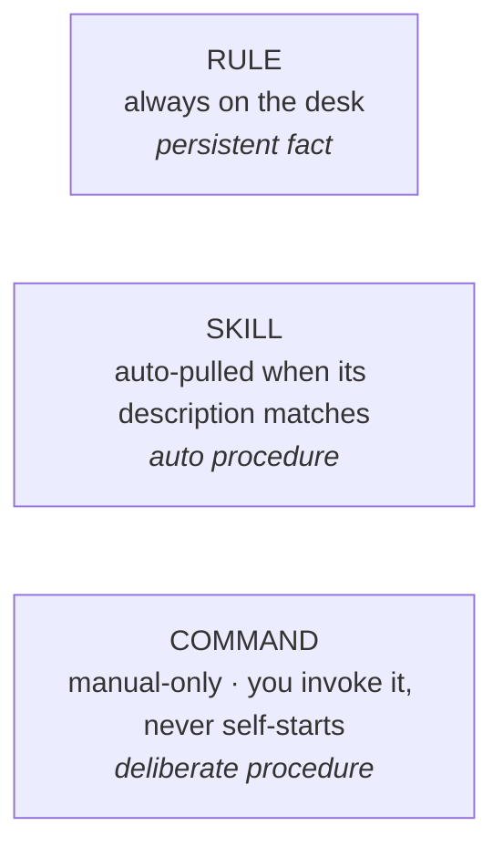
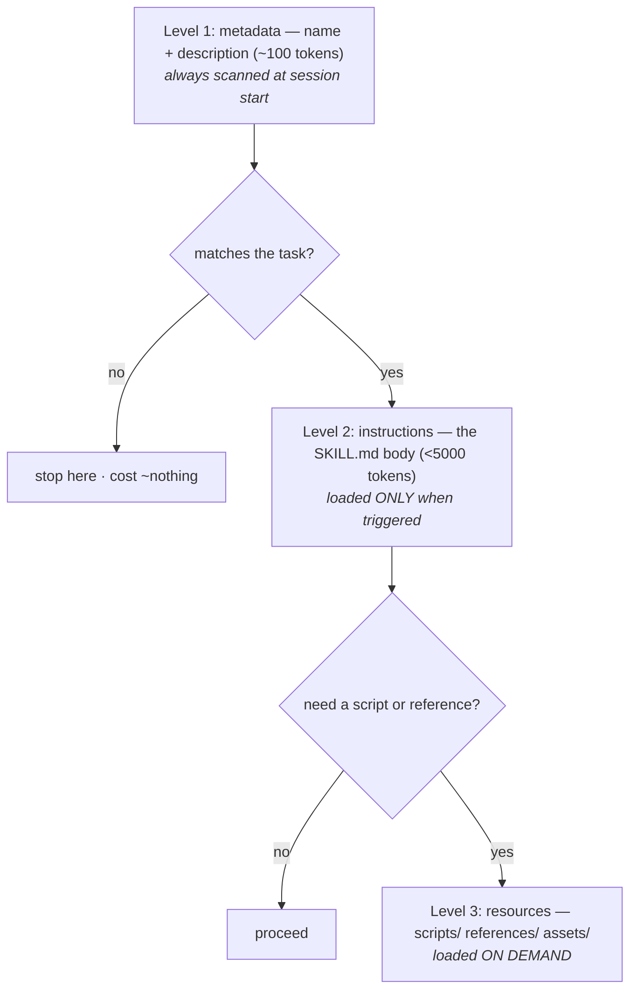

# Lesson 4.3 — Skills, rules & commands

> _Rule = fact always on the desk · Skill = procedure auto-pulled when it matches · Command = the same skill, manual-only._

_TL;DR (1–2 lines): Three ways to give the agent knowledge, differing by *when it shows up* — and progressive disclosure is why fifty skills cost almost nothing while fifty paragraphs in `AGENTS.md` would wreck the desk._

## ELI5 — three places to keep knowledge
_A rule is pinned to the wall (always visible); a skill is a recipe the agent grabs automatically; a command is that recipe, but only when you hand it over._

- **Rule** — a fact pinned to the wall, *always visible.* "We use 2-space indents."
- **Skill** — a recipe card in a drawer the agent **grabs automatically** when the moment matches. "When asked to cut a release, follow `release/SKILL.md`."
- **Command** — the same recipe card, but used **only** when *you* hand it over. "Run `/deploy`" — never on its own initiative.



## The decision
_Pick by relevance and trigger: always-relevant fact → rule; reach-for-it procedure → skill; fire-only-on-demand procedure → command._

| You have… | …it's a | Why |
|---|---|---|
| A persistent **fact / convention** | **Rule** | Always relevant → keep it loaded (briefly!) in `AGENTS.md`/rules. |
| A repeatable **procedure** the agent should reach for on its own | **Skill** | Auto-triggers on a strong `description`; loads only when needed [^1]. |
| A procedure you want fired **only on demand** | **Command** | A skill with `disable-model-invocation: true` [^2]. |

A command is literally **a skill with auto-invocation turned off** — same file, one flag [^2]. Anthropic's docs spell it out: *"Use `disable-model-invocation: true` for workflows with side effects that you want to trigger manually."* [^2] Use it for deploys, destructive migrations, anything where a human should pull the trigger.

> 🧠 **Test Yourself:** You want a release procedure the agent reaches for on its own when you ask to ship, but it must NOT fire during unrelated work. Skill or command?
> <details><summary>Answer</summary>**Skill.** It auto-triggers from its `description` *only when the task matches*, so it fires on "ship a release" and stays dormant otherwise. A **command** is manual-only — it would never fire on its own, breaking the "reaches for it" requirement.</details>

## Progressive disclosure — why skills don't bloat the desk
_The agent loads a skill in three levels — metadata, body, resources — only as deep as the task needs, so dormant skills cost ~nothing._

A skill stays cheap because it loads in **three levels** [^1]:



This is the magic: per the spec, **100 installed skills cost only ~3,000–5,000 tokens at session start** — just their one-line metadata [^1]. You can have fifty skills and pay almost nothing for the forty-nine that don't fire. Contrast `AGENTS.md`, whose *entire* body sits on the desk every session [^2] — which is exactly why `AGENTS.md` must stay tiny and procedures should be **skills**, not paragraphs.

> The spec is concrete: keep `SKILL.md` **under ~500 lines**, push detail into `references/`, and write a `description` that states **what it does AND when to use it**, with concrete trigger keywords [^1].

## Worked example
_Move a repeated procedure out of `AGENTS.md` into a `SKILL.md` with a sharp description; add one flag to make it manual-only._

You keep re-explaining your release process. Don't paste it into `AGENTS.md` (it'd sit on the desk forever, diluting everything). Make it a skill:

```markdown
<!-- .agents/skills/release/SKILL.md -->
---
name: release
description: Cut a versioned release — bump version, changelog, tag, publish.
  Use when the user asks to release, ship a version, or publish the package.
---
1. Confirm `main` is green: `make test`.
2. Bump version in package.json (semver per the change).
3. Update CHANGELOG.md from merged PRs since last tag.
4. Tag `vX.Y.Z` and run `make publish`.
```

Say "let's ship 2.4.0" → the strong `description` makes the agent **auto-pull** the skill; the forty others stay dormant. Want a human in the loop for publishing? One flag turns it into a **command**:

```markdown
---
name: release
description: Cut a versioned release.
disable-model-invocation: true   # now it's a COMMAND: manual-only
---
```

> 🧠 **Test Yourself:** Why does fifty skills cost ~nothing, but moving the same fifty procedures into `AGENTS.md` wrecks the desk?
> <details><summary>Answer</summary>**Progressive disclosure.** Only each skill's ~100-token metadata is scanned at startup; the body loads *only* for the one whose description matches. `AGENTS.md` has its **entire body on the desk every session** — so fifty procedures there is fifty bodies' worth of permanent rot.</details>

## The shared standard (all three agents)
_In 2026 the three agents merged their bespoke command systems into the open `SKILL.md` format — same file, same progressive-disclosure model everywhere._

All three target agents **merged their old command systems into the `SKILL.md` standard** [^1][^2][^3]. Same format, same `name`+`description` frontmatter, same three-level loading:

| | Claude Code | Codex | Cursor |
|---|---|---|---|
| Skill path | `.claude/skills/` [^2] | `.agents/skills/` [^3] | `.agents/skills/` |
| Format | `SKILL.md` ✅ [^2] | `SKILL.md` ✅ [^3] | `SKILL.md` ✅ |
| Manual-only | `disable-model-invocation: true` [^2] | installer-curated [^3] | `disable-model-invocation: true` |

> `.agents/skills/` is the neutral path Codex and Cursor honor; Claude auto-discovers `.claude/skills/`. A portable setup emits canonical `SKILL.md` in `.agents/skills/` and mirrors it into `.claude/skills/` — one authored skill, three agents.

## Your turn (exercise)

Find one procedure you've explained to an agent more than twice (a deploy, a test-data reset, a migration dance). Write it as a `SKILL.md` with a sharp `description` that says *when to use it*. Then decide: auto-fire (skill) or pull-the-trigger (command, add the flag)? Justify in one sentence — that judgment is the whole lesson.

---
← [Lesson 4.2](02-agents-md-done-right.md) · next → [Lesson 4.4 — Prose to hooks](04-prose-to-hooks.md)

[^1]: [Agent Skills — Specification (progressive disclosure)](https://agentskills.io/specification) — agentskills.io
[^2]: [Best practices for Claude Code — Create skills](https://code.claude.com/docs/en/best-practices) — Anthropic
[^3]: [Agent Skills](https://developers.openai.com/codex/skills) — OpenAI Codex
