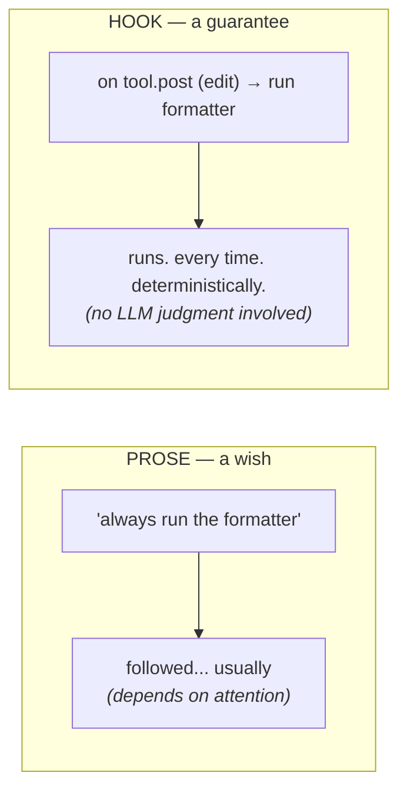
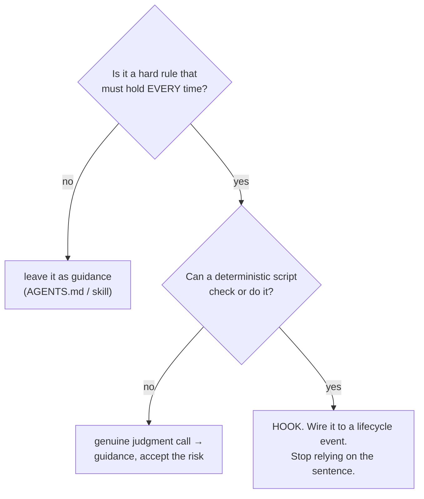

# Lesson 4.4 — Prose to hooks

> _If it must happen every time, it's a hook, not a sentence._

_TL;DR (1–2 lines): Knowledge files are *advisory guidance*; hooks are *deterministic enforcement* wired to lifecycle events. Promote any must-happen-every-time rule out of prose into a hook — and mind the fail-open trap on Cursor._

## ELI5 — the sign vs the spring lock
_A sign asking people to lock the door depends on attention; a spring lock locks itself every time — that's the difference between prose and a hook._

Two ways to keep a door locked:

- **A sign** — "please lock the door." People mean well; some nights they forget.
- **A spring lock** — locks itself every time the door closes. Nobody can forget.

A line in `AGENTS.md` is the **sign.** A hook is the **spring lock.** If something genuinely must happen *every* time, a sign is the wrong tool — no matter how firmly worded.



## The law of this phase
_Guidance is probabilistic; hooks are deterministic — emphasis in prose is the tell that you're reaching for enforcement and should promote to a hook._

> **If it must happen every time, it's a hook, not a sentence.**

This isn't opinion — it's how the agents are built. Anthropic states it directly: *"Unlike CLAUDE.md instructions which are advisory, hooks are deterministic and guarantee the action happens."* [^1] Knowledge files (`AGENTS.md`, skills, rules) are guidance — the agent *might* follow them, usually does, but it's probabilistic. A hook is code wired to a lifecycle event; the agent's attention and mood don't enter into it.

So the moment you catch yourself wording a steering line *really* emphatically — "ALWAYS", "NEVER", "under no circumstances" — that's the tell. Emphasis is you trying to make probabilistic guidance behave like deterministic enforcement. It won't. **Promote it to a hook.**

> 🧠 **Test Yourself:** `AGENTS.md` says in bold **"ALWAYS run tests before declaring done."** On a long session the agent declares done with tests failing. What does this most precisely reveal?
> <details><summary>Answer</summary>The line is **guidance — advisory and probabilistic** — so on a long session context rot buries it. Firmer wording, repositioning, or trimming won't make guidance deterministic. It must be a **hook** (a `Stop`-gate the agent can't skip).</details>

## The promotion test
_Two questions decide it: must it hold every time, and can a deterministic script check it? Two yeses → hook._



Classic prose that's really a hook:

| Prose in AGENTS.md (a wish) | The hook it should be | Canonical event |
|---|---|---|
| "Always format on save" | run formatter after every edit | `tool.post` (Edit\|Write) [^1] |
| "Never read `.env` / secrets" | block reads on secret paths | `tool.pre` (read) [^1] |
| "Don't finish with failing tests" | refuse to stop until `make test` is green | `turn.stop`-gate [^1][^2] |
| "Never commit to `main`" | deny `git commit` on protected branch | `tool.pre` (shell) [^1] |
| "Run lint before declaring done" | run lint, block on failure | `turn.stop` [^1] |

Left as prose, each is a coin flip on a busy session. As a hook, it's a law.

## Worked example — promote a Stop-gate
_The prose line leaves `AGENTS.md` and becomes a `Stop` hook that blocks the turn while tests fail — the guarantee moves from your wording into the runtime._

`AGENTS.md` says, in bold: **"ALWAYS run `make test` before saying you're done."** Watch it fail: turn 19, the desk is full (Phase 2), the agent is confident, declares victory without running tests. Guidance lost to context rot.

Promote it. The prose **leaves** `AGENTS.md`; a `Stop` hook takes its place:

```jsonc
// .claude/settings.json — exit 2 on a Stop hook blocks the turn from ending [^1]
{
  "hooks": {
    "Stop": [{ "command": "make test || exit 2" }]
  }
}
```

On exit-2, a `Stop` hook tells Claude to **keep working** rather than finish — the failure is fed back and the agent iterates until tests pass [^1]. No emphasis, no hoping; the guarantee moved into the runtime. (Anthropic notes Claude overrides the gate after a fixed number of consecutive blocks, so the loop can't wedge forever [^2].)

> 🧠 **Test Yourself:** On a `Stop` hook, what does **exit code 2** do — and why isn't that the same as exit 1?
> <details><summary>Answer</summary>Exit **2** is a *blocking* error: it stops the turn from ending and feeds the message back so the agent keeps working. Exit **1** (and other non-zero codes) are non-blocking — the action proceeds anyway. Only exit 2 enforces [^1].</details>

## The two portability traps
_Cursor fails *open* by default (a broken security hook is silently ignored), and events are near-portable but not identical — author canonical, render native._

If you ship hooks across agents, two facts will bite you:

| Trap | What bites you | The fix |
|---|---|---|
| **Fail-open vs fail-closed** | Claude & Codex fail **closed** on exit-2 (block sticks). **Cursor fails *open* by default** — a crashed/timed-out/invalid security hook is *ignored* [^3] | Set **`failClosed: true`** on Cursor security hooks [^3] — without it, a "never read secrets" hook is decoration |
| **Events near-portable, not identical** | Cursor splits `tool.pre` into `beforeShellExecution` / `beforeReadFile`, and lacks `compact.post` / `session.end` [^3] | Author against the **canonical** event; let an adapter render the native one |

A guardrail that fails open isn't a guardrail. Cursor's own docs flag `failClosed: true` as "recommended for security-critical" hooks — opt in explicitly [^3].

> 🧠 **Test Yourself:** You ship one `.env`-read-blocking hook to Claude, Codex, and Cursor. It blocks on Claude and Codex but silently lets `.env` reads through on Cursor. Most likely cause?
> <details><summary>Answer</summary>**Cursor fails open by default** — a failing/erroring security hook is ignored unless you set `failClosed: true` [^3]. Claude and Codex fail closed, which is why it worked there. (Cursor *does* have pre-read events — `beforeReadFile` — so it's not a missing-event problem.)</details>

## Your turn (exercise)

Grep your steering files for `ALWAYS`, `NEVER`, `must`, `every time`. Each hit is a suspect. Pick the strongest and answer: *can a deterministic script enforce it?* If yes, sketch the hook — which event (`tool.pre`, `tool.post`, `turn.stop`?) and the one-line command — and **delete the prose.** You've just converted a wish into a guarantee.

---
← [Lesson 4.3](03-skills-rules-commands.md) · next → [Lesson 4.5 — What the scaffolder automates](05-scaffolder-steering.md)

[^1]: [Claude Code hooks — events & exit-code behavior](https://code.claude.com/docs/en/hooks) — Anthropic
[^2]: [Best practices for Claude Code — Stop-hook gate](https://code.claude.com/docs/en/best-practices) — Anthropic
[^3]: [Cursor hooks — events & failClosed](https://cursor.com/docs/agent/hooks) — Cursor
