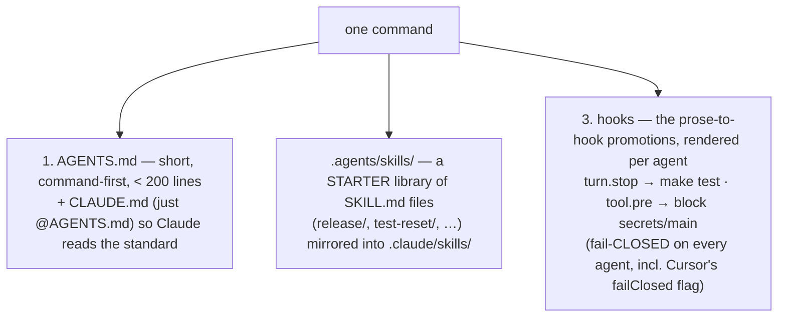

# Lesson 4.5 — What the scaffolder automates for you

> _Author the discipline once; the scaffolder ships it correctly to three agents._

_TL;DR (1–2 lines): The companion scaffolder emits the Phase 4 artifacts — a short `AGENTS.md` (+ `CLAUDE.md` bridge), a `.agents/skills/` starter library, and the prose-to-hook promotions — rendered per agent with the fail-closed trap handled for you._

> **Lockstep lesson.** Every phase ends by showing what the companion *scaffolder* generates so you don't do this by hand. Phase 4's artifacts: the **`AGENTS.md`**, a **`.agents/skills/` starter library**, and the **prose-to-hook promotion.**

## ELI5 — write the recipe once, print it in three languages
_You author the discipline a single time; the scaffolder "translates" it into each agent's native dialect — like writing one recipe and having a machine print it in English, French, and Spanish, getting every measurement conversion right._

You know how to do this phase by hand now. But doing it correctly for **three** agents means a bridge file, two skill directories, and hooks hand-translated into three sets of event names — fiddly, error-prone bookkeeping. The scaffolder is the translation machine: you write the recipe once (canonical `AGENTS.md` + `SKILL.md` + canonical hooks), and it prints the correct native dialect for Claude, Codex, and Cursor — including the easy-to-forget `failClosed: true` so nothing fails open.

## The problem this solves
_Doing the discipline by hand for three agents means a bridge file, duplicated skill paths, and hand-translated hooks with the right fail-open semantics — exactly the fiddly work a scaffolder should own._

Lessons 4.2–4.4 taught the discipline: tiny `AGENTS.md`, procedures as skills, must-haves as hooks. By hand, for *three* agents, that means:

| By hand you'd… | …and get wrong |
|---|---|
| Write portable `AGENTS.md` + a `CLAUDE.md` bridge | bridge drift, a fat root file |
| Author `SKILL.md` in the path each agent honors | skills in the wrong directory, silently inert |
| Hand-translate each hook to native event names | `tool.pre` → `beforeShellExecution`/`beforeReadFile` mismatches |
| Get fail-open/closed right per agent | Cursor's silent fail-open `.env` leak |

## What the scaffolder generates
_One command emits a short `AGENTS.md` + bridge, a mirrored skills starter library, and the hook promotions rendered fail-closed on every agent._

The interview-grade design choices:

- **One source, three agents.** You author canonical `AGENTS.md` + `SKILL.md` + canonical hook events; an **adapter** renders each agent's native form — the same author-once pattern Spec Kit uses to support 30+ agents. No hand-translation, no drift between what Claude, Codex, and Cursor see.
- **A label, not a manual.** The generator emits a *short*, command-first file because it knows the Lesson 4.2 law: longer steering reduces adherence [^1]. It won't pad it.
- **Procedures → skills, hard rules → hooks.** It makes the Lesson 4.4 promotion *for* you — "always run tests" becomes a `turn.stop` gate [^1], "never read `.env`" a `tool.pre` block [^2] — instead of a sentence you hope survives the session.

> 🧠 **Test Yourself:** Why does the scaffolder author hooks against *canonical* events instead of writing native Claude/Codex/Cursor hooks directly?
> 

Answer
So one authored spec renders to all three via an **adapter** — no hand-translation and no drift. Native event names differ (Cursor splits `tool.pre` into `beforeShellExecution`/`beforeReadFile`), so authoring canonical and adapting per agent is the only way to stay portable and correct.

## Why it's portable (Claude / Codex / Cursor)
_Hooks bind to canonical events; the adapter renders each agent's native form and sets `failClosed: true` on Cursor's security hooks so nothing fails open._

| Canonical event | Claude [^3] | Codex [^4] | Cursor [^2] |
|---|---|---|---|
| `tool.pre` | `PreToolUse` | `PreToolUse` | `beforeShellExecution` / `beforeReadFile` |
| `tool.post` | `PostToolUse` | `PostToolUse` | `afterFileEdit` / `afterShellExecution` |
| `turn.stop` | `Stop` | `Stop` | `stop` |

And it sets **`failClosed: true`** on Cursor's security hooks — because Cursor fails *open* by default [^2] (Lesson 4.4), and a guardrail that fails open is no guardrail. The scaffolder gets that trap right so you don't ship a decorative `.env` block.

## You could build this by hand — but you shouldn't
_That's the whole point: the scaffolder emits a correct, portable, tested version in one command, so the discipline ships right across all three agents._

By hand you'd write the bridge file, duplicate skills into two paths, translate every hook into three sets of event names, and remember Cursor's fail-open default on every security hook. The scaffolder emits a correct, portable version in one command — short `AGENTS.md`, mirrored skills, fail-closed hooks.

When you reach the **capstone (Phase 6)**, you'll run the scaffolder and recognize these artifacts: *"oh — that's the `AGENTS.md`/skills/hooks discipline Phase 4 taught me, automated and made portable."*

> 🧠 **Test Yourself:** The scaffolder emits a `.agents/skills/release/` skill *and* mirrors it into `.claude/skills/`. Why both paths?
> 

Answer
`.agents/skills/` is the neutral path **Codex and Cursor** honor; Claude auto-discovers `.claude/skills/`. Mirroring the one authored `SKILL.md` into both gives full three-way coverage from a single source.

## Your turn (exercise)

Sketch the three artifacts for one real project, by hand, on paper:

1. A 10-line `AGENTS.md` (commands + boundaries only — apply the removal test).
2. One `SKILL.md` heading + `description` for a procedure you repeat.
3. One prose-to-hook promotion: name the `ALWAYS`/`NEVER` line and the canonical event it maps to.

If all three fit on one page, you've internalized the phase — and you'll see exactly what the scaffolder is doing the day you run it.

---
← [Lesson 4.4](04-prose-to-hooks.md) · [Phase 4 home](index.md) · → [Check your understanding](quiz.md) · next phase → [Spec-Driven Development](../05-spec-driven-development/index.md)

[^1]: [Best practices for Claude Code](https://code.claude.com/docs/en/best-practices) — Anthropic
[^2]: [Cursor hooks — events & failClosed](https://cursor.com/docs/agent/hooks) — Cursor
[^3]: [Claude Code hooks — events](https://code.claude.com/docs/en/hooks) — Anthropic
[^4]: [Hooks](https://developers.openai.com/codex/hooks) — OpenAI Codex
