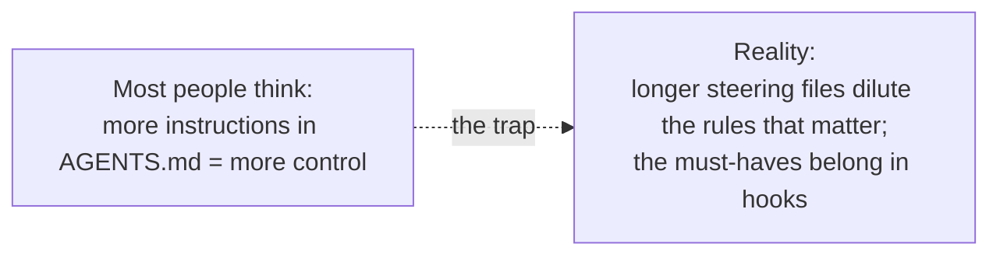
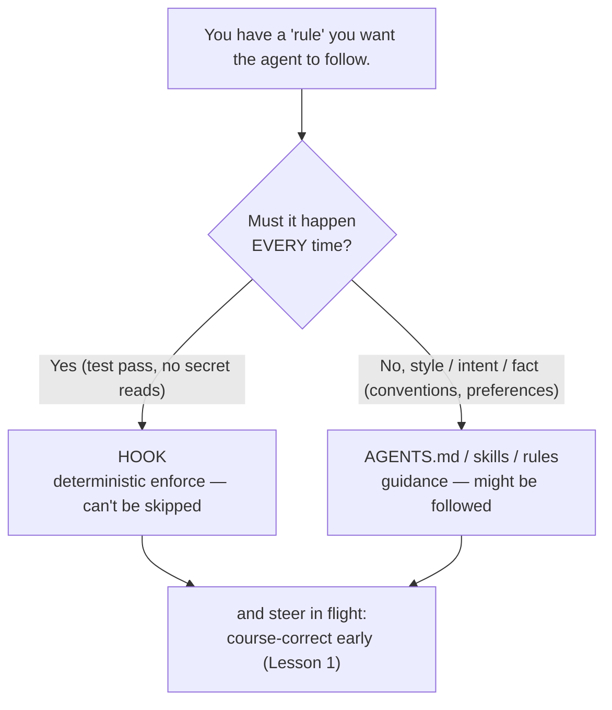

# Phase 4 — Session & Memory Discipline ★★

> _A steering file is a suggestion the agent might follow; a hook is a rule it cannot skip._

## Executive Summary

_What this phase makes you able to do, and why it matters._

This phase teaches you to **steer the agent in flight and across sessions.** You'll learn to course-correct the moment drift appears (at turn 1, not turn 8), author *minimal* steering files (`AGENTS.md` + skills), and — the load-bearing skill — **promote must-always-happen rules out of prose into deterministic hooks.** The spine: knowledge files are *advisory guidance* [^1], hooks are *deterministic enforcement* [^3]. The counterintuitive law underneath it all is that **bloated steering files measurably *reduce* adherence** [^1] — so the discipline is knowing which "rules" must become hooks, and keeping the rest ruthlessly short.

**Prerequisite:** Phase 2 (context engineering) and Phase 3 (verification & TDD).

### Learning objectives

By the end of this phase you can:

- **Interrupt drift instantly** and use cheap checkpoints (git everywhere; `/rewind` in Claude) to license bold attempts [^4].
- **Write an `AGENTS.md` that gets obeyed** — short, imperative, command-first; pass the removal test on every line [^1].
- **Choose rule vs skill vs command** by *when* knowledge should surface, and explain progressive disclosure [^2].
- **Promote prose to hooks** — recognize "ALWAYS/NEVER" as the tell, and wire the rule to a lifecycle event [^3].
- **Avoid the portability traps** — Cursor's fail-open default and near-portable event names [^5].

---

## The big idea (in one sentence)

> A steering file is a **suggestion the agent might follow**; a hook is a **rule it cannot skip.**
> The discipline is knowing which of your "rules" need to be the second kind — and keeping the
> first kind ruthlessly short.

The test for every steering line is brutal and simple: *would removing this cause a mistake? If not, cut it.* [^1]

---

## Lessons (one concept each)

| # | Lesson | The one idea |
|---|---|---|
| 1 | [Course-correct early](01-course-correct-early.md) | Interrupt drift instantly; cheap rewind makes risk safe. |
| 2 | [AGENTS.md done right](02-agents-md-done-right.md) | Short, imperative, command-first; bloat reduces adherence. |
| 3 | [Skills, rules & commands](03-skills-rules-commands.md) | Rule = fact · Skill = auto procedure · Command = manual skill. |
| 4 | [Prose to hooks](04-prose-to-hooks.md) | "If it must happen every time, it's a hook, not a sentence." |
| 5 | [What the scaffolder automates](05-scaffolder-steering.md) | `AGENTS.md` + skills starter + prose-to-hook promotion, per agent. |

---

## Phase diagram

---

## Phase exercise (do this for real)

Open the `AGENTS.md` (or `CLAUDE.md`) of a project you actually work in.

1. Read every line and apply the test: *would removing this cause a mistake?* [^1]
2. **Delete** every line that fails it. Most files lose 30–60%.
3. For each survivor, ask: *must this happen every single time?* If yes, it's a hook candidate — note it (Lesson 4).
4. Confirm the file is now short, imperative, and command-first.

Write 3 sentences on what you cut and why. That pruning instinct — *less steering, better adherence* — is the whole phase.

---

## Cheatsheet

_The terms, the decision, and the per-agent mechanics in three compact tables._

### Key terms — what people say vs what it actually means

| Term | What people say | What it actually means |
|---|---|---|
| `AGENTS.md` / `CLAUDE.md` | "the agent's rulebook" | **Advisory** context loaded every session; *guidance*, not enforcement [^1]. Bloat lowers adherence. |
| Rule | "a setting" | A persistent **fact/convention** that's always relevant — keep it briefly in the knowledge file. |
| Skill | "a plugin" | A `SKILL.md` procedure **auto-pulled** when its `description` matches; loads via progressive disclosure [^2]. |
| Command | "a slash command" | A skill with `disable-model-invocation: true` — **manual-only**, never self-fires [^4]. |
| Hook | "an automation" | **Deterministic** code on a lifecycle event; *guarantees* the action regardless of the model [^3]. |
| Progressive disclosure | "lazy loading" | Three levels — metadata (~100 tok) → body (<5k tok) → resources — loaded only as needed [^2]. |
| Checkpoint / `/rewind` | "undo" | Snapshots of **Claude's** edits only; *not* a git replacement [^4]. Git is the universal rollback. |
| Fail-open | "it failed safe" | A crashed security hook is **ignored** — Cursor's default; set `failClosed: true` to block [^5]. |

### The decision: rule vs skill vs command vs hook

| You have… | Use a… | Because |
|---|---|---|
| Always-relevant fact / convention | **Rule** (in `AGENTS.md`) | Always loaded — keep it short. |
| Procedure the agent should reach for itself | **Skill** | Auto-triggers on a strong `description`; cheap when dormant [^2]. |
| Procedure to fire only on demand | **Command** | `disable-model-invocation: true` [^4]. |
| Rule that must hold **every** time | **Hook** | Deterministic enforcement, not a wish [^3]. |

### Per-agent mechanics (agent-agnostic concept; the standard is shared)

| Capability | Claude Code | Codex | Cursor |
|---|---|---|---|
| Knowledge file | `CLAUDE.md` → `@AGENTS.md` [^1] | `AGENTS.md` (native) [^6] | `.cursor/rules` + reads `AGENTS.md` |
| Skills | `.claude/skills/` (`SKILL.md`) [^4] | `.agents/skills/` [^6] | `.agents/skills/` |
| Manual-only command | `disable-model-invocation: true` [^4] | installer-curated [^6] | `disable-model-invocation: true` |
| Hooks | `settings.json` (32 events) [^3] | `hooks.json` (~11) | `.cursor/hooks.json` (~20) [^5] |
| Stop-gate exit code | exit `2` blocks the turn [^3] | exit `2` blocks | `stop` + `failClosed` [^5] |
| Rewind / checkpoint | auto-checkpoint + `/rewind` [^4] | none — use **git** | git / IDE history |

> All three agents read the **`AGENTS.md`** open standard [^7] and the **`SKILL.md`** skill standard [^2]. The portable fallback for "undo" everywhere is **git** — commit before risky runs.

---

→ **[Check your understanding](quiz.json)** · next phase → [Spec-Driven Development](../05-spec-driven-development/index.md)

[^1]: [Best practices for Claude Code — Write an effective CLAUDE.md](https://code.claude.com/docs/en/best-practices) — Anthropic
[^2]: [Agent Skills — Specification (progressive disclosure)](https://agentskills.io/specification) — agentskills.io
[^3]: [Claude Code hooks — events & exit-code behavior](https://code.claude.com/docs/en/hooks) — Anthropic
[^4]: [Best practices for Claude Code — skills, commands, rewind](https://code.claude.com/docs/en/best-practices) — Anthropic
[^5]: [Cursor hooks — events & failClosed](https://cursor.com/docs/agent/hooks) — Cursor
[^6]: [Agent Skills](https://developers.openai.com/codex/skills) — OpenAI Codex
[^7]: [AGENTS.md — the open format for guiding coding agents](https://agents.md/) — Agentic AI Foundation (Linux Foundation)
