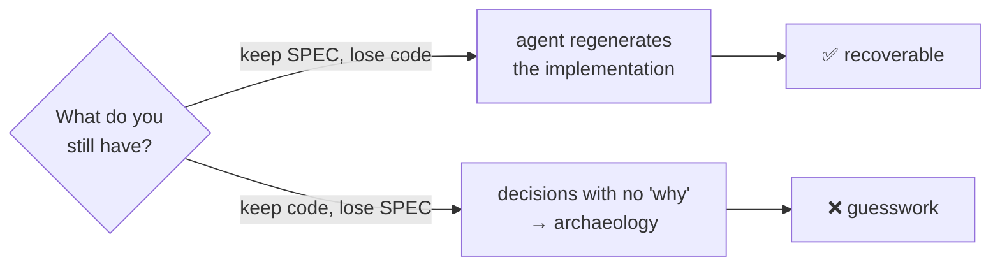

# Lesson 5.1 — Why specs beat prompts (git for intent)

> _A prompt is the spoken trip; the spec is the map you keep._

_TL;DR: A prompt is used once and evaporates; a spec is durable, re-runnable, and committed.
At system scale the code is a regenerable **output** of the spec, so the spec is the artifact
worth versioning._

## ELI5 — prompt vs. spec
_A prompt is directions you say out loud once; a spec is the map anyone can re-run._

| | Prompt | Spec |
|---|---|---|
| Lifespan | one session, then gone | committed · durable |
| Re-run | re-typed differently each time | same input → same destination |
| Reviewed? | no | yes, like code |
| Analogy | spoken turn-by-turn directions | the map |

```
   PROMPT                              SPEC
   ┌──────────────────────┐           ┌──────────────────────┐
   │ "add retries to the  │           │ # SPEC: payment       │
   │  payments client,    │   →→→      │   retries             │
   │  exponential I think"│           │ Goal / scope /        │
   └──────────────────────┘           │ contracts / verify    │
   used once, then gone               └──────────────────────┘
   re-typed differently each time      committed · re-runnable · reviewed
```

## The core claim: code is regenerable, the spec is durable
_Lose the code, keep the spec → an agent rebuilds it. Lose the spec → you have decisions with
no record of why._

Spec Kit's own framing: **"Specifications don't serve code — code serves specifications"** —
the implementation is the spec's *expression* in one language and framework [^1].



So the spec — not the chat log, not the diff — is the load-bearing artifact. You version it,
review it, and argue over it, because it's the part that's expensive to reconstruct [^1].

> **"Git for intent."** Git versions your *code* (the HOW-it-ended-up). A spec versions your
> *intent* (the WHAT-and-why). When intent has a diffable home, "why is this here?" stops being
> archaeology and becomes a `git log` on the spec.

> 🧠 **Test Yourself:** You delete the implementation but keep a HOW-free spec. Why is that
> recoverable, but the reverse (keep code, lose spec) is not?
> <details><summary>Answer</summary>The spec is the durable source of intent — an agent
> regenerates code from it [^1]. Code alone records *what* was built but not *why*, so the next
> change becomes guesswork.</details>

## Worked example: this repo's own scaffolder
_The scaffolder pinned a guarantee in a committed spec that no one-off prompt could survive._

Before a line of the scaffolder existed, someone wrote
`specs/002-scaffolder/spec.md`:

| Pinned in the spec | Why a prompt couldn't hold it |
|---|---|
| **FR-009** — MUST offer the Spec Kit handoff *and* leave a complete scaffold whether accepted **or declined** | The "even when declined" nuance is exactly what gets dropped between sessions. |
| **SC-008** — "Declining the hand-off still yields a complete, valid scaffold **100% of the time**" | A testable promise that survives team turnover and model upgrades. |

Six months out, an agent can regenerate the implementation *from the spec* and that guarantee
still holds — because it lives in the artifact, not in someone's memory of a chat.

## Why this scales when prompts don't
_A prompt's reach is one session; a spec's reach is the lifetime of the system._

```
   one small change:        prompt is fine (Phase 1: small tasks skip the plan) [^2]
   a feature:               prompt rots across a long session (Phase 2: context rot) [^2]
   a system, over months:   only the spec survives team turnover, model upgrades,
                            and "wait, why did we build it this way?"
```

The bigger and longer-lived the work, the more the durable artifact wins.

## Your turn (exercise)

Find a feature whose *intent* lives nowhere — not a doc, not a spec, just code and someone's
head. Write the 5-line spec that *should* have existed: Goal, Scope, one Contract, one
Constraint, one Verification. Then ask: hand only that to a fresh agent — could it regenerate
the feature? If yes, you just turned tribal knowledge into git-for-intent.

---
← [Phase 5 home](index.md) · next → [Lesson 5.2 — The Spec Kit loop](02-the-speckit-loop.md)

[^1]: [Spec-Driven Development methodology (spec-driven.md)](https://github.com/github/spec-kit/blob/main/spec-driven.md) — GitHub
[^2]: [Best practices for Claude Code](https://code.claude.com/docs/en/best-practices) — Anthropic
