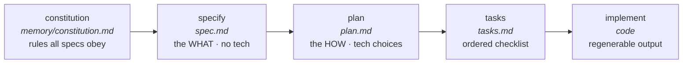
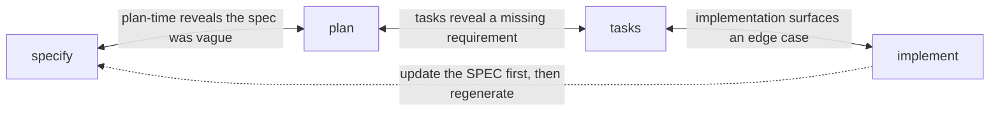

# Lesson 5.2 — The Spec Kit loop

> _Don't learn the command names — learn what artifact each step leaves behind._

_TL;DR: Spec Kit turns spec-driven development into five named commands. Each produces one
durable markdown artifact; a constitution sits above them all; and the loop is iterative,
not a waterfall._

## The five steps, and what each *produces*
_The artifacts — not the command names — are the durable record from Lesson 5.1._

| Step | Command | Produces | What it pins down [^1] |
|---|---|---|---|
| 1 | `/speckit.constitution` | `memory/constitution.md` | Non-negotiable principles every spec must obey. |
| 2 | `/speckit.specify` | `specs/NNN/spec.md` | The **WHAT**: user stories, requirements, success criteria. |
| 3 | `/speckit.plan` | `plan.md` | The **HOW**: stack, architecture, file layout. |
| 4 | `/speckit.tasks` | `tasks.md` | An ordered, reviewable task checklist. |
| 5 | `/speckit.implement` | code + tests | The implementation — output, not source of truth. |

The core Spec Kit process ships ready to use: **Spec → Plan → Tasks → Implement** [^1].

> 🧠 **Test Yourself:** Which step's artifact is the *source of truth*, and which is the
> regenerable *output*?
> 

Answer
`spec.md` (step 2) is the durable source of truth; the
> code from `implement` (step 5) is the regenerable output [^2].

## Why a constitution sits *above* the loop
_Written once, it governs every spec after it — the layer that keeps the loop honest._

The **constitution** establishes project-wide governing principles that the agent references
during specify, plan, *and* implement [^1]. It is not restated per-spec; it applies to all by
default, and the plan/review steps *check compliance* against it.

This repo's `.specify/memory/constitution.md`: Principle IV
("Guardrails Over Vibes, NON-NEGOTIABLE") and Principle VII ("Specs Are the Source of Truth")
apply to every spec without being re-typed.

> **ELI5:** the constitution is the **house rules**; each spec is the **plan for one room**.
> You don't re-litigate "no smoking indoors" for every room — it's settled upstairs.

## Worked example: tracing this repo through the loop
_The real loop, run on this project — note step 2 deliberately refuses to name a tech._

| Step | This repo's artifact |
|---|---|
| constitution | `.specify/memory/constitution.md` (v1.0.0) — 7 principles, incl. "dogfood Spec Kit." |
| specify | `specs/002-scaffolder/spec.md` — 6 user stories, 22 requirements, 11 success criteria, **zero** tech choices. |
| plan | *would* pick Python-vs-Node (the spec flags it: *FR-015 [NEEDS CLARIFICATION … decide at plan time]*). |
| tasks | *would* slice that plan into ordered, checkable steps. |
| implement | the actual scaffolder code, regenerable from the four artifacts above. |

Step 2 *deliberately refused* "Python or Node?" — parking it as a `[NEEDS CLARIFICATION]`
marker for the plan [^3]. That discipline (WHAT now, HOW later) is Lesson 5.3.

## The loop is iterative, not a waterfall
_The arrows go both ways — and when implementation surfaces something new, you fix the spec
**first**._

Spec Kit's own framing: *"Change a core requirement … and affected implementation plans update
automatically"* — maintaining software means **evolving the spec**, not patching the code [^2].
You update the spec first, then regenerate downstream (Principle VII). You don't silently patch
code and leave the spec lying.

> 🧠 **Test Yourself:** During `implement` the agent finds an edge case the spec missed. What's
> the correct move?
> 

Answer
Update the **spec first**, then regenerate downstream. The
> spec is the source of truth; patching only the code lets the spec rot [^2].

## Your turn (exercise)

Open `specs/002-scaffolder/spec.md` and find one
`[NEEDS CLARIFICATION]` marker. Write the one sentence a `plan.md` would add to resolve it.
Notice your sentence is a **HOW** decision that had no business being in the spec. That gap
between the two artifacts *is* the loop working as designed.

---
← [Lesson 5.1](01-why-specs-beat-prompts.md) · next → [Lesson 5.3 — WHAT vs HOW](03-what-vs-how.md)

[^1]: [Spec Kit — Toolkit for Spec-Driven Development](https://github.com/github/spec-kit) — GitHub
[^2]: [Spec-Driven Development methodology (spec-driven.md)](https://github.com/github/spec-kit/blob/main/spec-driven.md) — GitHub
[^3]: [Spec Kit Documentation](https://github.github.com/spec-kit/) — GitHub
