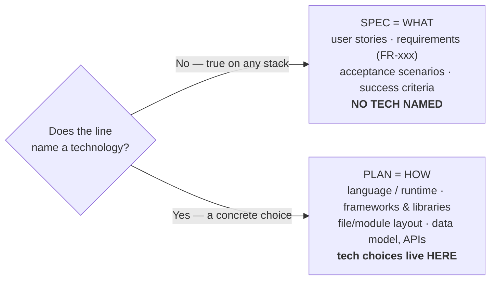

# Lesson 5.3 — Separating WHAT from HOW

> _The spec is the order; the plan is the kitchen. Name a tech and you've left the spec._

_TL;DR: A line belongs in the spec if it's true no matter the stack; it moves to the plan the
moment it names a technology. Spec Kit splits WHAT and HOW into two artifacts on purpose._

## ELI5 — the restaurant order
_You say WHAT you want; you don't dictate which pan. Mixing the two is the #1 spec mistake._

You order: "medium-rare burger, no onions, gluten-free bun" (**WHAT**). You don't say which
pan, what flame, which spatula (**HOW**). Dictate the HOW and you've stopped ordering and
started cooking. Spec Kit's guidance is literally *"Focus on WHAT users need and WHY"* —
avoid implementation details in the spec [^1].

## The dividing line
_True regardless of stack → spec. Names a technology → plan._

| Belongs in the SPEC (WHAT) | Belongs in the PLAN (HOW) |
|---|---|
| "Every generated skill must validate against the standard." | "We validate with a JSON-schema check in Node." |
| "The tool must work across multiple agents." | "We use an adapter-class registry like Spec Kit's." |
| "Memory survives compaction." | "A `.agent/memory/*.md` markdown store." |
| "Each guardrail hook must actually fire." | "A bash fixture invoked by the test runner." |
| *Survives a rewrite in any language* | *Is the language-specific decision* |

> 🧠 **Test Yourself:** "We'll store sessions in Redis with a 24-hour TTL." Spec or plan?
> 

Answer
**Plan.** It names Redis and a concrete TTL mechanism —
> a HOW commitment. The spec version would be "an abandoned session must be resumable later."

## Why the separation actually matters
_Four payoffs — defer commitment, stay reviewable, keep code regenerable, surface fights cheap._

| Reason | Payoff |
|---|---|
| **Defers commitment** | Naming the stack in the spec freezes a decision before you've thought about it; the plan is where you commit [^2]. |
| **Stays reviewable by non-implementers** | A product owner signs off on WHAT without parsing framework choices. |
| **Keeps code regenerable** | A HOW-free spec lets you pick a *new* stack in a new plan and regenerate (Lesson 5.1) [^2]. |
| **Surfaces tech disputes cheaply** | Stack arguments happen over a short `plan.md`, not buried in 2,000 committed lines (Lesson 5.4). |

## Worked example: the scaffolder spec's discipline
_The hardest test is when you're tempted to name a tech — and the spec refuses._

`specs/002-scaffolder/spec.md` is a clinic in this:

> **FR-015**: … MUST be permissively licensed; *[NEEDS CLARIFICATION: primary implementation
> language/runtime — Spec Kit is Python/uvx; an `npx`/Node CLI is more familiar to JS/TS devs.
> **Decide at plan time.**]*

It *knows* the Python-vs-Node decision exists — even lists the trade-off — and still parks it
for the plan. That's the WHAT/HOW line held under pressure [^3]. Compare FR-005, pure WHAT:
"keep the open standard as the single source of truth and emit vendor artifacts through a
per-agent adapter layer" — behavior only, no language or file path named.

## Your turn (exercise)

Sort each line into SPEC or PLAN:

1. "Users can export their data as a downloadable file."
2. "We'll store sessions in Redis with a 24-hour TTL."
3. "An abandoned interview must be resumable later."

Answers

1. **SPEC** — pure WHAT; "downloadable file" is a user-visible outcome, no tech.
2. **PLAN** — names Redis and a concrete TTL mechanism; a HOW commitment.
3. **SPEC** — a behavioral requirement (literally an edge case in the scaffolder spec); says
   nothing about *how* state is persisted.

---
← [Lesson 5.2](02-the-speckit-loop.md) · next → [Lesson 5.4 — Spec as steering wheel](04-spec-as-steering-wheel.md)

[^1]: [Spec Kit — Toolkit for Spec-Driven Development](https://github.com/github/spec-kit) — GitHub
[^2]: [Spec-Driven Development methodology (spec-driven.md)](https://github.com/github/spec-kit/blob/main/spec-driven.md) — GitHub
[^3]: [Spec Kit Documentation](https://github.github.com/spec-kit/) — GitHub
