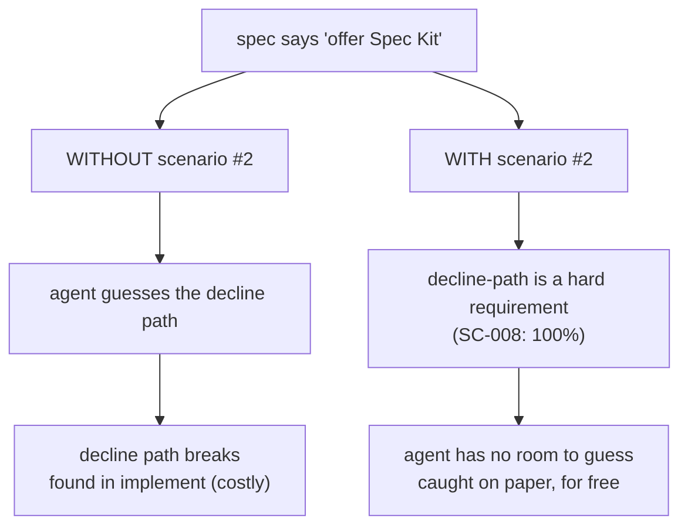

# Lesson 5.4 — The spec as steering wheel

> _Steer in the spec (a flick of the wrist), not in 2,000 lines (a U-turn back from the crash)._

_TL;DR: A misunderstanding is cheap to fix in the spec and brutal to fix in code. The spec
format is designed to surface ambiguity — markers, acceptance scenarios, out-of-scope — before
it becomes a rewrite._

## The cost curve nobody mentions
_Fix it early and it's one paragraph; fix it late and it's a rewrite cascade._

```
   cost to fix a misunderstanding
     │                                         ╱ in 2,000 lines of code
     │                                    ╱     (rewrite cascade)
     │                              ╱
     │                       ╱
     │              ╱
     │      ╱
     │ ─ in the spec (edit one paragraph)
     └─────────────────────────────────────────► how late you catch it
        specify   plan    tasks    implement
        ◄── cheapest to steer here ──►
```

Same instinct as Phase 2's **spec handoff** (catch problems before a coding session) and
Phase 1's **plan mode** — align on direction while the artifact is still cheap to edit [^1].
Anthropic's own guidance: *"Time spent making the spec precise pays off more than time spent
watching the implementation"* [^1]. The spec is the biggest, most durable version of that lever.

> **ELI5:** A 2° wrong turn caught **now** is a flick of the wrist; caught a mile later it's
> reversing all the way back. The spec is the steering wheel at the *start* of the trip.

> 🧠 **Test Yourself:** Why is "I'll just clarify that while coding" a trap?
> <details><summary>Answer</summary>By implement-time the agent has poured code that assumes
> the wrong thing — fixing it is a rewrite cascade, not a one-paragraph edit [^1].</details>

## Where misunderstandings hide — and how the spec catches them
_The spec format makes ambiguity visible before it becomes code._

| Spec mechanism | Catches |
|---|---|
| **`[NEEDS CLARIFICATION]` markers** | Forces *"mark all ambiguities … if the prompt doesn't specify something, mark it"* instead of silently guessing at implement-time [^2]. |
| **Acceptance scenarios (Given/When/Then)** | Forces the exact expected behavior — surfaces "what happens when the user declines?" on paper. |
| **Explicit out-of-scope** | Stops the agent from helpfully building what you didn't ask for. |

## Worked example: a misunderstanding caught in the spec
_User Story 4's two acceptance scenarios pin **both** branches before any code exists._

From `specs/002-scaffolder/spec.md`:

> 1. **Given** a completed scaffold, **When** the developer **accepts**, **Then** a valid Spec
>    Kit setup is added without conflicting with generated files.
> 2. **Given** a completed scaffold, **When** the developer **declines**, **Then** the
>    agent-first scaffold is **complete and self-sufficient.**



Without scenario #2, an agent could reasonably ship a tool that's broken if you decline — found
only after the code exists, mid-implementation. The scenario steers it **before** a line is
written. Cost: one bullet point, not a rewrite of the handoff path.

## The operator's rule of thumb
_Minutes in the spec save hours of regenerating confidently-wrong code._

> **Every minute spent making the spec unambiguous saves an hour of regenerating code that was
> confidently wrong.** When you feel an "I'll clarify that while coding" urge — clarify it in
> the spec instead. That's where steering is cheap.

## Your turn (exercise)

Take a spec or ticket lying around. Write **one** Given/When/Then scenario for its
least-obvious behavior (an error case, an empty input, a "user declines" branch). Did writing
it surface a question you'd otherwise have answered by guessing in code? That surfaced question
is a crash you just avoided by steering early.

---
← [Lesson 5.3](03-what-vs-how.md) · next → [Lesson 5.5 — Scaffolder ↔ Spec Kit handoff](05-scaffolder-speckit-handoff.md)

[^1]: [Best practices for Claude Code](https://code.claude.com/docs/en/best-practices) — Anthropic
[^2]: [Spec-Driven Development methodology (spec-driven.md)](https://github.com/github/spec-kit/blob/main/spec-driven.md) — GitHub
