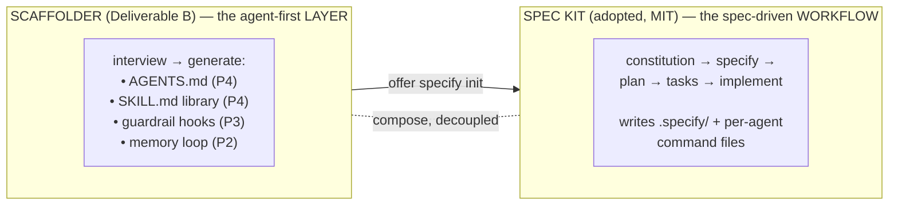

# Lesson 5.5 — What the scaffolder automates: the Spec Kit handoff

> _Two tools, composed in one sitting: the scaffolder builds the layer, Spec Kit owns the loop._

_TL;DR (lockstep): Phase 5's scaffolder artifact is the **Spec Kit handoff** — after generating
the agent-first layer, it offers to run `specify init` so you graduate with the whole
spec-driven loop wired in. The two tools compose; neither forks the other._

> **Lockstep lesson.** Every phase ends by showing what the companion *scaffolder* generates so
> you don't wire it by hand. Phase 5's artifact: the **Spec Kit handoff**.

> **ELI5.** Think of moving into a new house. The *scaffolder* is the contractor who builds the
> rooms and wiring (your agent-first layer). *Spec Kit* is the moving company that brings in the
> furniture and arranges it (the spec → plan → tasks → implement workflow). The contractor finishes,
> then *offers* to call the movers — but if you say "no thanks," you still have a complete, livable
> house. Two crews, one moving day, neither doing the other's job.

## The problem this solves
_The loop's machinery is fiddly to stand up by hand — exactly the setup people skip._

You've learned the loop by hand: constitution → specify → plan → tasks → implement. But standing
up `.specify/` templates, per-agent command files, and a starter constitution on a fresh repo is
the kind of setup most people skip — and then they're back to prompting. So the scaffolder, after
generating the agent-first layer (`AGENTS.md`, skills, guardrail hooks), **offers to hand off to
Spec Kit** — and on accept, runs its init flow.

## The two tools compose — they don't overlap
_Constitution Principle VI (Adopt, Don't Reinvent), made concrete: build alongside, don't fork._



| | Scaffolder owns | Spec Kit owns |
|---|---|---|
| Layer | context + guardrails | the workflow |
| Examples | AGENTS.md, skills, hooks, memory | spec → plan → tasks → implement |
| Relationship | **does not** re-implement the loop | **is not** forked by the scaffolder [^1] |

> 🧠 **Test Yourself:** A reviewer asks why the scaffolder doesn't just bundle spec→plan→tasks
> itself. Best answer?
> <details><summary>Answer</summary>Adopt, Don't Reinvent (Principle VI): the scaffolder builds
> *alongside* Spec Kit and hands off, staying decoupled. Spec Kit is MIT and invokable — the
> reason is composition, not license or speed [^1].</details>

## The decline path is a hard requirement
_The handoff is optional **and** lossless — pinned in the spec up front._

| Requirement | What it guarantees |
|---|---|
| **FR-009** | MUST offer the handoff *and* leave a complete, valid scaffold whether accepted **or declined**; the two tools stay decoupled (no fork). |
| **SC-008** | "Declining the hand-off still yields a complete, valid scaffold **100% of the time**." |

That's Lesson 5.4 eating its own cooking: the *decline* branch was pinned in the spec's
acceptance scenarios up front, so the scaffolder can't ship a setup that's broken when you say
"no thanks."

## Why portable: Spec Kit is already agent-agnostic
_One shared template renders into 30+ agents — the handoff is portable for free._

Spec Kit renders one shared template into 30+ agents via its integration registry [^1] (the same
adapter pattern the scaffolder borrows for its guardrails — Phase 6). So `specify init` writes
the right command files for whichever agent you target:

| What `specify init` writes | Claude Code | Codex | Cursor |
|---|---|---|---|
| Shared `.specify/` (templates, scripts, constitution) | ✅ same | ✅ same | ✅ same |
| Per-agent command files | `.claude/commands/` | Codex commands | Cursor commands |
| Invocation | `/speckit.specify` | `/speckit.specify` | `/speckit.specify` |

One source of truth, per-agent rendering — the exact principle the whole curriculum is built on,
and the same open-standard idea behind `AGENTS.md` [^2].

## The full picture (you've now seen every layer)
_Run the scaffolder for real at the capstone and you'll recognize each artifact as a lesson._

```
   AGENTS.md ........... Phase 4      memory loop ........ Phase 2
   guardrail hooks .... Phase 3      Spec Kit handoff ... Phase 5  ◄── you are here
   adapter / CI layer . Phase 6
```

The tool stops being magic and becomes *automation of a process you understand.*

## Your turn (exercise)

On a scratch repo, run `specify init --here` (pick your agent). Open the generated
`memory/constitution.md` and write **one** principle for *your* project, in the imperative voice
of this repo's constitution (`.specify/memory/constitution.md`). You've just done by hand
the exact step the scaffolder's handoff would tee up — and you now know what it's wiring in,
and why.

---
← [Lesson 5.4](04-spec-as-steering-wheel.md) · [Phase 5 home](index.md) · → [Check your understanding](quiz.json)

[^1]: [Spec Kit — Toolkit for Spec-Driven Development](https://github.com/github/spec-kit) — GitHub
[^2]: [AGENTS.md — open format for coding agents](https://agents.md) — Agentic AI Foundation
