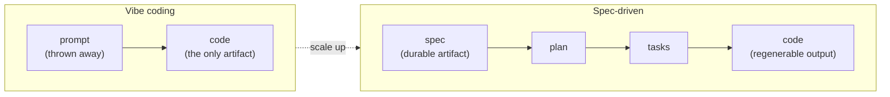
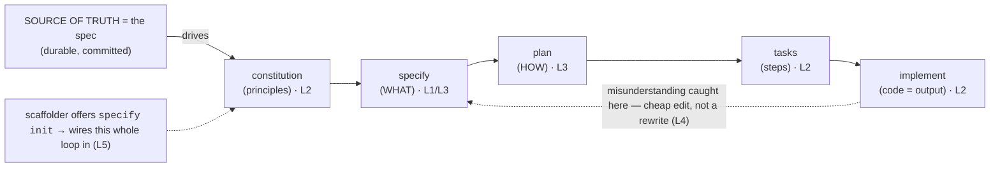

# Phase 5 — Spec-Driven Development

> _Stop shipping the prompt. Ship the spec — the code is just its output._

## Executive Summary

_What this phase makes you able to do, and why it matters._

You will stop treating the **prompt** as the artifact and start treating an **executable
spec** as the source of truth — a precise, self-contained WHAT that an agent regenerates
the implementation from. At system scale the spec is **durable** and the code is
**regenerable**, so the spec — not the chat log or the diff — is what you version, review,
and argue over [^1][^2]. This is the methodology GitHub's **Spec Kit** productizes
(`constitution → specify → plan → tasks → implement`) across 30+ agents [^1], and the one
this repo dogfoods. Master it and a misunderstanding gets caught in a one-line spec edit
instead of a 2,000-line rewrite.

**Learning objectives — after this phase you can:**

| # | You can… |
|---|---|
| 1 | Explain why the **spec is durable and code is regenerable** ("git for intent"). |
| 2 | Run the five-step **Spec Kit loop** and name what artifact each step leaves behind. |
| 3 | Hold the **WHAT/HOW line**: no tech in the spec; tech choices live in the plan. |
| 4 | Use the spec as a **steering wheel** — catch ambiguity on paper, cheaply. |
| 5 | Describe how the **scaffolder hands off** to `specify init` (two tools, composed). |

**Prerequisite:** Phase 2 (the spec handoff) and Phase 4 (steering files & hooks).

---

## The big idea (in one sentence)

> At system scale the **spec is durable and the code is regenerable** — so the spec, not the
> chat history or the diff, is the thing worth version-controlling, reviewing, and arguing over [^2].

Phase 2 taught the spec handoff as a *context trick* (think in one session, implement in a
clean one) [^3]. This phase scales that instinct into a *methodology*: a repeatable loop with
named artifacts you commit to git. Same idea, bigger scale.

---

## Lessons (one concept each)

| # | Lesson | The one idea |
|---|---|---|
| 1 | [Why specs beat prompts](01-why-specs-beat-prompts.md) | The spec is durable; code is regenerable. "Git for intent." |
| 2 | [The Spec Kit loop](02-the-speckit-loop.md) | constitution → specify → plan → tasks → implement, and what each produces. |
| 3 | [WHAT vs HOW](03-what-vs-how.md) | The spec is WHAT (no tech); the plan is HOW (tech choices). |
| 4 | [Spec as steering wheel](04-spec-as-steering-wheel.md) | Catch the misunderstanding in the spec (cheap), not in 2,000 lines (expensive). |
| 5 | [Scaffolder ↔ Spec Kit handoff](05-scaffolder-speckit-handoff.md) | The scaffolder offers `specify init`; the two tools compose. |

---

## Phase diagram

---

## Phase exercise (do this for real)

Take a feature you'd normally one-shot. Run the loop by hand on it:

1. Write a **spec** that says only **WHAT** — no framework, no file layout, no library names.
   Steal the structure from `specs/002-scaffolder/spec.md`
   (user stories, acceptance scenarios, `[NEEDS CLARIFICATION]` markers).
2. Read the spec back and find one ambiguity. Resolve it **in the spec**, not in your head.
3. *Then* write a short **plan** that picks the tech (the HOW).
4. Note how many decisions in step 3 you'd otherwise have made silently mid-code.

Three sentences on what surfaced. The habit — *decide WHAT before HOW, on paper, before
code* — is the whole phase.

---

## Cheatsheet

_The load-bearing terms, the five artifacts, and the per-agent commands at a glance._

### Key terms — what people say vs. what it means

| Term | What people say | What it actually means |
|---|---|---|
| **Spec** | "the doc nobody reads" | The **durable** WHAT artifact; code is its regenerable output [^2]. |
| **Plan** | "the design" | The **HOW**: stack, architecture, file layout — tech choices live *here* [^1]. |
| **Constitution** | "more rules" | Project-wide **non-negotiables** every spec inherits; checked at plan/review [^1]. |
| **Spec-driven dev** | "waterfall again" | An **iterative loop** where the spec is source of truth, not a one-way gate [^2]. |
| **`[NEEDS CLARIFICATION]`** | "a TODO" | A **deliberate park**: flag the ambiguity instead of guessing at implement-time [^4]. |
| **Regenerable code** | "throwaway code" | Lose the code, keep the spec → an agent rebuilds it; the spec is what's expensive [^2]. |

### The five artifacts (what each step leaves behind)

| Step | Command | Produces | Pins down |
|---|---|---|---|
| 1 | `/speckit.constitution` | `memory/constitution.md` | Principles every spec must obey. |
| 2 | `/speckit.specify` | `specs/NNN/spec.md` | The **WHAT** — stories, requirements, success criteria. |
| 3 | `/speckit.plan` | `plan.md` | The **HOW** — stack, architecture, layout. |
| 4 | `/speckit.tasks` | `tasks.md` | Ordered, reviewable task checklist. |
| 5 | `/speckit.implement` | code + tests | The implementation — output, not source of truth. |

### WHAT vs HOW — the dividing line

| Belongs in the SPEC (WHAT) | Belongs in the PLAN (HOW) |
|---|---|
| "Skills must validate against the standard." | "Validate with a JSON-schema check in Node." |
| "Must work across multiple agents." | "Use an adapter-class registry." |
| "Memory survives compaction." | "A `.agent/memory/*.md` markdown store." |
| Survives a rewrite in any language | *Is* the language-specific decision |

### Agent cheat-sheet (Spec Kit is agent-agnostic — 30+ agents [^1])

Spec Kit authors one shared template and renders per-agent command files via an integration
registry. The commands are the same idea everywhere; only invocation differs [^1].

| Step | Claude Code | Codex | Cursor |
|---|---|---|---|
| Scaffold the loop | `specify init --here` | `specify init --here` | `specify init --here` |
| Set principles | `/speckit.constitution` | `/speckit.constitution` | `/speckit.constitution` |
| Write the WHAT | `/speckit.specify` | `/speckit.specify` | `/speckit.specify` |
| Pick the HOW | `/speckit.plan` | `/speckit.plan` | `/speckit.plan` |
| Break into tasks | `/speckit.tasks` | `/speckit.tasks` | `/speckit.tasks` |
| Build it | `/speckit.implement` | `/speckit.implement` | `/speckit.implement` |

> One source template → 30+ agent outputs [^1]. `specify init` writes `.specify/` (templates,
> scripts, `memory/constitution.md`) **plus** the command files for whichever agent(s) you
> target — so the methodology is portable, not Claude-only.

---

→ **[Check your understanding](quiz.md)**

---
← [Phase 4](../04-session-and-memory/index.md) · next phase → [Orchestration & Harness Engineering](../06-orchestration-and-harness/index.md)

[^1]: [Spec Kit — Toolkit for Spec-Driven Development](https://github.com/github/spec-kit) — GitHub
[^2]: [Spec-Driven Development methodology (spec-driven.md)](https://github.com/github/spec-kit/blob/main/spec-driven.md) — GitHub
[^3]: [Best practices for Claude Code](https://code.claude.com/docs/en/best-practices) — Anthropic
[^4]: [Spec Kit Documentation](https://github.github.com/spec-kit/) — GitHub
