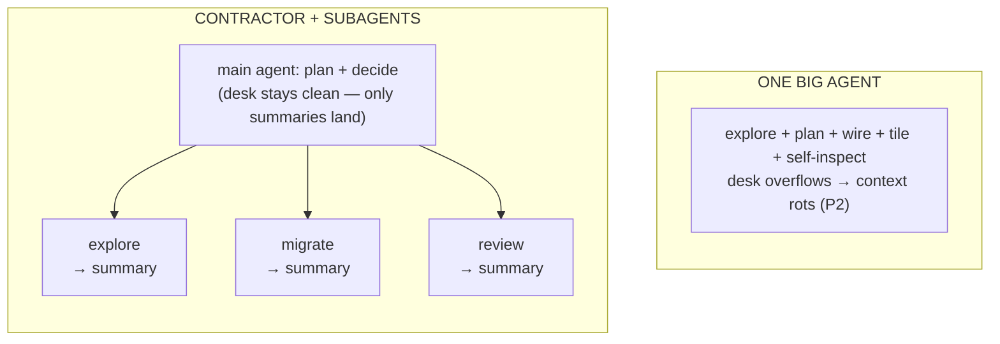
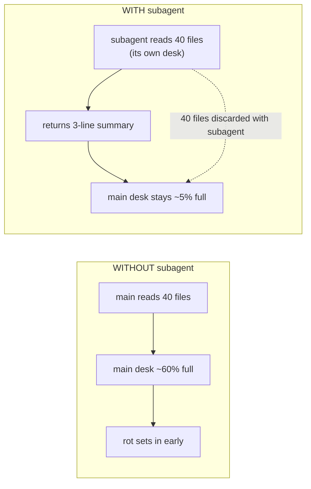

# Lesson 6.1 — Small, focused agents

> _One job, one clean desk — the contractor never picks up a hammer._

_TL;DR: Cut work into 3–20-step slices and hand context-heavy slices to disposable **subagents** that
burn their own window and return a summary — so the main agent's desk never fills [^1][^2]._

## ELI5
_Hire a general contractor who delegates, not one person who does everything and forgets the wiring._

One person who **designs the house, pours the foundation, wires it, lays tile, and self-inspects** —
in one shift, writing nothing down — has forgotten the wiring by tile-time. That's a single agent on
a giant task: by step 30 it's lost the plot. A **general contractor** instead hands each subtask to a
specialist, gets back a short report, and keeps only the *summary* on their desk. That's **small,
focused agents** (12-factor #10) [^1].



_Each subagent has its own desk and least-privilege tools; only its short summary returns to the main agent._

## Why scope kills quality
_A sprawling task fills the window with junk and rots quality before the window even fills [^1]._

You know *why* from Phase 2: a long task fills the context with file dumps, tool output, and dead
ends, and quality **rots** before the window is full. #10 is the operational rule that falls out:
**keep each unit of work to a tight 3–20 steps** [^1]. Past that, models lose constraints,
re-litigate decisions, and drift. The goal isn't one heroic agent — it's **decomposition**: slices
small enough that each fits on a clean desk.

| One big agent | Decomposed (contractor + subagents) |
|---|---|
| 50 steps in one window | 3–20 steps per slice [^1] |
| constraints drift past ~step 30 | each slice holds its constraints |
| desk fills with every dead end | dead ends die with the subagent |
| reviews its own justifications | fresh reviewer judges the artifact (L2) |

> 🧠 **Test Yourself:** Why cap a unit of work near 3–20 steps instead of letting one agent run 50?
> <details><summary>Answer</summary>Past ~20–30 steps the window fills with dead ends and tool output; signal-to-noise falls and the model drifts off constraints — quality rots *before* the window is full [^1].</details>

## Subagents protect the *main* context window
_A subagent reads 40 files in its **own** window and returns 3 lines — the 40 files never touch the
main desk [^2]._

The load-bearing mechanic is subtle. When the main agent delegates "find every call site of
`retry()`" to a **subagent**, the subagent burns *its own* context reading 40 files and hands back
**three lines**: "12 call sites, here are the paths, none pass a custom timeout." Each subagent runs
in **its own context window** and returns only a distilled summary [^2]. The 40 files never reach the
main desk.



This is *own your context window* (#3) [^1] at the orchestration level: you don't just `/clear` your
desk, you **prevent junk from landing on it** by exporting context-heavy work to a disposable agent.
The subagent is a **context firewall**.

> 🧠 **Test Yourself:** A subagent reads 40 files and returns a 3-line summary. What's the *primary* benefit over the main agent reading them?
> <details><summary>Answer</summary>The 40 files load into the subagent's window and are discarded with it — the main desk stays clean. It's a context firewall, not a speed or billing trick [^2].</details>

## Least-privilege tools
_Scope tools too: narrow tools = less wandering **and** less blast radius [^3]._

A focused agent should also be *constrained*. A reviewer subagent needs **read + run-tests**, not
write + push. A migration subagent edits one directory, never deletes `.env`. Limiting a subagent's
tools is an explicit benefit — it **enforces constraints** by capping what the agent can do [^2].

| Scoping tools buys you | Why |
|---|---|
| **Safety** | a subagent can't act outside its job [^2] |
| **Quality** | fewer tools = fewer choices = less wandering [^3] |

> **Rule of thumb:** give each subagent the *narrowest* tool set that finishes its slice and nothing
> more. The narrowest harness is the most reliable harness.

## Worked example
_One feature, four desks: the main agent orchestrates and never reads the internals itself._

Adding rate-limiting to an API — instead of one 50-step session:

```
  main agent (plans, holds the thread):
    └─ subagent A  "find all route handlers; return file list + which lack auth"
                    tools: read, grep        → returns 6 lines
    └─ subagent B  "implement the limiter in src/middleware/ per SPEC.md"
                    tools: read, edit(src/middleware/**), run-tests  → returns diff + test result
    └─ subagent C  "review the diff for correctness only" (Lesson 6.2)
                    tools: read, run-tests   → returns PASS/FAIL + findings
```

The main agent never reads the 6 handlers or stares at the limiter internals. It orchestrates, keeps
a clean desk, and stays sharp across the whole feature.

## Your turn (exercise)

Take the next task you'd reflexively one-shot. Before starting, **write the decomposition**:

```
  main: ______________________  (what stays on your desk: the plan + summaries)
  subagent 1: _________________  tools: __________   returns: __________
  subagent 2: _________________  tools: __________   returns: __________
```

For each subagent, what's the *narrowest* tool set that still finishes its slice? If "find the call
sites" needs write + delete + network, you've mis-scoped it.

---
← [Phase 6 home](index.md) · next → [Lesson 6.2 — Adversarial review](02-adversarial-review.md)

[^1]: [12-Factor Agents (factors 3, 10)](https://github.com/humanlayer/12-factor-agents) — humanlayer
[^2]: [Create custom subagents](https://code.claude.com/docs/en/sub-agents) — Anthropic (Claude Code docs)
[^3]: [Effective context engineering for AI agents](https://www.anthropic.com/engineering/effective-context-engineering-for-ai-agents) — Anthropic
