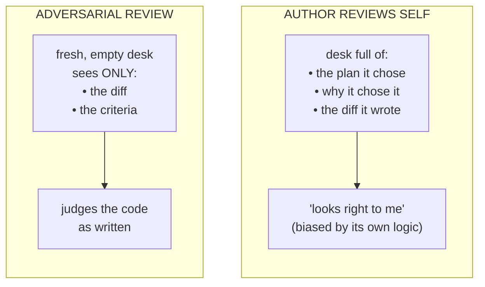
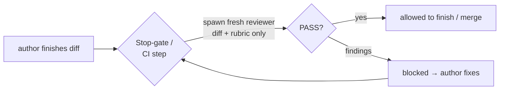

# Lesson 6.2 — Adversarial review

> _The author can't proofread the author — only a fresh pair of eyes reads what's actually there._

_TL;DR: Spawn a **fresh-context** reviewer that sees *only* the diff + a **correctness-only** rubric
(and may return PASS), so it catches what the author rationalized away without drowning you in nits
[^1][^2]._

## ELI5
_You miss your own typo three times; a friend spots it instantly — because they read what's there,
not what you meant._

The agent that just wrote the code has that blind spot — *worse*, because its window is full of the
reasoning that produced the code. Ask it "is this correct?" and it reviews its own justifications,
not the diff. The fix is an **adversarial reviewer**: a **fresh-context** agent that sees **only the
diff and the criteria** — never the conversation that produced it [^1].



## Why the author can't review the author
_A reviewer carrying the authoring context inherits every one of its blind spots; a clean desk is
what makes review adversarial [^1]._

A reviewer biased by the code that produced it inherits **every blind spot.** If the author misread
the spec, the review re-reads it the same wrong way. If it rationalized a shortcut, the review
re-rationalizes it. A fresh-context reviewer can't be reassured by "I considered that and decided it
was fine" — it never had that thought; it has only the artifact. This is *own your context window*
(#3) [^2] used as a **tool for objectivity**: the clean desk is what makes the review adversarial
instead of agreeable. (The reviewer is also a focused subagent from L1, scoped to read + run-tests
[^1].)

> 🧠 **Test Yourself:** Why a *fresh* window rather than continuing in the authoring session?
> <details><summary>Answer</summary>The authoring window holds the reasoning that made the bug *feel* correct, so a self-review inherits those blind spots. A fresh window judges only the artifact [^1]. It's not about capacity or billing.</details>

## Scope it to correctness — or it invents findings
_An open-ended "review this" *forces* a list, so it invents nits; a correctness-only rubric that may
return PASS restores signal._

Hand a reviewer "review this code" and it will *find* something — that's what it was asked to do.
It invents style nits, speculates about impossible inputs, flags "consider refactoring" on fine
code. You drown in **false positives** and stop trusting it. The fix is a **tight, correctness-only
rubric** that *allows PASS*:

```
   Review the diff against these criteria ONLY. Report PASS or list findings:
   1. Does it do what the SPEC says? (cite the spec line it violates)
   2. Are there correctness bugs? (off-by-one, null, race, wrong error path)
   3. Does it break an existing contract / public API?
   Do NOT comment on style, naming, or hypothetical future requirements.
   If you find nothing in 1–3, return PASS.
```

| Brief | Result |
|---|---|
| "review this code" (open-ended) | must produce a list → invents nits, buries real bugs |
| correctness-only + "PASS if clean" | returns signal, or honestly says nothing's wrong |

## Worked example
_Fed only the diff + spec + rubric, the fresh reviewer catches the off-by-one the author had already
justified._

The author subagent ships the limiter and says "done, tests pass." The fresh reviewer receives
**only** the diff (`git diff`), the `SPEC.md`, and the rubric above. It returns:

```
  FINDING (criterion 2): limiter uses `>` not `>=` on the threshold — the Nth request
  in the window is allowed when the spec says it must be rejected. See SPEC line 14.
  Otherwise PASS.
```

The author missed it because in *its* desk, `>` was a choice it had already justified. The fresh
reviewer, seeing only code + spec line, caught the off-by-one in one pass — and being scoped to
correctness, didn't bury it under ten style nits.

> 🧠 **Test Yourself:** A reviewer returns 12 findings — 11 nits, 1 real bug. The precise fix?
> <details><summary>Answer</summary>Scope the rubric to correctness-only and let it return PASS. Ranking, re-running, or a bigger model still lets the 11 nits exist — the open-ended *brief* is the bug.</details>

## Why this is a *harness* move, not a vibe
_You wire the reviewer into a Stop-gate / CI step so it fires automatically — the bridge to L4._

You won't run this by hand each time: a `Stop`-gate or CI step **spawns the reviewer automatically**
on every diff, same rubric, before work is allowed to "finish." That's the bridge to Lesson 6.4 — the
reviewer stops being something *you* remember to invoke and becomes part of the harness that makes
correctness automatic.



## Your turn (exercise)

Take a diff an agent recently produced and **review it twice**:

1. Ask the *same* session "is this correct?" — note how it defends its choices.
2. Open a **fresh** session, paste *only* the diff + a 3-line correctness rubric (with explicit
   "return PASS if clean"), and ask it to review.

Compare. Did the fresh reviewer find something the author defended? Did the scoped rubric stop it
inventing nits? That gap is why adversarial review belongs in your harness.

---
← [Lesson 6.1](01-small-focused-agents.md) · next → [Lesson 6.3 — Parallelism & worktrees](03-parallelism-and-worktrees.md)

[^1]: [Create custom subagents](https://code.claude.com/docs/en/sub-agents) — Anthropic (Claude Code docs)
[^2]: [12-Factor Agents (factor 3 — own your context window)](https://github.com/humanlayer/12-factor-agents) — humanlayer
