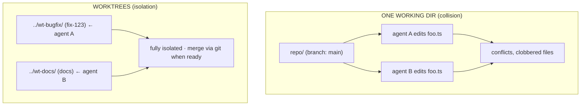
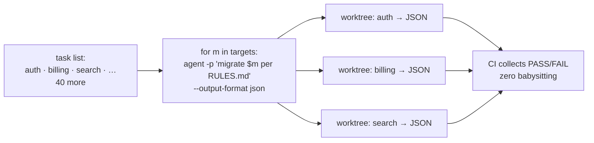
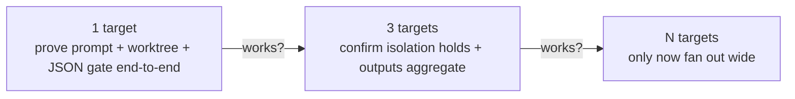

# Lesson 6.3 — Parallelism & worktrees

> _Give every cook their own cutting board — then prove the recipe on one before cooking forty._

_TL;DR: A git **worktree** is a separate directory + branch, so parallel agents never collide on
disk; **headless** `-p` + JSON output lets CI **gate** on results across many targets — but test the
prompt on 1, then 3, then N [^1][^2]._

## ELI5
_Two cooks on one cutting board bump elbows and ruin both dishes; give each their own board and they
work in parallel._

A git **worktree** is a second cutting board: the *same* repo, checked out into a *separate
directory* on its own branch [^1]. Two agents — one fixing a bug, one writing docs — each get an
isolated working tree, never overwriting each other's files or half-finished edits.



## Why worktrees, not just branches
_Branches share the files **on disk**; a worktree gives each agent its own physical directory and
dirty state [^1]._

Give each agent its own branch in one directory and they still share the **working files on disk** —
A's uncommitted edits are visible to and clobberable by B. A worktree gives each agent its **own
physical directory**: separate files, separate test runs, separate dirty state. Edits in one session
**never touch files in another** [^1]. Merge happens through git, deliberately, when each is done.

```bash
  # one repo, three isolated agents working at once:
  git worktree add ../wt-rate-limit  -b feat/rate-limit
  git worktree add ../wt-flaky-test  -b fix/flaky-test
  git worktree add ../wt-readme      -b docs/readme
  # point an agent session at each directory; they can't collide
```

Most agents automate this — *one repo, many isolated desks*:

| | Claude Code | Codex | Cursor |
|---|---|---|---|
| Built-in worktree | `--worktree` flag; `isolation: worktree` on a subagent [^1] | per-thread | automatic per-agent |
| Cleanup | auto-removed if no changes [^1] | manual | per-agent |

> 🧠 **Test Yourself:** You give each of two agents its own branch in the *same* directory. Why can they still collide?
> <details><summary>Answer</summary>A branch only isolates commits — both agents share the same working files on disk, so one's uncommitted edits can clobber the other's. A worktree gives each its own directory [^1].</details>

## Headless / CI fan-out
_Run the agent non-interactively with `-p` + JSON output, and CI can gate on results across many
targets — no human in the loop [^2]._

Worktrees isolate parallel **interactive** sessions. The next gear is **headless** mode: run the
agent non-interactively with `-p` (print/exec), feed it a task, capture machine-readable output
[^2]. That lets you **fan out** the same operation across many targets.



The idiom is shared — only the flag differs:

| | Claude Code | Codex | Cursor |
|---|---|---|---|
| Headless run | `claude -p "<task>"` [^2] | `codex exec "<task>"` | `cursor-agent -p "<task>"` |
| Machine output | `--output-format json` | `--json` / `--output-schema` | `--output-format json` |
| Where it runs | GH Action / SDK | GH Action / `exec` | GH Action |

Machine-readable output is load-bearing: JSON in, JSON out means CI can **gate** on the result (merge
only if the reviewer returned PASS) instead of a human eyeballing 40 logs.

## Test small, then scale
_The cardinal rule: never launch 40 parallel agents on a prompt you haven't proven on 1, then 3 [^2]._

A bad prompt run once wastes a minute; run 40× in parallel it wastes an hour *and* leaves 40 messy
branches to clean up. Launch each in its own worktree, **cap concurrency** to stay under rate limits,
and capture structured JSON [^2].



This is *own your control flow* (#8) [^3] — *you* decide the orchestration — one, then three, then
many — rather than hoping a big parallel launch works first try.

> 🧠 **Test Yourself:** You must run one migration across 30 packages. What do you do *first*?
> <details><summary>Answer</summary>Run it on 1, verify the diff and JSON, then 3 to confirm isolation, *then* fan out. Launching all 30 on an unproven prompt wastes time and leaves 30 messy branches [^2].</details>

## Worked example
_Touch 25 packages, personally review 2 — babysit the exceptions, not the work._

You need a missing test file in 25 packages:

1. **Run 1:** `claude -p "add a smoke test to packages/auth per TEST-RULES.md" --output-format json`
   in a throwaway worktree. The prompt imported the wrong helper. Fix it.
2. **Run 3:** fan out to `auth`, `billing`, `search`. All three produce correct diffs; JSON shows
   `tests: pass`. Isolation held.
3. **Run 25:** fan out to the rest. CI gates each branch on `tests: pass`; you review only the two
   that failed.

You touched 25 packages and reviewed 2. *Babysit the exceptions, not the work* — that's the point.

## Your turn (exercise)

Create two worktrees and run a **trivial** task in each (e.g., "add a comment to the top of `README`"):

```bash
  git worktree add ../wt-a -b throwaway-a
  git worktree add ../wt-b -b throwaway-b
```

Point an agent at each. Confirm edits in `wt-a` are invisible in `wt-b`. Then run one task **headless**
with `-p` + JSON output and read the structured result — that JSON is what a CI gate reads. You've
hand-simulated fan-out at N=1. Clean up with `git worktree remove`.

---
← [Lesson 6.2](02-adversarial-review.md) · next → [Lesson 6.4 — Harness engineering](04-harness-engineering.md)

[^1]: [Run parallel sessions with worktrees](https://code.claude.com/docs/en/worktrees) — Anthropic (Claude Code docs)
[^2]: [Building an AI-Native Engineering Team (headless / CI)](https://developers.openai.com/codex/guides/build-ai-native-engineering-team) — OpenAI
[^3]: [12-Factor Agents (factor 8 — own your control flow)](https://github.com/humanlayer/12-factor-agents) — humanlayer
