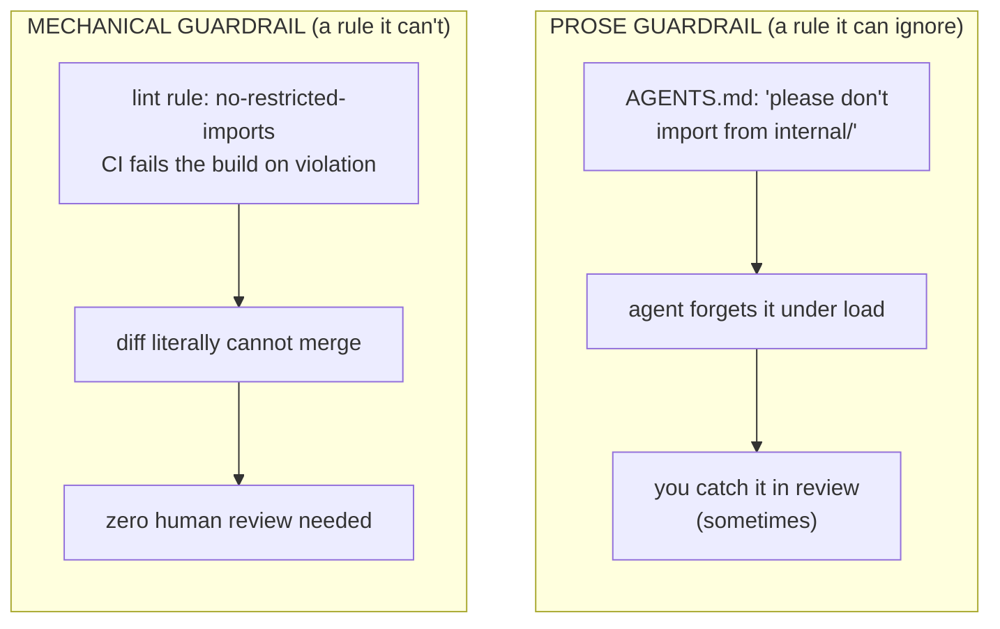
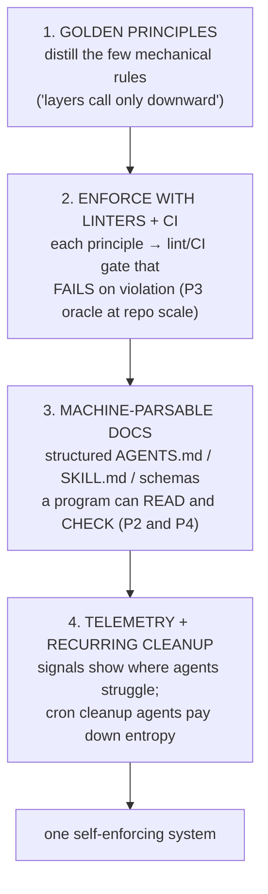

# Lesson 6.4 — Harness engineering

> _Put bumpers on the lane — then even a bad throw stays out of the gutter._

_TL;DR: Stop reminding agents of rules; reshape the repo so rules are **impossible to break** —
golden principles → linters/CI → machine-parsable docs → telemetry + recurring cleanup [^1][^2]._

> **Tech-lead framing.** From here you're not operating an agent — you're **building the environment**
> a whole team of agents runs inside. OpenAI calls this *harness engineering*: when most of the code
> is agent-written, the leverage isn't writing code, it's **engineering the harness** that makes every
> agent's code correct [^1].

## ELI5
_A kids' bowling alley has bumpers: the kid still throws, but the gutters are closed. You changed the
lane, not the throw._

Harness engineering is putting bumpers on your repo. Instead of reminding the agent of a rule every
time (and watching it forget), you reshape the environment so the rule is **impossible to break.** You
move correctness from *your attention* into *the lane itself*.



## The four pillars
_Four moves, each met in an earlier phase; the frontier is wiring them into one self-enforcing
system [^1]._



| Pillar | Was, in an earlier phase | Becomes, at repo scale |
|---|---|---|
| Golden principles | "good architecture" prose | a handful of **checkable** rules [^1] |
| Linters + CI | the test for one feature (P3) | a pass/fail oracle for the whole repo |
| Machine-parsable docs | minimal AGENTS.md (P2/P4) | docs a *program* validates, not skims |
| Telemetry + cleanup | — | signals + scheduled cleanup agents [^1] |

### 1. Golden principles — few and mechanical
_A golden principle is **objectively checkable**; an unenforced rule is just a suggestion [^1]._

"Write clean code" isn't one. "No module in `domain/` may import from `infra/`" is — a linter decides
it in milliseconds. OpenAI's Codex team encodes these **opinionated, mechanical rules** directly into
the repo to keep it legible for future agent runs [^1]. Distill your architecture to the handful of
such rules, then **delete the prose** that merely *describes* good taste.

### 2. Enforce with linters + CI
_Phase 3's verification oracle, scaled from "this feature" to "the whole repo's rules."_

Each golden principle becomes a CI gate that turns red on violation. The agent gets a deterministic
pass/fail oracle for *architecture*, not just function behavior — and an agent with an oracle closes
its own loop without you.

### 3. Machine-parsable docs as the source of truth
_Prose drifts; nobody runs `assert` on a wiki. Harness docs are structured so a program can check
them._

An `AGENTS.md` whose rules map to lint configs, schemas the build validates, a `SKILL.md` loaded on
demand. When code and doc disagree, a *check* — not a human noticing six weeks later — flags it. The
doc is load-bearing because it's *executable*, not decorative.

### 4. Telemetry + recurring cleanup
_You can't improve a harness you can't see; parallel work breeds entropy, so cleanup runs on a loop
[^1]._

Wire signals: which lint rules fire most, where agents retry, which tests flake — that data shows
*where to add the next bumper.* And because parallel work (L3) generates entropy (dead branches,
duplicated helpers, drift), schedule **recurring cleanup agents** (headless, on cron/CI) to pay it
down [^1]. The harness maintains *itself*.

> 🧠 **Test Yourself:** Why must a golden principle be *mechanically checkable*?
> <details><summary>Answer</summary>An unenforced rule is only a suggestion — agents dilute it under load. If a linter can decide it, CI can make the violation impossible to merge with zero human attention [^1].</details>

## Worked example: "layers only call downward"
_Promote `api→service→repository→db` from a paragraph into a CI gate the agent literally cannot
bypass._

Your rule: `api → service → repository → db`, never upward, never skipping.

| | Prose (before) | Harness (after) |
|---|---|---|
| Where it lives | a paragraph in `AGENTS.md` | a `no-restricted-imports` / dependency-cruiser CI rule |
| Enforcement | ~70% caught in review; rest rots | upward import **cannot merge** |
| Doc | describes the rule | states it *and* points to the lint config — can't disagree |
| Signal | none | dashboard counts firings → spikes flag a confusing boundary |

Now an agent *cannot merge* an upward import. The hour/week you spent catching layer violations is
gone — absorbed into the lane.

## The mindset shift
_Every recurring review comment is a bug in your harness. Promote it [^1]._

> If you've said "you imported upward again" three times, the problem isn't the agent — it's that the
> rule lives in your head instead of in CI. Promote it.

Treat your own repeated feedback as a backlog of bumpers to install.

> 🧠 **Test Yourself:** You've left the same review comment 3 times. What does the harness mindset say to do?
> <details><summary>Answer</summary>Promote it to a mechanical gate (lint/hook/CI). A repeated comment is a *bug in your harness* — fix the class of error once, mechanically, forever [^1].</details>

## Your turn (exercise)

Audit your last 10 review comments (or rules you most repeat). For each, mark:

```
  comment / rule         | checkable by a machine?  | promote to: lint / hook / CI / test
  ───────────────────────┼──────────────────────────┼─────────────────────────────────────
  "don't import upward"  | yes                      | dependency-cruiser CI gate
  "name things clearly"  | no (taste)               | keep as prose (or drop)
```

Pick the **one** most-repeated, most-checkable comment and wire its gate this week. You've just done
harness engineering: fixed a class of bugs once, mechanically, forever.

---
← [Lesson 6.3](03-parallelism-and-worktrees.md) · next → [Lesson 6.5 — Defining team direction](05-defining-team-direction.md)

[^1]: [Harness engineering: leveraging Codex in an agent-first world](https://openai.com/index/harness-engineering/) — OpenAI
[^2]: [Building an AI-Native Engineering Team](https://developers.openai.com/codex/guides/build-ai-native-engineering-team) — OpenAI
