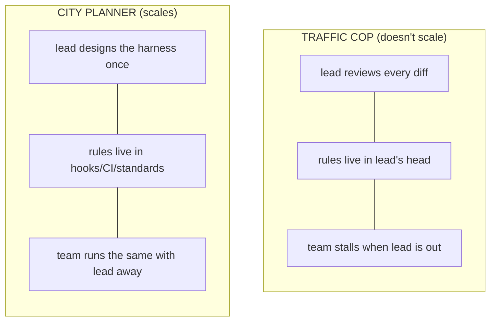
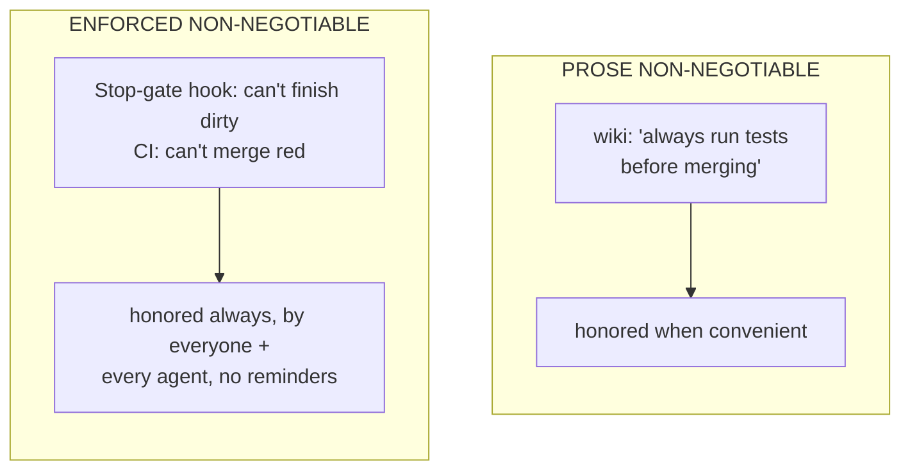
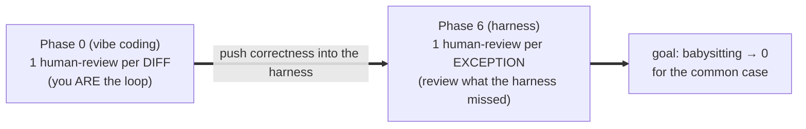

# Lesson 6.5 — Defining a team's direction

> _Be the city planner, not the traffic cop — design the roads, then step back._

_TL;DR: Set direction by **standardizing one core**, enforcing non-negotiables with **hooks/CI not
prose**, betting on **open standards**, and measuring success by how little humans **babysit** [^1][^2]._

> **The leadership lesson.** L6.4 made *your* repo a good harness. This one is about a *team*: how a
> tech lead sets direction so ten engineers and a swarm of agents pull the same way — without
> reviewing every diff. Your job stops being "best agent operator" and becomes "the person who
> designed the environment everyone else operates in."

## ELI5
_A good city planner lays roads and times the lights; traffic flows on its own. A bad one waves their
arms at the intersection — and chaos returns the moment they leave._

Agent-first leadership is city planning, not traffic-cop work. Design the **roads** (the standardized
core), enforce the **limits** (non-negotiables as hooks/CI), then **step back.** If the team only
works when you're watching, you built a cop's job, not a system.



## Four moves of agent-first leadership
_Standardize the core · enforce in mechanism · bet on open standards · measure the babysit ratio._

| Move | One line | Failure it prevents |
|---|---|---|
| 1. Standardize the core | one shared `AGENTS.md`/hook/CI baseline, extended per repo | ten snowflake setups; relearning each repo |
| 2. Enforce in mechanism | non-negotiables as hooks/CI, never prose [^1] | rules "honored when convenient" |
| 3. Bet on open standards | author once in `AGENTS.md`/`SKILL.md`/MCP, render per agent [^2][^3] | a vendor lock-in rewrite |
| 4. Measure babysitting | track human-attention-per-unit-of-agent-work | shipping volume that hides rising toil |

### 1. Standardize the agent-first core
_Every repo shares **one** baseline so agents move between repos without relearning each one's quirks._

Same `AGENTS.md` skeleton, same hook guardrails, same CI gates, same memory loop (P2), same test-gate
(P3) — not ten snowflakes, **one standard core**, extended per project. A new repo (or agent) inherits
the team's hard-won knowledge on day one.

### 2. Enforce non-negotiables with hooks/CI — never prose
_A non-negotiable that lives in a doc is one that gets violated; your output is mechanism, not memo
[^1]._

"Always run the formatter," "never commit secrets," "tests pass before merge" — as *prose* these are
aspirations.



This is *own your control flow* (#8) [^1] at team scale: process encoded in mechanisms you control,
not in everyone *remembering* it.

> 🧠 **Test Yourself:** A wiki says "never commit secrets," yet secrets leak every few weeks. What change *most* reduces leaks?
> <details><summary>Answer</summary>A non-bypassable secret-scanning hook / required CI check. Wider prose, review checklists, and dashboards depend on someone remembering or only *measure* the problem — mechanism *prevents* it [^1].</details>

### 3. Bet on open standards, not a vendor
_Author once in the open standard, render per agent — so the next tool migration is a re-render, not a
rewrite [^2][^3]._

Your team will use Claude Code, Codex, Cursor, Copilot — and tools that don't exist yet. A core in
one vendor's proprietary format bets the team on that vendor. Anchor on open standards instead:

| Standard | What it is | Stewarded by |
|---|---|---|
| **`AGENTS.md`** | open context-file format; vendor configs become thin adapters | Agentic AI Foundation (Linux Foundation) [^3] |
| **`SKILL.md`** | open progressive-disclosure skill format | agentskills.io |
| **MCP** | open tool/integration protocol; one inventory, rendered per agent | modelcontextprotocol.io |

> **Principle:** *author once in the open standard, render per-agent.* The vendor format is an
> adapter, never the source of truth — that's how you stay agent-agnostic and survive the next
> migration without a rewrite [^2].

### 4. Measure success by how little humans babysit
_The metric isn't PRs merged — it's the **babysit ratio**: human attention per unit of agent work._



Healthy trend: agents open PRs, the harness gates them, most merge green untouched, and you spend
time on the *novel* failures — which become the *next* bumper (L6.4). If your review queue isn't
shrinking as agent volume grows, your harness isn't improving.

> 🧠 **Test Yourself:** Why is "babysit ratio" a better leadership metric than "PRs merged"?
> <details><summary>Answer</summary>PR count can rise while human toil rises too. The babysit ratio measures *attention per unit of work* — the thing the harness is supposed to drive toward zero. A falling ratio means the harness is improving.</details>

## Worked example
_A staff engineer ships one `agent-first-core` instead of a 20-page best-practices doc nobody
enforces._

Inheriting five teams "using AI" differently, they:

1. **Standardize:** publish one `agent-first-core` — shared `AGENTS.md` base, hook pack, CI templates
   — every repo adopts it.
2. **Enforce:** the secret-scanning hook and test `Stop`-gate are **required CI checks**; branch
   protection makes them non-bypassable. Rules become load-bearing infrastructure.
3. **Open standards:** the core is `AGENTS.md` + `SKILL.md` + an MCP inventory; per-vendor files are
   generated adapters, so swapping Cursor for Codex is a re-render, not a rewrite [^2].
4. **Measure:** a dashboard tracks the babysit ratio per team. Two months in, agent PRs tripled and
   review-comments-per-PR halved. *That ratio* is the win — not the PR count.

## Your turn (exercise)

Write your team's (or your own) **three non-negotiables** — rules that must *never* be violated. For each:

```
  non-negotiable          | currently enforced by:  prose / hook / CI / nothing
  ────────────────────────┼────────────────────────────────────────────────────
  1. ____________________ | __________
  2. ____________________ | __________
  3. ____________________ | __________
```

Any "prose" or "nothing" is a leadership gap, not a discipline problem. Convert one to a mechanism. A
non-negotiable an agent *can* violate isn't one.

---
← [Lesson 6.4](04-harness-engineering.md) · next → [Lesson 6.6 — The scaffolder is the capstone](06-scaffolder-capstone.md)

[^1]: [12-Factor Agents (factor 8 — own your control flow)](https://github.com/humanlayer/12-factor-agents) — humanlayer
[^2]: [Building an AI-Native Engineering Team](https://developers.openai.com/codex/guides/build-ai-native-engineering-team) — OpenAI
[^3]: [AGENTS.md — open agent-instruction standard](https://agents.md/) — Agentic AI Foundation (Linux Foundation)
