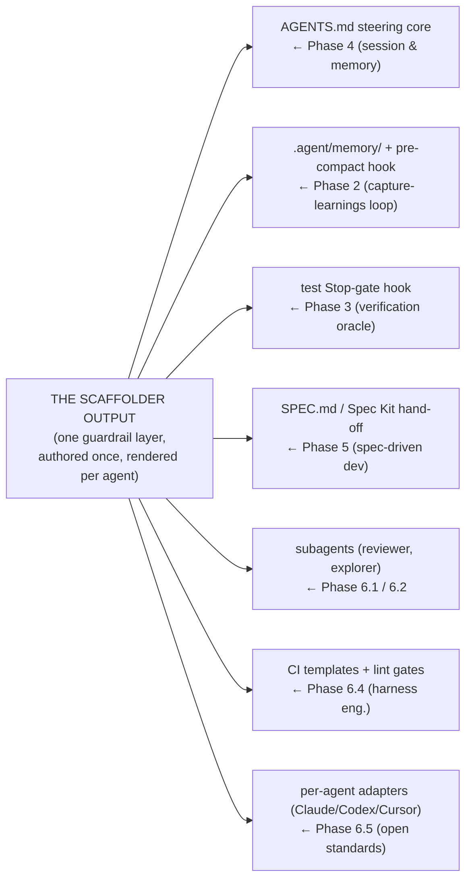
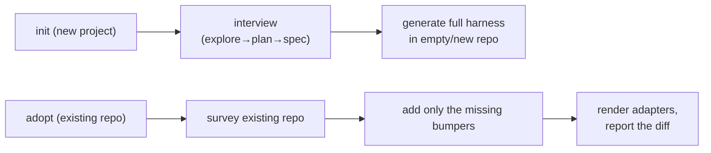

# Lesson 6.6 — The scaffolder is the capstone

> _When you can name the phase behind every generated file, the magic is gone and the understanding
> is complete._

_TL;DR (lockstep + graduation): the **whole scaffolder** is this phase's artifact — run it and
recognize every generated piece as something an earlier phase taught you [^1][^2]._

## ELI5
_It's an IKEA flat-pack of the harness you'd otherwise build by hand — and you've already learned to
make every single part, so when you open the box nothing is a mystery._

A scaffolder bolts together the memory hook, the test gate, the reviewer subagent, the CI rules, and
the per-agent adapters into one ready-to-run harness. The graduation moment is opening the box and
naming the phase that taught each piece — at which point the tool stops being magic and becomes
*your* process, automated.

> **Lockstep lesson — and the graduation.** Every phase ended by showing the one artifact the companion
> *scaffolder* generates. Here, the **whole scaffolder** is the artifact. Run it and every piece should
> read as something a prior phase taught — at which point the tool stops being magic and becomes
> *automation of a process you understand.*

## The whole tool, finally visible
_Each earlier phase showed one generated piece; the capstone is seeing them **assembled** into one
coherent harness._

The guardrail layer, the CI templates, and the per-agent adapters that make it portable — that
assembly *is* harness engineering (L6.4) and team direction (L6.5), packaged as one command.



_Every output is a harness piece an earlier phase taught — assembled into one coherent system [^3][^4]._

## Two ways in: `init` and `adopt`
_The scaffolder meets a repo where it is — build fresh, or fit to existing history._

| | `init` (new project) | `adopt` (existing repo) |
|---|---|---|
| Step 1 | **interviews** you (explore→plan→spec, P2) | **surveys** what's already there |
| Step 2 | generates the full harness from scratch | adds only the **missing** bumpers |
| Records | the full setup | **a diff of what it changed** — nothing silent |



Either way the **output is the same harness** — the only difference is built fresh vs. fitted to a
repo with history.

> 🧠 **Test Yourself:** When does `adopt` add an `AGENTS.md`, and what does it *always* produce?
> <details><summary>Answer</summary>Only if the repo lacks one (it fills gaps, not overwrites). It always records a **diff of what it changed**, so nothing happens silently.</details>

## The recognition exercise — *the* graduation moment
_Run it on a real repo and annotate every generated artifact with the phase that taught it._

This is the point of the whole curriculum. When you can do this, you've graduated: you understand not
just *what* the tool produced, but *why each piece exists* and *what failure it prevents.*

```
   .agent/memory/ + PreCompact hook   ─► "Phase 2 — survives compaction; learnings persist"
   AGENTS.md (short, imperative)      ─► "Phase 2/4 — minimal steering; rules it can't dilute"
   Stop-gate: refuse-finish-if-red    ─► "Phase 3 — the verification oracle; can't ship broken"
   SPEC.md template + Spec Kit hook   ─► "Phase 5 — think then implement; durable plan"
   reviewer subagent + rubric         ─► "Phase 6.2 — fresh-context adversarial review"
   CI lint gates (arch rules)         ─► "Phase 6.4 — golden principles, mechanically enforced"
   .claude/ + .codex/ + .cursor/      ─► "Phase 6.5 — open standard authored once, per-agent adapters"
   downgrade-recorded fallbacks       ─► "Phase 6.5 — portability; fail-closed, no silent drops"
```

If any artifact makes you go "what's this and why?" — that's a phase to re-skim. A fully annotated
tree means the magic is gone and the *understanding* is complete.

## Why building it by hand would be a mistake
_You'd get the portability edge cases subtly wrong and spend a week; the scaffolder encodes the process
you just learned._

You *could* hand-write all of it — a memory hook per agent, a `Stop`-gate with the right fail-closed
semantics (**Cursor fails open by default** — a real trap [^3]), CI templates, three sets of vendor
adapters kept in sync. But you'd get edge cases wrong and burn a week. The scaffolder generates a
**correct, portable, tested** version in one command — *because* it encodes the same process six
phases taught you. That's the lockstep promise: it only automates what the curriculum made you able to
verify.

## Your turn (exercise — the capstone deliverable)
_Run the scaffolder on a real repo, then produce the annotation map with no blanks._

```
  generated artifact        | taught in | prevents…
  ──────────────────────────┼───────────┼───────────────────────────────────
  .agent/memory/ + hook      | Phase 2   | learnings lost on compaction
  AGENTS.md                  | Phase 2/4 | unsteered, drifting agents
  Stop-gate hook             | Phase 3   | shipping with red tests
  …                          | …         | …
```

Fill that table for **every** artifact with no blanks and you've completed the curriculum: the tool
is no longer magic — it's *your* process, automated. That is what it means to be a systems engineer
for agents.

---
← [Lesson 6.5](05-defining-team-direction.md) · [Phase 6 home](index.md) · 🎓 → [Check your understanding](quiz.json)

[^1]: [Building an AI-Native Engineering Team](https://developers.openai.com/codex/guides/build-ai-native-engineering-team) — OpenAI
[^2]: [Harness engineering: leveraging Codex in an agent-first world](https://openai.com/index/harness-engineering/) — OpenAI
[^3]: [Run parallel sessions with worktrees](https://code.claude.com/docs/en/worktrees) — Anthropic (Claude Code docs)
[^4]: [AGENTS.md — open agent-instruction standard](https://agents.md/) — Agentic AI Foundation (Linux Foundation)
