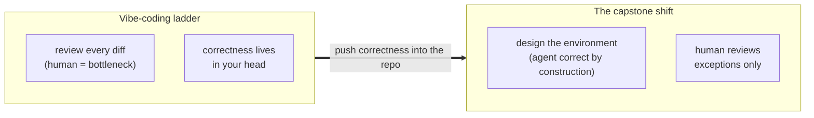
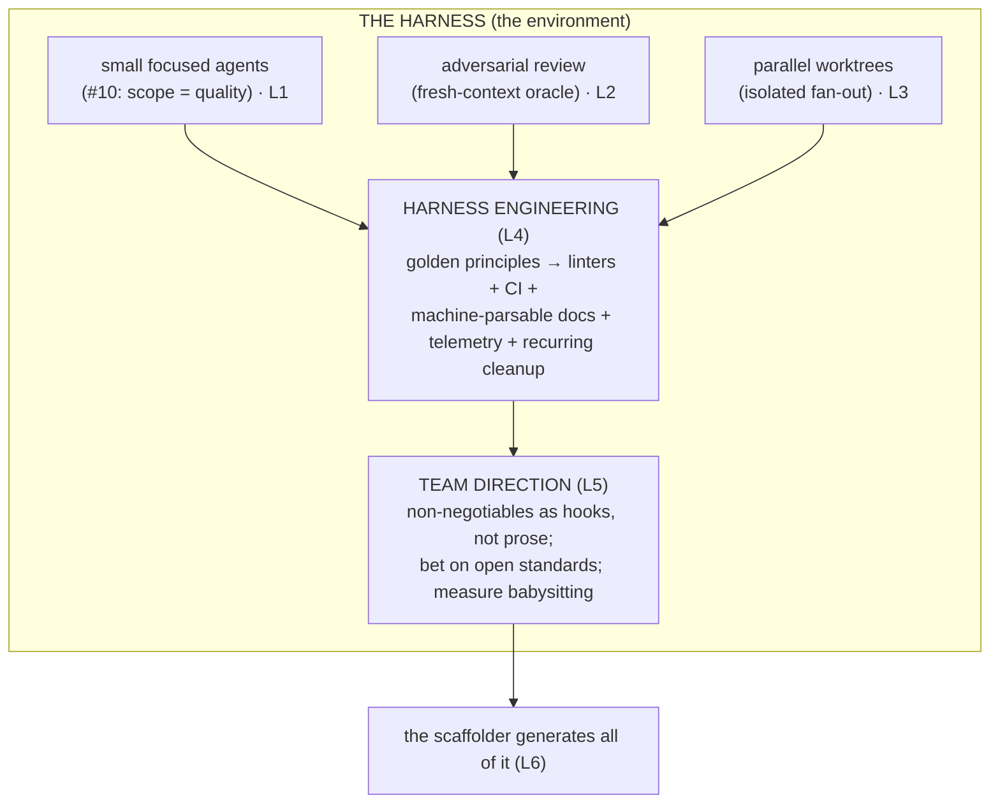

# Phase 6 — Orchestration & Harness Engineering ★★★ (capstone)

> **The capstone.** Everything so far taught you to operate *one* agent well. This phase is the
> payoff: stop tuning individual edits and **design the environment** so that *any* competent agent
> succeeds by construction — the leap from "good agent operator" to **systems engineer for agents.**

## Executive summary

_What this phase makes you able to do, in five sentences._

You stop being the pilot for every task and start **building the lane** the agents fly in. You'll
decompose work into **small, focused agents** (writer + adversarial reviewer), run them in
**parallel via git worktrees** and **headless fan-out**, then graduate to **harness engineering** —
encoding mechanical "golden principles," enforcing architecture with linters + CI, treating
machine-parsable docs as the source of truth, and wiring telemetry + recurring cleanup [^1][^2]. The
leadership lesson closes it: a tech lead sets **team direction** with hooks and open standards, not
prose, and measures success by how little humans babysit. The whole phase distills the
**load-bearing three** of 12-factor-agents — *own your context window* (#3), *own your control flow*
(#8), *keep agents small and focused* (#10) [^3]. Master it and correctness moves from your review
queue into the repo itself.

**Prerequisite:** Phases 1–5 (the loop, context engineering, verification, session & memory, specs).

**Learning objectives — after this phase you can:**

| # | You can… |
|---|---|
| 1 | Decompose a task into scoped subagents that protect the main context window |
| 2 | Run an adversarial, fresh-context reviewer scoped to correctness-only |
| 3 | Run isolated parallel agents via worktrees + headless fan-out (test small, then scale) |
| 4 | Promote a repeated review comment into a mechanical gate (lint / hook / CI) |
| 5 | Set team direction with enforced non-negotiables and open standards |
| 6 | Recognize every scaffolder artifact as a phase you've already learned |

---

## The big idea (in one sentence)

> Don't engineer the **edit** — engineer the **environment** that makes the edit correct.

_You bottleneck the team when correctness lives in your head and your review queue. Push it into the
repo instead._

---

## Lessons (one concept each)

| # | Lesson | The one idea |
|---|---|---|
| 1 | [Small, focused agents](01-small-focused-agents.md) | Scope kills quality; subagents protect the main context window [^3][^4]. |
| 2 | [Adversarial review](02-adversarial-review.md) | A fresh-context reviewer that sees *only* the diff + criteria catches what the author can't [^4]. |
| 3 | [Parallelism & worktrees](03-parallelism-and-worktrees.md) | Isolated worktrees + headless fan-out; test small, then scale [^5]. |
| 4 | [Harness engineering](04-harness-engineering.md) | Encode principles mechanically; enforce with linters + CI + telemetry [^1][^2]. |
| 5 | [Defining team direction](05-defining-team-direction.md) | Standardize the core; enforce non-negotiables with hooks, not prose [^6]. |
| 6 | [The scaffolder is the capstone](06-scaffolder-capstone.md) | Run it on a real repo and recognize every artifact from prior phases. |

---

## Phase diagram

---

## Phase exercise (do this for real)

_Design one piece of the environment instead of doing one task._

1. Pick the single rule you most often have to *remind* an agent of ("don't import from `internal/`",
   "always run the formatter"). Write it as **prose** in `AGENTS.md` — note how often the agent still
   forgets it.
2. Move that same rule into a **mechanical check**: a lint rule, a `PreToolUse` hook, or a CI gate
   that *fails* on violation.
3. Have an agent intentionally try to violate it. Watch the check stop it with **zero** human review.

Write 3 sentences on the difference between a rule the agent *can* ignore and a rule it *can't*. That
shift — from asking nicely to enforcing mechanically — is the entire phase.

---

## Cheatsheet

_The whole phase on one screen._

### Key terms — what people say vs. what it means

| Term | What people say | What it actually means |
|---|---|---|
| **Subagent** | "A helper bot" | A disposable agent with its **own** context window + scoped tools; returns a summary so its junk never lands on the main desk [^3][^4]. |
| **Context firewall** | "Saving tokens" | Exporting context-heavy work to a subagent so the *main* window stays clean — the load-bearing reason to delegate [^4]. |
| **Adversarial review** | "Have it check itself" | A **fresh-context** reviewer that sees *only* diff + criteria, so it doesn't inherit the author's blind spots [^4]. |
| **Worktree** | "Another branch" | A separate working **directory** on its own branch — agents get isolated files on disk, not just isolated commits [^5]. |
| **Headless / fan-out** | "Run it in a script" | Non-interactive `agent -p` with JSON output, so CI can *gate* on the result across many targets — no human in the loop [^5]. |
| **Harness engineering** | "Good tooling" | Reshaping the repo so rules are **impossible to break**: golden principles → linters/CI → machine-parsable docs → telemetry [^1][^2]. |
| **Golden principle** | "A best practice" | A **mechanically checkable** rule ("`domain/` can't import `infra/`") — if a linter can't decide it, it's a suggestion [^1]. |
| **Babysit ratio** | "Productivity" | Human attention per unit of agent work; the real metric — it should *fall* as agent volume rises. |

### The move is universal; the button differs

| Move | Claude Code | Codex | Cursor |
|---|---|---|---|
| Spawn a scoped subagent | `.claude/agents/*.md` + Task tool [^3] | `.codex/agents/*` | custom mode / Task subagent |
| Isolated parallel session | `--worktree` / `isolation: worktree` [^5] | per-thread worktree | per-agent worktree |
| Headless / fan-out | `claude -p --output-format json` | `codex exec --json` | `cursor-agent -p` |
| Enforce a hard rule | `PreToolUse` hook (fail-closed) | `PreToolUse` hook | `beforeShellExecution` (`failClosed: true`) |
| Block finish until green | `Stop`-gate hook | `Stop`-gate hook | `stop` hook |

> **Portability trap:** Claude/Codex hooks fail **closed** on exit-2; **Cursor fails open by
> default** — set `failClosed: true` on any security hook, or your guardrail is decorative.

### The mindset, in one line

> Every recurring review comment you write is a **bug in your harness.** Promote it to a gate [^1].

---

→ **[Check your understanding](quiz.md)**

[^1]: [Harness engineering: leveraging Codex in an agent-first world](https://openai.com/index/harness-engineering/) — OpenAI
[^2]: [Building an AI-Native Engineering Team](https://developers.openai.com/codex/guides/build-ai-native-engineering-team) — OpenAI
[^3]: [12-Factor Agents (factors 3, 8, 10)](https://github.com/humanlayer/12-factor-agents) — humanlayer
[^4]: [Create custom subagents](https://code.claude.com/docs/en/sub-agents) — Anthropic (Claude Code docs)
[^5]: [Run parallel sessions with worktrees](https://code.claude.com/docs/en/worktrees) — Anthropic (Claude Code docs)
[^6]: [AGENTS.md — open agent-instruction standard](https://agents.md/) — Agentic AI Foundation (Linux Foundation)
