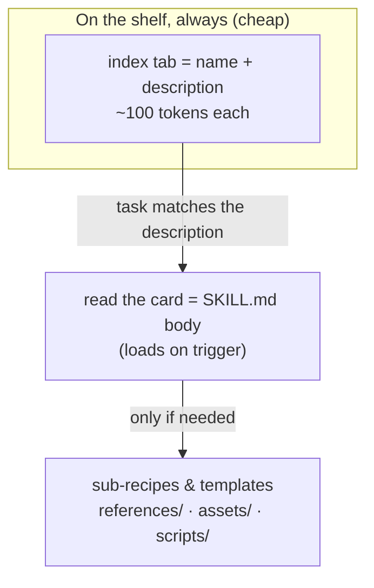
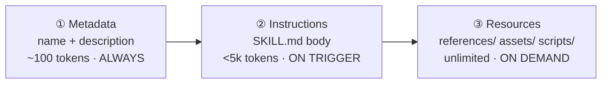

# Lesson 7.1 — Anatomy of a Skill

> _A skill is a capability the agent reaches for by name — written once, loaded only when it fits._

_TL;DR: A skill is a **directory** with a `SKILL.md` (YAML frontmatter + instructions). Only its `name`+`description` stay in context; the body and bundled files load **on demand** [^2]. The same `SKILL.md` works across Claude Code, Codex, and Cursor [^1][^6][^7]._

## ELI5: the recipe card in a binder
_The agent keeps a hundred recipe cards on the shelf but only ever reads the index tabs — until one matches._

A skill is a **labeled recipe card** in a kitchen binder. The cook keeps the whole binder on the shelf but only reads the *index tab* — the title and a one-line "use this when making lasagna." Owning a hundred cards costs nothing. The moment a task matches a tab, the cook pulls *that one card* and reads the full method; if it says "see the sauce sub-recipe on the back," they fetch that **only then**. The card lives in a standard binder, so any cook in any kitchen can use it unchanged.



## The file: frontmatter + body
_A `SKILL.md` is YAML frontmatter (metadata) followed by Markdown instructions — and the `description` is what gets it chosen [^1][^2]._

| Field | Required | What it's for |
|---|---|---|
| `name` | **Yes** (open standard) | Lowercase-hyphen id, ≤64 chars, **must match the directory name** [^1] |
| `description` | **Yes** | ≤1024 chars; *what it does and when to use it* — drives automatic invocation [^1][^2] |
| `license` | No | Top-level license name/reference [^1] |
| `metadata` | No | Arbitrary map; **`version` lives here**, not at top level [^1] |
| `allowed-tools` | No (experimental) | Pre-approved tool list [^1] |

The body below the frontmatter is plain instructions — "there are no format restrictions" [^1]. At startup the agent loads only `name`+`description` (~100 tokens/skill); "when you request something that matches a Skill's description, Claude reads `SKILL.md` from the filesystem" [^2]. So the **`description` is the single load-bearing field** — it's all the agent sees when deciding whether to reach for the skill.

> 🧠 **Test Yourself:** A skill has a brilliant 400-line body but a vague one-line description. Why does it silently never fire?
> <details><summary>Answer</summary>At selection time the agent sees only `name`+`description`, never the body — it can't reason about know-how it hasn't loaded. A keyword-poor description means the skill is never matched to a task, no matter how good the body [^2].</details>

## Progressive disclosure (why it scales)
_Three levels load at three times — so a skill can bundle huge references at **zero** standing context cost [^2]._



| Level | Loads | Cost | Holds |
|---|---|---|---|
| ① Metadata | always, at startup | ~100 tokens | `name` + `description` [^2] |
| ② Instructions | when triggered | keep < 500 lines | the `SKILL.md` body [^2] |
| ③ Resources | only when used | ~free until accessed | `references/`, `assets/`, `scripts/` [^1] |

A key trick: a **script's code never enters the context window — only its output does** [^1]. So `scripts/` give an agent deterministic operations cheaply. The authoring rule that falls out: **keep `SKILL.md` under ~500 lines and push detail into `references/`** that load on demand [^1][^2]. A bloated body defeats the whole mechanism (it's a recurring per-turn cost).

## Portable by default
_One `SKILL.md`, every agent — only the discovery directory differs [^1][^6][^7]._

The open-standard home is `.agents/skills/`; vendor dirs are mirrors/aliases. Codex scans `.agents/skills` from the cwd up to the repo root; Cursor reads `.agents/skills/` natively (plus legacy `.claude`/`.codex` paths) [^6][^7].

=== "Claude Code"
    `.claude/skills/<name>/SKILL.md` (project) or `~/.claude/skills/`. All frontmatter is optional here; `name` defaults to the directory name [^3].

=== "Codex"
    `.agents/skills/<name>/SKILL.md`, scanned cwd→repo-root. "Skills build on the open agent skills standard" [^7].

=== "Cursor"
    `.agents/skills/` (and `.cursor/skills/`); legacy `.claude`/`.codex` paths also read for compatibility [^6].

> **Dogfood:** this very repo keeps its skills in the open-standard `.agents/skills/` and mirrors them byte-for-byte to `.claude/skills/` so Claude Code loads them — one source, every agent [^1]. *(Authoring tip: always set `name` to match the directory; it satisfies the strict standard and every consumer [^3].)*

## Skills vs the alternatives
_Skills are *know-how*; the other mechanisms are connectivity, isolation, or always-on facts. They compose [^3][^4]._

| Reach for… | When you need… |
|---|---|
| **Skill** | a repeatable procedure the agent pulls in *only when relevant*, portable & shareable [^2] |
| **Slash command** | backward-compat only — commands were **merged into skills**; add new ones as skills [^3] |
| **Subagent** | context isolation / a fresh budget for a delegated task (a skill can even run in one) [^3] |
| **Output style** | to reshape *how* it responds (tone/format), not add a capability [^3] |
| **MCP server** | a live connection to an external system — *connectivity*, which a skill's *know-how* then drives (Lesson 7.3) [^4] |
| **CLAUDE.md / memory** | an always-true fact; promote it to a skill once "a section has grown into a procedure rather than a fact" [^3] |

## Worked example — dissecting a real skill
_This repo's `author-curriculum` skill, read through the anatomy above._

```markdown
---
name: author-curriculum          # ① matches the directory → always in context
description: Add or update a curriculum lesson… the full Mandatory/Recommended/
  Optional checklist… and integration edits (mkdocs nav, quiz.json…). Trigger
  with "add a lesson", "update the curriculum"…   # the keywords that get it chosen
---
# Author Curriculum                # ② body — loads only when the description matches
…the procedure + checklist…
```

When you typed *"add a lesson on personas"* earlier in this curriculum's own development, that
`description` is what made the agent reach for this skill — Level ① doing its job. A larger skill in
the same repo, `scaffold-agent-project`, adds `references/` and `assets/` subdirectories: Level ③
content that stays off the context shelf until the skill actually needs a hook script or a template.
For more real, open-source skills to learn from, Anthropic maintains a public reference library [^5].

## Your turn (exercise)
Take a procedure you re-explain to your agent often (how you run tests, how you cut a release). Write a `SKILL.md`: `name` matching the directory, a **keyword-rich `description`** naming the trigger phrases, a body **under ~500 lines**, and push any long reference into a `references/` file. Then prove Level ① works: start a fresh session, describe the task in your *own* words (don't name the skill), and confirm the agent auto-invokes it. If it doesn't fire, your description — not your body — is the bug.

---
← [Phase 7 home](index.md) · next → [Lesson 7.2 — Hooks, deep](02-hooks-deep.md)

[^1]: [Agent Skills — Specification](https://agentskills.io/specification) — agentskills.io (the open standard)
[^2]: [Agent Skills — Overview](https://platform.claude.com/docs/en/agents-and-tools/agent-skills/overview) — Anthropic
[^3]: [Extend Claude with skills](https://code.claude.com/docs/en/skills) — Anthropic (Claude Code docs)
[^4]: [Equipping agents for the real world with Agent Skills](https://www.anthropic.com/engineering/equipping-agents-for-the-real-world-with-agent-skills) — Anthropic Engineering (Oct 16, 2025)
[^5]: [anthropics/skills — reference implementation](https://github.com/anthropics/skills) — Anthropic
[^6]: [Agent Skills — Cursor docs](https://cursor.com/docs/skills) — Cursor
[^7]: [Agent Skills — Codex](https://developers.openai.com/codex/skills) — OpenAI
