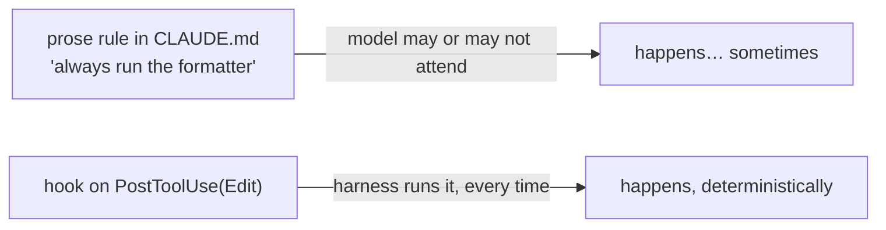
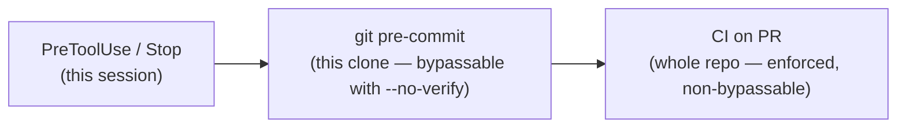

# Lesson 7.2 — Hooks, deep

> _A hook is a tripwire wired to the event — not a sign asking the agent to behave._

_TL;DR: A hook is a deterministic command the **harness** runs on a lifecycle event — not the model [^1]. On the blocking events, **exit code 2 stops the action**; that's what turns an advisory rule ("always run tests") into an enforced one [^1][^4]._

## ELI5: the tripwire vs the sign
_A sign relies on the hiker reading and obeying it; a tripwire is wired to the gate — cross the line and it fires, every time._

A prompt that says "please don't commit secrets" is a **sign on the trail**: it works only if the agent reads it and chooses to obey (and it's competing with everything else in the context window). A hook is a **tripwire**: it's wired to the *event*, not to the agent's goodwill — when the event fires, the command runs, no judgment call, whether or not anyone "read the sign."



## What a hook is — and why deterministic wins
_The harness, not the LLM, decides to run a hook; the model can't skip it, forget it, or decide it isn't needed [^1]._

This is the payoff of **prose → hooks** (Phase 4.4): a rule written as advisory prose is *probabilistic* — followed only when the model attends to it. The same rule as a hook is *deterministic* — it executes 100% of the time the event fires, outside the model's reasoning. It's 12-factor Factor 8, **"own your control flow"**: keep authority in code, and interrupt the agent "ESPECIALLY between the moment of tool **selection** and the moment of tool **invocation**" [^4] — which is exactly where a `PreToolUse` hook sits.

> 🧠 **Test Yourself:** "Never commit secrets" written in `CLAUDE.md` vs. the same rule as a hook — what actually changes?
> <details><summary>Answer</summary>The `CLAUDE.md` line is probabilistic: it competes for attention and is followed only when the model attends to it. The hook is deterministic: the harness runs it on the event, outside the model's control — it can't be forgotten or reasoned away [^1][^4].</details>

## The lifecycle events
_Hooks bind to events; only **pre**-events can block — and the exit code is the contract [^1]._

The high-value core (the current Claude Code set is much larger — ~30 events — but these carry most lessons) [^1]:

| Event | Fires | Can block? |
|---|---|---|
| `SessionStart` | session begins/resumes | — (can inject context) |
| `UserPromptSubmit` | before the agent sees your prompt | ✅ |
| `PreToolUse` | before a tool runs | ✅ (the key one) |
| `PostToolUse` | after a tool succeeds | ❌ (react only) |
| `Stop` / `SubagentStop` | the agent is about to finish | ✅ (force it to continue) |
| `PreCompact` | before context compaction | ✅ |

Every hook gets a JSON object on **stdin** (`session_id`, `cwd`, `hook_event_name`, and for tool events `tool_name`/`tool_input`) [^1]. The **exit code** is the contract: `0` = success (stdout may carry JSON or injected context); **`2` = block** — stdout is ignored and **stderr is fed back to the agent as the reason** [^1]. The effect of a block is event-specific: on `PreToolUse` it cancels the tool call; on `Stop` it *prevents stopping* and pushes the agent to keep working [^1].

## Handler patterns → which event
_Match the goal to the event — and remember only pre-events can stop something [^1]._

| Goal | Event | How |
|---|---|---|
| Block a dangerous command (`rm -rf`, force-push) | `PreToolUse` (matcher `Bash`) | inspect `tool_input.command`; **exit 2** to deny |
| Auto-format after an edit | `PostToolUse` (matcher `Edit\|Write`) | run the formatter on `tool_input.file_path` |
| Gate finishing until tests pass | `Stop` | run tests; **exit 2** to force the agent to continue |
| Secret-scan before a write/commit | `PreToolUse` (+ the git/CI layer below) | scan; exit 2 to deny |
| Reduce approval fatigue | `PreToolUse` | auto-`allow` known-safe calls deterministically |

> 🧠 **Test Yourself:** You want to auto-run the linter after every file edit. Which event — and can it block a bad edit?
> <details><summary>Answer</summary>`PostToolUse` on `Edit|Write`. It fires *after* the edit, so it can react (format/lint/log) but **cannot block** it — the edit already happened. To *prevent* something, hook the matching `Pre` event [^1].</details>

## Agent-agnostic — and the fail-open trap
_The concept is converging across harnesses, but the **default failure mode** is what bites you [^1][^2][^3]._

| | Claude Code [^1] | Codex [^2] | Cursor [^3] |
|---|---|---|---|
| Naming | PascalCase | PascalCase | camelCase |
| Block mechanism | exit 2 / `deny` | exit 2 / `deny` | exit 2 / `deny` |
| **On hook crash/timeout** | blocks | blocks | **fails OPEN — action proceeds** |

> ⚠️ **Cursor hooks fail open by default** — the docs state a crashed/timed-out hook "allow[s] the action through (fail-open)." A security hook that errors silently *stops protecting you* unless you set **`failClosed: true`** [^3]. Never assume Claude/Codex's exit-2-blocks behavior carries over.

## Innermost → outermost: the layers
_Agent-session hooks are the inner gate; git `pre-commit` and CI are the outer gates that catch what escapes [^5][^6][^7]._



A harness hook protects *one agent session*. The git `pre-commit` hook aborts a commit on non-zero exit [^6], and the `pre-commit` framework manages such checks via `.pre-commit-config.yaml` [^5]. But a contributor can `--no-verify` past a local hook — so **CI is the enforced backstop**: a workflow on `pull_request` that no human or agent can skip [^7]. Run the same check at multiple layers.

## Worked example — our skill-mirror gate
_This repo's own rule, promoted from prose to a deterministic gate at two layers._

The rule "keep `.agents/skills/` and `.claude/skills/` byte-identical" started as prose in `CLAUDE.md` — advisory, forgettable. It's now `tests/check-skill-mirror.sh` (POSIX sh; exits non-zero on any drift), wired into **both** outer gates:

```yaml
# .pre-commit-config.yaml — fast local feedback when either skills tree changes
- repo: local
  hooks:
    - id: skill-mirror-parity
      entry: tests/check-skill-mirror.sh
      language: script
      files: ^\.(agents|claude)/skills/
```
```yaml
# .github/workflows/ci.yml — the enforced backstop, runs on every PR
- name: Skill mirror parity (.agents/skills == .claude/skills)
  run: sh tests/check-skill-mirror.sh
```

That's the lesson in miniature: a forgettable prose rule became a tripwire — local pre-commit for speed [^5][^6], CI for enforcement [^7] — exactly Factor 8's "own your control flow" [^4].

## Your turn (exercise)
Take a rule you keep re-typing to your agent ("run the linter after editing", "don't touch `main`"). Decide the **event** (a `Pre` event to *block*, a `Post` event to *react*), write a small script that reads the stdin JSON and exits `2` to stop, and wire it as a hook. Test that it actually fires. Then ask the real question: should it *also* be a git/CI gate, so a human — or a different agent — can't bypass it?

---
← [Lesson 7.1](01-anatomy-of-a-skill.md) · [Phase 7 home](index.md) · → [Check your understanding](quiz.json)

[^1]: [Hooks reference](https://code.claude.com/docs/en/hooks) — Anthropic (Claude Code docs)
[^2]: [Codex hooks](https://developers.openai.com/codex/hooks) — OpenAI
[^3]: [Cursor hooks](https://cursor.com/docs/hooks) — Cursor (note: fail-open by default)
[^4]: [12-Factor Agents — Factor 8: Own your control flow](https://github.com/humanlayer/12-factor-agents/blob/main/content/factor-08-own-your-control-flow.md) — humanlayer
[^5]: [pre-commit — a framework for managing pre-commit hooks](https://pre-commit.com/) — pre-commit.com
[^6]: [Git Hooks (Pro Git §8.3)](https://git-scm.com/book/en/v2/Customizing-Git-Git-Hooks) — git-scm.com
[^7]: [Understanding GitHub Actions](https://docs.github.com/en/actions/about-github-actions/understanding-github-actions) — GitHub
