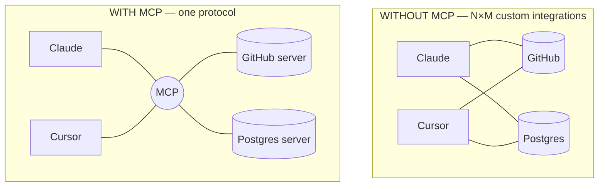
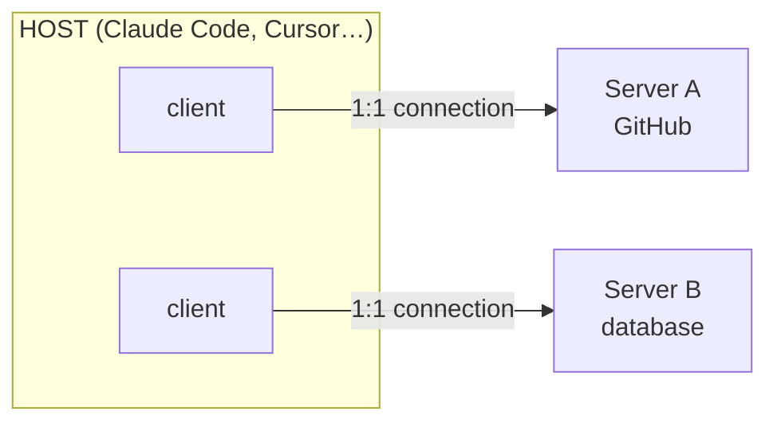

# Lesson 7.3 — MCP, deep

> _Build the plug once on your data; any agent that speaks the protocol can connect._

_TL;DR: MCP (Model Context Protocol) is an open standard so **any** agent can reach your codebase, data, and tools over one protocol — instead of N×M custom integrations [^4][^5]. A server exposes three things: **Tools, Resources, and Prompts** [^3]._

## ELI5: USB-C for AI
_Before USB-C, every device had its own charger; before MCP, every agent needed a custom plug for every tool._

The official framing: "Think of MCP like a **USB-C port for AI applications**… a standardized way to connect AI applications to external systems" [^4]. Build the plug once on your data or tool (the **server**), and any MCP-speaking app (the **host**) can connect to it — no bespoke wiring per pair.

## The problem it solves
_Every new data source used to need its own custom connector; MCP replaces those with a single protocol [^5]._

Anthropic's framing at launch (Nov 2024): "Every new data source requires its own custom implementation, making truly connected systems difficult to scale" [^5]. MCP's design is borrowed from the **Language Server Protocol** — LSP standardized how editors talk to language tooling; MCP standardizes how agents talk to context and tools [^1]. One server, many clients.

## Architecture: host, client, server
_A host runs one client per server; each client holds a dedicated 1:1 connection [^2]._

The protocol has two layers: a **data layer** (JSON-RPC 2.0 — lifecycle, capability negotiation, the primitives) and a **transport layer** (connection, framing, auth) [^2].

> 🧠 **Test Yourself:** A host connects to three MCP servers. How many clients does it run?
> 

Answer
Three — the host instantiates **one client per server**, each maintaining a dedicated 1:1 connection [^2].

## The three server primitives
_What a server exposes — and **who controls each** is the load-bearing distinction [^3]._

| Primitive | What it is | Who controls it |
|---|---|---|
| **Tools** | Executable functions the agent invokes to *act* (query a DB, call an API, write a file) | **Model** |
| **Resources** | Passive, read-only data that supplies *context* (file contents, a schema, records) | **Application** |
| **Prompts** | Reusable, parameterized instruction templates (often surfaced as slash-commands) | **User** |

The control column is the insight most people miss: only **Tools** are model-controlled. **Resources** are application-controlled (the host decides what to pull in) and **Prompts** are user-controlled. The spec's canonical example: a database server exposes *tools* to run queries, a *resource* for the schema, and a *prompt* with few-shot examples [^1][^3].

> 🧠 **Test Yourself:** Which of the three primitives does the *model* decide to invoke on its own?
> 

Answer
Only **Tools**. Resources are application-controlled and Prompts are user-controlled — a common misconception is that all three are model-driven [^3].

## Transports & connecting a host
_Local servers use stdio; remote servers use Streamable HTTP (with OAuth). The old SSE transport is deprecated [^1][^7]._

- **stdio** — stdin/stdout between local processes; no network; typically one client [^2].
- **Streamable HTTP** — HTTP POST + optional Server-Sent Events; for remote, multi-client servers; "MCP recommends using OAuth" for tokens [^1]. (The standalone HTTP+SSE transport is deprecated — "Use HTTP servers instead" [^7].)

Connecting in Claude Code is one command — e.g. `claude mcp add --transport http notion https://mcp.notion.com/mcp`, scoped `local` / `project` (committed `.mcp.json`) / `user` [^7]. Cursor uses `.cursor/mcp.json`; the pattern is the same everywhere.

## Security: the trust boundary
_MCP gives agents "arbitrary data access and code execution paths" — and the protocol **cannot** enforce safety for you [^1][^6]._

Three facts to internalize [^1][^6]:
1. **Auth is OPTIONAL and HTTP-only** (OAuth 2.1 with PKCE); stdio servers use environment credentials instead.
2. **The spec "cannot enforce these security principles at the protocol level"** — consent, privacy, and tool safety are your responsibility, not the wire's.
3. **Tool descriptions are untrusted by default** — "should be considered untrusted, unless obtained from a trusted server." A malicious server can *poison* tool descriptions (indirect prompt injection).

Named attack classes the spec calls out: **confused deputy**, **token passthrough** (explicitly forbidden — a server "MUST NOT accept any tokens not explicitly issued for it"), **session hijacking**, and **SSRF** [^6]. And a server that fetches external content "can expose you to prompt injection risk" [^7] — which is exactly Lesson 7.4.

## MCP vs skill vs subagent
_MCP is **connectivity**; a skill is **know-how**; a subagent is **isolation** — and they compose [^8]._

| Reach for… | When you need… |
|---|---|
| **MCP server** | a reusable, live connection to a *system* (DB, API, SaaS, codebase) that many agents should reach — solving N×M [^5] |
| **Skill** (7.1) | to teach one agent a *procedure*; it has no wire protocol, and often *drives* an MCP tool [^8] |
| **Subagent** (6.1) | context isolation / parallelism for a bounded task — orthogonal; a subagent can use both |

Anthropic's own framing: skills and MCP are "complementary, not competing" — "Skills can complement MCP servers by teaching agents more complex workflows that involve external tools" [^8]. MCP supplies the live tool; a skill supplies the know-how to use it well.

## Agent-agnostic adoption
_MCP is an open standard, not an Anthropic feature — the major hosts all speak it [^4][^7]._

| Host | Speaks MCP? |
|---|---|
| Claude Code / Claude | Yes — stdio, HTTP (SSE deprecated) [^7] |
| Cursor | Yes — `.cursor/mcp.json` [^4] |
| OpenAI / Codex / ChatGPT | Yes — Responses API, Agents SDK [^4] |
| VS Code (+ Copilot) | Yes [^4] |

> Two misconceptions to drop: MCP is **not** Anthropic-only (OpenAI, Microsoft, Google, Cursor support it [^4]), and it does **not** replace your APIs — a server typically *wraps* an existing API or DB [^3].

## Your turn (exercise)
Pick a system you keep pasting into the agent by hand — a DB schema, an internal API, your issue tracker. Sketch the MCP server: which **Tools** (actions the model can take), which **Resources** (read-only context like the schema), which **Prompts** (templates)? Choose the transport: **stdio** (local, single user) or **HTTP** (shared, needs OAuth). Then ask the real question: is this genuinely an MCP server (many agents, live data), or is it actually a **skill** (one agent, procedural know-how) — or both, a skill that drives the server's tools?

---
← [Lesson 7.2](02-hooks-deep.md) · [Phase 7 home](index.md) · next → [Lesson 7.4 — Security & injection](04-security-and-injection.md)

[^1]: [MCP Specification (rev. 2025-11-25)](https://modelcontextprotocol.io/specification/2025-11-25) — Model Context Protocol
[^2]: [Architecture overview](https://modelcontextprotocol.io/docs/learn/architecture) — Model Context Protocol
[^3]: [Server concepts — Tools, Resources, Prompts](https://modelcontextprotocol.io/docs/learn/server-concepts) — Model Context Protocol
[^4]: [What is MCP? (intro — the USB-C analogy + ecosystem)](https://modelcontextprotocol.io/docs/getting-started/intro) — Model Context Protocol
[^5]: [Introducing the Model Context Protocol](https://www.anthropic.com/news/model-context-protocol) — Anthropic (Nov 25, 2024)
[^6]: [Security Best Practices](https://modelcontextprotocol.io/specification/2025-11-25/basic/security_best_practices) — Model Context Protocol
[^7]: [Connect Claude Code to tools via MCP](https://code.claude.com/docs/en/mcp) — Anthropic (Claude Code docs)
[^8]: [Equipping agents for the real world with Agent Skills (Skills ↔ MCP)](https://www.anthropic.com/engineering/equipping-agents-for-the-real-world-with-agent-skills) — Anthropic Engineering
