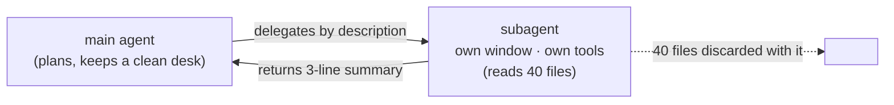
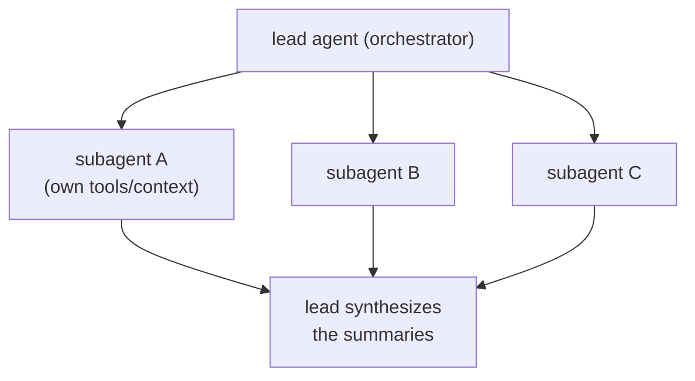

# Lesson 7.5 — Anatomy of a Subagent

> _A subagent is a specialist you hand one job, its own clean desk, and only the tools it needs._

_TL;DR: A subagent is a Markdown file (frontmatter + body) whose **body is its system prompt**; it runs in its **own context window** with its **own tools**, and the agent delegates to it automatically from its `description` [^1]. Least-privilege + one job = the durable specialist (Phase 6.1, now as a reusable file)._

## ELI5: the specialist contractor
_The general contractor doesn't pick up the wiring — they call a licensed electrician who brings their own tools and hands back a short report._

You met this in Phase 6.1: a subagent is the **electrician**. A focused specialist with their own toolbox (least-privilege tools), their own workspace (a separate context window), who does one job and returns a summary. The 40 files they read never land on your desk. What's new here: that specialist is now a **reusable file** you (and your team) keep.



## The file: frontmatter + body
_Only `name` and `description` are required; the **body is the system prompt** — and it *replaces* the default, it doesn't append to it [^1]._

| Field | Role |
|---|---|
| `name` | unique id (the subagent's identity) [^1] |
| `description` | **what it does + when to use it** — drives automatic delegation [^1] |
| `tools` | least-privilege allowlist; omit to inherit all [^1] |
| `model` | `inherit` (default), or route to a cheaper model like `haiku` to control cost [^1] |
| *(also)* `disallowedTools`, `permissionMode`, `skills`, `mcpServers`, `hooks`, `isolation`… | optional [^1] |

> "The body becomes the system prompt… Subagents receive **only this system prompt** (plus basic
> environment details), **not the full Claude Code system prompt**" [^1]. So a subagent isn't a nudge
> layered on top of the default assistant — it *is* a different assistant, scoped to one job.

> 🧠 **Test Yourself:** You give a reviewer subagent *all* tools "to be safe." Why is that worse, not safer?
> <details><summary>Answer</summary>Least-privilege cuts both ways: fewer tools = less wandering (quality) **and** a smaller blast radius (safety). A reviewer needs read + inspect, never write/push — granting more invites exactly the actions a reviewer shouldn't take [^1].</details>

## The `description` drives delegation
_Just like a skill, the `description` is the load-bearing field — it's how the agent decides to delegate [^1]._

The agent auto-delegates "based on the task description in your request, the `description` field in subagent configurations, and current context." To make it fire, "include phrases like **'use proactively'** in your subagent's description" [^1]. Same lesson as 7.1: a brilliant body with a vague description never gets reached for.

## Own context window = a durable context firewall
_A subagent burns its *own* window and returns a distilled summary — the firewall from 6.1, now reusable [^1]._

A subagent "runs in its own context window with a custom system prompt, specific tool access, and independent permissions" [^1]. That buys you four things at once [^1]:

| Benefit | Why |
|---|---|
| **Preserve context** | exploration/logs stay out of your main conversation |
| **Enforce constraints** | limited tools cap what it *can* do |
| **Reuse** | check it into `.claude/agents/` so the team shares it |
| **Control cost** | route the task to a faster/cheaper model |

## Orchestration: one specialist → a team
_One specialist is good; a coordinated team is better — the orchestrator-worker pattern [^2]._



Anthropic's research system uses "an orchestrator-worker pattern, where a lead agent coordinates the
process while delegating to specialized subagents that operate in parallel"; each "provides separation
of concerns — distinct tools, prompts, and exploration trajectories" [^2]. The measured payoff: a
multi-agent system (Opus lead + Sonnet subagents) **outperformed single-agent Opus by 90.2%** on their
internal research eval [^2]. But it only works with discipline — each subagent "needs an objective, an
output format, guidance on the tools and sources to use, and clear task boundaries… Without detailed
task descriptions, agents duplicate work, leave gaps, or fail" [^2]. The **writer/reviewer pair** is the
smallest version: one builds, a fresh-context reviewer judges (Phase 6.2).

> 🧠 **Test Yourself:** Why does a *writer* subagent plus a separate *reviewer* subagent beat one agent reviewing its own work?
> <details><summary>Answer</summary>Separation of concerns + fresh context: the reviewer isn't anchored to the author's own justifications, so it catches what the writer rationalized away (Phase 6.2's adversarial review) [^2].</details>

## Skill vs subagent (they compose)
_A skill is know-how loaded into *your* context; a subagent is a separate worker with *its own* context [^1]._

| | Lives where | Reach for it when |
|---|---|---|
| **Skill** (7.1) | loads into your conversation | the agent needs a procedure/know-how *inline* |
| **Subagent** | its own context window | a side task would flood your context, or you want least-privilege isolation |

They **compose**: a subagent can load skills, call MCP tools (7.3), and run under hooks (7.2) — scoped by least-privilege (7.4). The subagent is where the whole tier comes together.

## Agent-agnostic
_The durable specialist exists in every major tool — only the definition format differs._

The same idea — *a named worker = a system prompt + a tool set* — appears as Claude Code `.claude/agents/*.md` (the body is the system prompt) [^1] and as the OpenAI Agents SDK's `Agent(name=…, instructions=…)`, where `instructions` "is used as the system prompt" [^4]; Cursor expresses it as custom agents/modes. Note: subagent **definitions** are the least-standardized layer — unlike `SKILL.md`, there's no shared cross-tool file format yet.

## What the scaffolder automates for you
_Lockstep: the companion scaffolder now emits a least-privilege `code-reviewer` subagent — this lesson, productized._

This repo dogfoods exactly what you just learned: it runs a **`lesson-reviewer`** subagent (read +
inspect, no write) built on these mechanics, and the companion scaffolder now emits a starter
**`code-reviewer`** subagent into `.claude/agents/` for any project it sets up. The guidance is
consistent across sources — define **focused, specialized** subagents [^3], one job each (12-factor's
"small, focused agents", #10) [^5] — now captured as a reusable file.

## Worked example — a real subagent in this repo
_`.claude/agents/lesson-reviewer.md`, read through the anatomy above._

```markdown
---
name: lesson-reviewer
description: Adversarial reviewer for curriculum lessons. Use proactively after
  writing or editing a lesson… Reports findings; does not edit.   # ← drives delegation
tools: Read, Grep, Glob, Bash, WebFetch     # ← least-privilege: inspect, never write/push
model: inherit
---
You are a senior curriculum reviewer… review with fresh eyes… report findings only.
  # ↑ the body IS the system prompt — it replaces the default assistant for this worker
```

The `description` (with "use proactively") is what makes the main agent delegate to it after a lesson
is written; the `tools` line is why it *can't* secretly edit the file it's judging.

## Your turn (exercise)
Pick a recurring side task (review a diff, find call sites, check a migration). Write a subagent: a `name`, a `description` naming the trigger **+ "use proactively"**, the **narrowest** `tools` that finish the job (if "find call sites" needs write + push, you mis-scoped it), and a focused system-prompt body. Then describe the task in your *own* words and confirm the agent delegates. If it does the work but floods your main context afterward, your tools or description are too broad.

---
← [Lesson 7.4](04-security-and-injection.md) · [Phase 7 home](index.md) · next → [Lesson 7.6 — Prompt & context caching](06-prompt-and-context-caching.md)

[^1]: [Create custom subagents](https://code.claude.com/docs/en/sub-agents) — Anthropic (Claude Code docs)
[^2]: [How we built our multi-agent research system](https://www.anthropic.com/engineering/multi-agent-research-system) — Anthropic Engineering (Jun 13, 2025)
[^3]: [Claude Code best practices](https://code.claude.com/docs/en/best-practices) — Anthropic
[^4]: [OpenAI Agents SDK — agents](https://openai.github.io/openai-agents-python/agents/) — OpenAI
[^5]: [12-Factor Agents (factor 10 — small, focused agents)](https://github.com/humanlayer/12-factor-agents) — humanlayer
