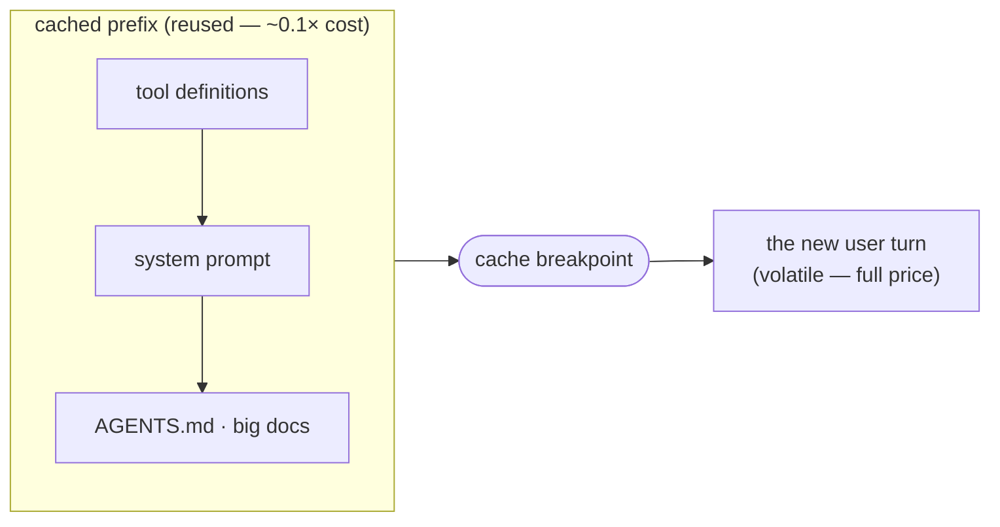

# Lesson 7.6 — Prompt & context caching

> _Don't pay to re-read what hasn't changed — cache the stable prefix._

_TL;DR: Prompt caching stores the **processed prefix** (tools → system → context) so an identical-prefix request skips reprocessing — cache **reads cost ~0.1× input**, writes ~1.25× [^1]. Claude Code does it automatically; your job is to keep the prefix stable [^2]._

## ELI5: mise en place
_Prep the station once; each new order only adds the new ingredient at the end._

Every turn is a new order at the same restaurant. Without caching, the cook re-chops every onion and re-reads the whole recipe binder *before every order*. Caching is the **prepped station**: the binder's open to the right page, the onions are diced. A new order just adds the one new ingredient at the end — everything before it is already on the counter. But the rule is strict: **rearrange the station** (swap the binder, reorder the spice rack — i.e. change the system prompt or tool list) and the cook re-preps from scratch. And the prep stays fresh only ~5 minutes of idle (or an hour, if you pay to keep it warm) [^1].

## How it works: it's a prefix match
_The cache matches an **exact prefix** — everything from the start (tools → system → messages) up to a breakpoint; one changed byte downstream invalidates all of it [^1]._

You mark a block with `cache_control: {type: ephemeral}`; everything *before* it is cached for a **~5-minute TTL** (a 1-hour TTL is available at extra cost). The economics: a **cache write costs ~1.25×** base input, a **cache read ~0.1×** — so you come out ahead once the prefix is read back ~twice [^1]. (There's also a per-model minimum prefix length — a short prompt silently won't cache [^1].) Caching never changes the model's *output*; it only skips re-processing input you already paid for [^1].

> 🧠 **Test Yourself:** You interpolate the current timestamp into your system prompt header. What happens to caching?
> 

Answer
The prefix changes on *every* request, so nothing after it can be reused — you pay full price every turn and write a fresh cache entry that's never read. Keep volatile content (timestamps, IDs, the current question) **after** the breakpoint [^1].

## What to cache: static first, volatile last
_Cache the byte-identical prefix — tool defs, system prompt, `AGENTS.md`, big reference files — and physically place the changing content **after** it [^1][^2]._

| Cache it (stable prefix) | Keep it out (volatile tail) |
|---|---|
| tool definitions (serialized deterministically) | the current user turn |
| the system prompt (no interpolated time/IDs) | timestamps, per-request IDs, mode flags |
| `AGENTS.md` / `CLAUDE.md`, large docs, retrieved context | the varying question / latest tool result |

Order is the whole game: stable content must *precede* volatile content. A timestamp in the system-prompt header makes everything after it uncacheable no matter where the marker goes [^1].

## Claude Code does it for you
_Claude Code caches by default and front-loads rarely-changing content; you verify it's working, you don't wire it [^2]._

> "Claude Code manages prompt caching automatically" — it re-sends the full context each turn, appends new content at the **end**, and caches the unchanged prefix [^2]. It orders three layers so the stable ones come first:

| Layer | Changes when |
|---|---|
| System prompt + tool definitions | the tool set changes or Claude Code upgrades |
| Project context (`CLAUDE.md`, memory, rules) | session start, `/clear`, or `/compact` |
| Conversation (your turns, responses, tool results) | every turn |

Verify the hit rate via `cache_read_input_tokens` vs `cache_creation_input_tokens` in `usage` — "a high read-to-creation ratio means caching is working well" [^2].

## Caching vs compaction & context editing
_Anything that rewrites the prefix breaks the cache — compaction, context editing, switching models, changing tools [^1][^2]._

This is why the two Phase-2 moves interact with cost: **compaction** replaces history with a summary (by design it invalidates the conversation layer), and **context editing** prunes from the middle — both shift the prefix and force a recompute downstream. Switching model, changing effort level, or adding/removing/reordering tools (including connecting an MCP server whose tools load into the prefix) all silently break the cache too [^1][^2]. The design rule: **freeze the system prompt and tool list, inject dynamic context late, and compact at natural task breaks**, not mid-task [^5].

> 🧠 **Test Yourself:** Mid-session you switch from Sonnet to Opus to "think harder" on one question. Why did your cost jump more than expected?
> 

Answer
Each model has its *own* cache — switching models means the new model re-processes the entire prefix at full price (a cache write), not a 0.1× read. Model/effort/tool changes all reset the cache [^1][^2].

## Agent-agnostic
_Every major provider caches; the axis is **automatic vs explicit** — but all agree: static first, volatile last [^1][^3][^4]._

| | Anthropic | OpenAI | Google Gemini |
|---|---|---|---|
| How | explicit `cache_control` + **auto in Claude Code** [^2] | **automatic**, no code change [^3] | explicit **and** implicit [^4] |
| Cached-read discount | ~0.1× (≈90% off) [^1] | "up to 90%" off [^3] | lower cost (see pricing) [^4] |
| TTL | ~5 min default, 1 h optional [^1] | ~5–10 min idle, up to ~1 h [^3] | 1 h default, configurable [^4] |

> 💡 **The pricier the model, the more caching saves** — the read discount is a fraction of base input, so a 2×-priced model doubles the absolute savings on every cached turn [^1].

## Worked example
_Same prompt, one cache-busting mistake._

❌ **Cache-busting:** system prompt begins `"You are a coding assistant. Current time: 2026-06-09T17:42:11Z…"`. Every request's prefix differs → `cache_read_input_tokens` stays 0, full price every turn.

✅ **Cacheable:** freeze the system prompt + tool list; put the timestamp (and the user's question) in the latest user message, after the cached prefix. Now `cache_read_input_tokens` climbs each turn and the prefix costs ~0.1×.

## Your turn (exercise)
Take a long-running agent prompt you control. Separate the **stable prefix** (tools, system, `AGENTS.md`) from the **volatile tail** (the question, timestamps, IDs). Is anything volatile sitting *inside* the prefix — an interpolated time, a session ID, a tool list you reorder? Move it after the breakpoint. Then watch `cache_read_input_tokens` rise across turns: that climbing number is money you stopped spending.

---
← [Lesson 7.5](05-anatomy-of-a-subagent.md) · [Phase 7 home](index.md) · next → [Lesson 7.7 — Computer use & browser agents](07-computer-use-and-browser-agents.md)

[^1]: [Prompt caching](https://platform.claude.com/docs/en/build-with-claude/prompt-caching) — Anthropic
[^2]: [How Claude Code uses prompt caching](https://code.claude.com/docs/en/prompt-caching) — Anthropic (Claude Code docs)
[^3]: [Prompt caching](https://developers.openai.com/api/docs/guides/prompt-caching) — OpenAI
[^4]: [Context caching (Gemini API)](https://ai.google.dev/gemini-api/docs/caching) — Google
[^5]: [Lessons from building Claude Code: prompt caching is everything](https://claude.com/blog/lessons-from-building-claude-code-prompt-caching-is-everything) — Anthropic (Apr 30, 2026)
