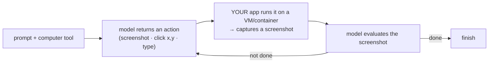

# Lesson 7.7 — Computer use & browser/UI agents

> _Give the agent eyes and hands — then never leave it alone with the company credit card._

_TL;DR: Computer use gives a model a tool to take screenshots and control a screen — click, type, scroll — in a reason→act loop [^1]. For engineering work the killer use is **visual self-verification**: a browser as an oracle for UI you can't unit-test (Phase 3) [^4]. But it reads **untrusted screen content** → prompt injection (Phase 7.4); sandbox it [^1][^7]._

## ELI5: eyes and hands
_Most tools are a walkie-talkie to a specialist; computer use sits the agent at a screen like a brand-new intern driving the mouse._

A normal tool lets the agent *ask a specialist* (query a database, call an API). Computer use gives it **eyes and hands**: it looks at a screen, moves the cursor, clicks, and types — operating any software a person can [^2]. Powerful, but like a too-eager intern it will also do whatever a sticky note on the monitor says — even one an attacker left there.

## The loop: screenshot → reason → act
_The model returns an action; **your app** runs it on a VM and returns a screenshot; repeat — the "agent loop" [^1]._

The computer-use tool is *schema-less* — the action vocabulary is built into the model — and "Claude cannot run it directly"; your application executes each action and returns the result, usually a screenshot [^1]. It's the same shape as Claude Code's tool-use loop, except the tool result is a **picture of a screen** instead of stdout.

> 🧠 **Test Yourself:** With the computer-use tool, who actually clicks the mouse and types the keys?
> 

Answer
**Your application does.** The model only *requests* an action (e.g. `left_click [x,y]`); your harness runs it on a VM/container and feeds back a screenshot. The model has eyes, but your code is its hands [^1].

## The killer use: visual self-verification
_When "is the rendered UI right?" has no unit-test assertion, an agent with eyes can screenshot, judge, and self-correct — a browser oracle (Phase 3) [^1][^4]._

This is the high-value case for engineers, not form-filling. Anthropic's prompting guidance bakes it in: "After each step, take a screenshot and carefully evaluate if you have achieved the right outcome… If not correct, try again" [^1]. And their long-running-agents work found that giving the agent **browser-based end-to-end testing** "dramatically improved performance, as the agent was able to identify and fix bugs that weren't obvious from the code alone" [^4].

> **Dogfood:** this repo did exactly that — it drove **Playwright/Chromium** under the agent to verify the interactive quiz widget on the live site (it rendered, scored clicks, filtered, zero console errors). No unit test on the quiz *data* could establish that the *UI* worked; the browser was the visual oracle (Phase 3's "oracles for the un-testable").

## Two ways to drive a browser
_Vision (pixels → coordinate clicks) vs structured (Playwright via the accessibility tree — deterministic and cheaper) [^1][^5]._

| | Vision-driven | Structured (Playwright MCP) |
|---|---|---|
| Sees | screenshot pixels [^1] | the accessibility tree, "not pixel-based input" [^5] |
| Acts | click coordinates, type | `browser_navigate` / `browser_click` / `browser_snapshot` [^5] |
| Trade-off | works on *any* UI; vision-token cost, can mis-click | deterministic, cheaper, assertable; needs a real DOM |

Microsoft's **Playwright MCP** server exposes browser control to any MCP client (Claude Code, Cursor…) over structured snapshots [^5]; Anthropic's **Claude for Chrome** is an official browser extension that acts inside your live Chrome session [^3]. For agent-driven *testing*, the structured route is usually the right default.

## The big caveat: untrusted screen = prompt injection
_A browser/computer-use agent reads attacker-controllable page content as input — the lethal trifecta, by default [^1][^7]._

Anthropic says it plainly: "Claude will follow commands found in content even if it conflicts with the user's instructions… webpages or images might override instructions… Take precautions to isolate Claude from sensitive data and actions" [^1]. A logged-in browser agent reading arbitrary pages with network access has **all three legs** of Phase 7.4's lethal trifecta — private data + untrusted content + an exfil channel [^7]. And mitigations *reduce* but don't *eliminate* it: Claude for Chrome's prompt-injection success rate dropped from **23.6% to 11.2%** with safeguards — still ~1 in 9 [^3].

The documented mitigations are your checklist [^1]:

1. A dedicated **VM/container with minimal privileges**.
2. **No access to sensitive data / credentials.**
3. **Allowlist** the domains it can reach.
4. A **human confirms** consequential, real-world actions.

> 🧠 **Test Yourself:** "Anthropic added a prompt-injection classifier, so browser agents are safe now." What's wrong?
> 

Answer
Safeguards cut the attack-success rate to ~11% — roughly 1 in 9 still gets through [^3] — and Anthropic says the precautions "remain important even with the classifier defense layer in place" [^1]. Untrusted screen content is untrusted input; the boundary is the sandbox, not the classifier.

## Agent-agnostic
_Claude computer use, OpenAI's computer-use tool, and Playwright MCP all run the screenshot→act loop; the split is vision vs structured [^1][^5][^6]._

OpenAI's developer docs give the same loop and the same warning, as a rule: "Treat screenshots, page text, tool outputs… as untrusted input. Only direct instructions from the user count as permission… Run Computer use in an isolated browser or VM, keep a human in the loop for high-impact actions" [^6]. (OpenAI ships this capability as the Responses-API computer-use tool [^6].)

## Your turn (exercise)
Take a change that has **no unit-test oracle** — a UI tweak, a rendered chart, a responsive layout. Drive a browser under the agent (Playwright or the Playwright MCP) to load the page, snapshot/screenshot it, and **assert** the behavior — that's your visual oracle. Then, before you'd ever let it run unattended, list the **trifecta legs** your setup has (Is it logged in? Does it read untrusted pages? Does it have network egress?) and cut at least one with an *enforced* control.

---
← [Lesson 7.6](06-prompt-and-context-caching.md) · [Phase 7 home](index.md) · next → [Lesson 7.8 — Plugins & marketplaces](08-plugins-and-marketplaces.md)

[^1]: [Computer use tool](https://platform.claude.com/docs/en/agents-and-tools/tool-use/computer-use-tool) — Anthropic (Claude docs)
[^2]: [Introducing computer use, a new Claude 3.5 Sonnet, and Claude 3.5 Haiku](https://www.anthropic.com/news/3-5-models-and-computer-use) — Anthropic (Oct 22, 2024)
[^3]: [Piloting Claude for Chrome](https://claude.com/blog/claude-for-chrome) — Anthropic (Aug 25, 2025)
[^4]: [Effective harnesses for long-running agents](https://www.anthropic.com/engineering/effective-harnesses-for-long-running-agents) — Anthropic Engineering (Nov 26, 2025)
[^5]: [Playwright MCP server](https://github.com/microsoft/playwright-mcp) — Microsoft
[^6]: [Computer use (developer guide)](https://developers.openai.com/api/docs/guides/tools-computer-use) — OpenAI
[^7]: [The lethal trifecta for AI agents](https://simonwillison.net/2025/Jun/16/the-lethal-trifecta/) — Simon Willison (Jun 16, 2025)
