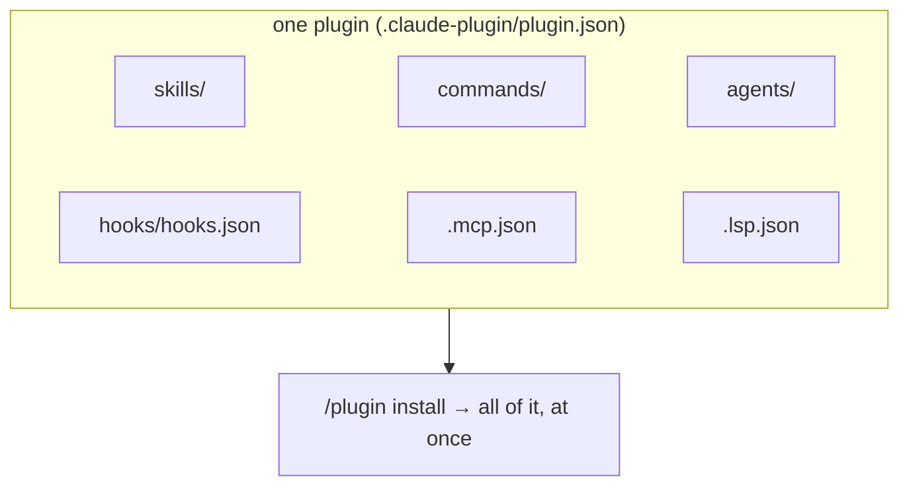
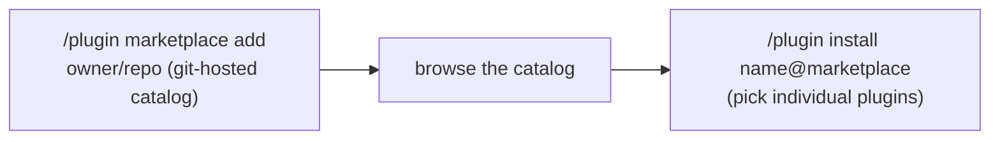

# Lesson 7.8 — Plugins & marketplaces

> _A plugin is a convention pack; a marketplace is the tap your whole team installs from._

_TL;DR: A plugin bundles **many** extension types — skills, commands, hooks, subagents, MCP/LSP servers — into one installable, versioned unit [^1][^3]. A marketplace is a git-hosted **catalog**: add it, then `/plugin install name@marketplace` [^2]. This is how a team distributes its agent-first conventions._

## ELI5: the Homebrew tap
_Your skills, hooks, and reviewer subagents are custom tools; a plugin staples them into one box; a marketplace is the tap everyone points at._

A plugin is a **convention pack**. A marketplace is the tap you point the team at — `/plugin marketplace add your-org/plugins`, then `/plugin install …` — just like `brew tap` then `brew install`. Adding the tap installs nothing; you still choose what to pull [^2].

## What a plugin bundles
_Not one thing — a plugin is the container for every extension type a team built [^1][^3]._

> "A plugin is a self-contained directory of components… skills, agents, hooks, MCP servers, LSP servers, and monitors" [^3]. The load-bearing point: a one-skill plugin is the *minimal* case, not the definition — a plugin is how you ship a whole team's extensions as **one** versioned artifact [^1].

> 🧠 **Test Yourself:** A teammate says "a plugin is just a skill with a fancier name." Where's the flaw?
> 

Answer
A skill is *one* component type. A plugin is the container that can bundle skills **and** commands, hooks, subagents, MCP/LSP servers, and monitors — distributed and versioned as a unit [^3].

## The manifest & layout
_`.claude-plugin/plugin.json` (only `name` is required); **every other directory sits at the plugin root**, not inside `.claude-plugin/` [^1][^3]._

| Path | Holds |
|---|---|
| `.claude-plugin/plugin.json` | the manifest — **only this file goes here** |
| `skills/<name>/SKILL.md` · `commands/*.md` · `agents/*.md` | skills, commands, subagents |
| `hooks/hooks.json` · `.mcp.json` · `.lsp.json` | hooks, MCP servers, LSP servers |

The single most common failure is putting `skills/`/`hooks/` *inside* `.claude-plugin/` — don't; only the manifest lives there [^1][^3]. Components are **namespaced** by the plugin name (`my-plugin:hello`) to avoid collisions, and at install time a second axis appears: `plugin@marketplace`. Precedence is safe by default — your project/user `.claude/agents/` win over same-named plugin items, so a plugin never silently overrides your local conventions [^3].

## Marketplaces: add, then install
_A marketplace is a git-hosted **catalog** of plugins — a two-step flow, add the catalog then install from it [^2][^4]._

"A marketplace is a catalog of plugins that someone else has created and shared" [^2]. Two official ones: **`claude-plugins-official`** (curated by Anthropic, available automatically) and the **community** marketplace (`anthropics/claude-plugins-community`, added manually) [^2]. A marketplace is just a `marketplace.json` listing each plugin's `name` + `source` — anyone can host one (a GitHub repo, GitLab, even a private/internal repo) [^4].

## Safety: trust + commit-pinning
_Plugins run **arbitrary code at your privileges** — only add marketplaces you trust, and pin versions [^2][^3]._

> "Plugins and marketplaces are highly trusted components that can execute arbitrary code on your machine with your user privileges. Only install plugins and add marketplaces from sources you trust" [^2].

This is a supply-chain trust boundary (Phase 7.4). The mitigations: community plugins are review-screened and **pinned to a commit SHA**; setting an explicit `version` means users only update when you bump it; and orgs can restrict allowed marketplaces via managed settings [^2][^3].

> 🧠 **Test Yourself:** Why is adding a random marketplace riskier than installing a single npm package?
> 

Answer
A plugin can ship **hooks and MCP servers that execute arbitrary code on your machine at your privileges**, and they run inside your agent's trusted context. Treat a marketplace like granting shell access — add only trusted sources and pin to a commit/version [^2][^3].

## Capstone: package THIS repo into a plugin
_The whole tier in one box — bundle the skills (7.1), hooks (7.2), and subagent (7.5) we built [^1]._

This repo already contains exactly the pieces a plugin bundles:

| This repo has | Plugin slot |
|---|---|
| `.agents/`/`.claude/skills/` (author-curriculum, check-understanding, scaffold-agent-project) | `skills/<name>/SKILL.md` |
| `.agent/hooks/*.sh` wired via `.claude/settings.json` | `hooks/hooks.json` (move the `hooks` object verbatim) |
| `.claude/agents/lesson-reviewer.md` | `agents/lesson-reviewer.md` |

The one caveat to teach: an installed plugin is copied to a cache and **cannot reference files outside its own root** — so the hook scripts must live *inside* the plugin and use the `${CLAUDE_PLUGIN_ROOT}` variable in their paths, not `.agent/hooks/...` [^1][^3].

## Agent-agnostic
_Skills are portable (the open standard); the bundle/marketplace layer is richest in Claude Code; Cursor/Codex distribute conventions by committing rule/`AGENTS.md` files to git [^5][^6][^7]._

| Ecosystem | Portable unit | How conventions are shared |
|---|---|---|
| **Claude Code** | Skill (`SKILL.md`) | **Plugins** bundle everything; **marketplaces** distribute + version [^1] |
| **Agent Skills** (open std) | `SKILL.md` folder | portable as-is across Codex, Cursor, Gemini CLI… [^5] |
| **Cursor** | `.cursor/rules/*.mdc` | check rules into git "so your whole team benefits" [^7] |
| **OpenAI Codex** | `AGENTS.md` | a README-for-agents committed to the repo [^6] |

Takeaway: the **skills inside a plugin stay portable** (open standard) — packaging as a plugin doesn't lock them to Claude; it just adds a bundling + catalog + versioning layer on top [^5].

## Your turn (exercise)
Package this repo's `.claude/` into a plugin: `mkdir -p afe-plugin/.claude-plugin`, write `plugin.json` (`{"name":"agent-first-engineering","version":"1.0.0"}`), copy `skills/` and `agents/`, move the `settings.json` `hooks` object into `hooks/hooks.json` (rewriting paths to `${CLAUDE_PLUGIN_ROOT}/hooks/…`), and test with `claude --plugin-dir ./afe-plugin`. Then decide: which conventions belong in a **team** plugin, and which are personal and should stay in your `~/.claude/`?

---
← [Lesson 7.7](07-computer-use-and-browser-agents.md) · [Phase 7 home](index.md) · → [Check your understanding](quiz.md)

[^1]: [Create plugins](https://code.claude.com/docs/en/plugins) — Anthropic (Claude Code docs)
[^2]: [Discover and install plugins](https://code.claude.com/docs/en/discover-plugins) — Anthropic (Claude Code docs)
[^3]: [Plugins reference](https://code.claude.com/docs/en/plugins-reference) — Anthropic (Claude Code docs)
[^4]: [Create and distribute a plugin marketplace](https://code.claude.com/docs/en/plugin-marketplaces) — Anthropic (Claude Code docs)
[^5]: [Equipping agents for the real world with Agent Skills](https://www.anthropic.com/engineering/equipping-agents-for-the-real-world-with-agent-skills) — Anthropic Engineering
[^6]: [AGENTS.md — the open agent-instruction format](https://agents.md/) — Agentic AI Foundation
[^7]: [Cursor — Rules](https://cursor.com/docs/context/rules) — Cursor
