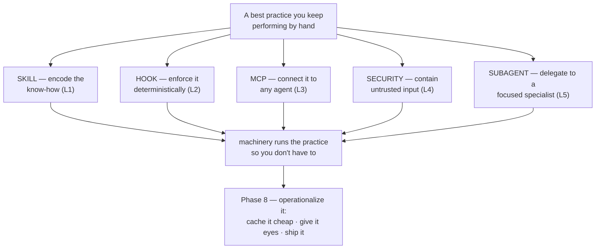

# Phase 7 — Advanced Patterns: encode & automate

> **Beyond the foundations.** Phases 1–6 taught the *disciplines*. This tier teaches you to **encode
> them into durable machinery** — skills, hooks, protocols, and guardrails — so the practice runs
> without you holding it in your head.

## Executive summary
_What this phase makes you able to do, and why it matters._

Most "advanced" agent tricks aren't new prompting magic — they're **best practices you stop performing
by hand and start encoding**: as skills (reusable know-how), hooks (deterministic enforcement), MCP
servers (portable connectivity), and security boundaries (harness-enforced safety) [^1][^2]. This phase
makes you able to build that machinery — package a procedure as a portable `SKILL.md`, wire a rule into
a deterministic hook, expose a system over MCP, and contain an agent that reads untrusted input. The
throughline: **the foundations teach the practice; the advanced tier automates it** [^2].

**Prerequisite:** Phases 1–6 — especially [Skills, rules & commands](../04-session-and-memory/03-skills-rules-commands.md) (4.3), [Prose to hooks](../04-session-and-memory/04-prose-to-hooks.md) (4.4), and [Harness engineering](../06-orchestration-and-harness/04-harness-engineering.md) (6.4).

### Learning objectives
By the end of this phase you can:
- **Author a portable skill** — a `SKILL.md` any agent auto-invokes by description and loads progressively.
- **Engineer hooks** — bind a rule to a lifecycle event so it runs deterministically, not hopefully.
- **Design an MCP server** — expose your codebase, data, and tools to any agent over one open standard.
- **Secure an agent** — least-privilege, sandboxing, and injection defense for agents that read untrusted input.
- **Build a subagent** — a focused, least-privilege specialist with its own context and system prompt that the agent delegates to.

---

## The big idea (in one sentence)

> If a practice matters, **don't keep doing it by hand — encode it** so the machinery enforces it every time.

## Lessons (one concept each)

| # | Lesson | The one idea |
|---|---|---|
| 1 | [Anatomy of a Skill](01-anatomy-of-a-skill.md) | A skill is a `SKILL.md` directory; name+description load always, the rest on demand; portable across agents. |
| 2 | [Hooks, deep](02-hooks-deep.md) | A hook is a deterministic command the harness runs on an event; exit 2 blocks. Prose → enforced. |
| 3 | [MCP, deep](03-mcp-deep.md) | One open protocol so any agent reaches your data/tools; servers expose Tools, Resources, Prompts. |
| 4 | [Security & injection](04-security-and-injection.md) | Agents read untrusted input — enforce safety in the harness (sandbox, least-privilege), not the prompt. |
| 5 | [Anatomy of a Subagent](05-anatomy-of-a-subagent.md) | A subagent is a file whose body is its system prompt; own context, own tools, delegated by description. |

> **Next:** these five are the building blocks. [**Phase 8 — Production Patterns**](../08-production-patterns/index.md) operationalizes them: cache it cheap, give it eyes, and ship it.

---

## Phase diagram

---

## Cheatsheet
_The Advanced tier in compact form. Grows as the phase fills in._

### Key terms

| Term | What people say | What it actually means |
|---|---|---|
| **Skill** | "a custom command" | A `SKILL.md` directory the agent auto-discovers by `description` and loads progressively [^1]. |
| **Progressive disclosure** | "lazy loading" | Only `name`+`description` stay in context; body loads on trigger, bundled files only when used [^2]. |
| **`description`** | "a label" | The single load-bearing field — it's *all* the agent sees when deciding whether to reach for the skill [^2]. |
| **Hook** | "a script" | A deterministic command the *harness* runs on a lifecycle event; **exit 2 blocks** [^3]. |
| **Fail-open** | "it errored, so we're fine" | A guardrail that *allows* the action when it crashes — Cursor hooks' dangerous default [^4]. |
| **MCP** | "an Anthropic thing" | An open protocol (USB-C for AI) so any agent reaches your tools/data; servers expose Tools/Resources/Prompts [^5]. |
| **Lethal trifecta** | "prompt injection" | Private-data access + untrusted content + an exfil channel — all three, and data can be stolen [^6]. |
| **Prompt injection** | "a jailbreak" | Untrusted text (a README, an issue) the agent treats as instructions — OWASP's #1 LLM risk [^7]. |
| **Subagent** | "a helper" | A file whose body is its system prompt; runs in its own context with its own tools, delegated by `description` [^8]. |

### Agent translation (same idea, different homes)

| Concept | Claude Code | Codex | Cursor |
|---|---|---|---|
| Skill location | `.claude/skills/` | `.agents/skills/` | `.agents/skills/` or `.cursor/skills/` |
| Open-standard home | `.agents/skills/` (mirror) | `.agents/skills/` (native) | `.agents/skills/` (native) |

---

→ **[Check your understanding](quiz.md)**

---
← [Curriculum home](../index.md) · next phase → [Production Patterns](../08-production-patterns/index.md)

[^1]: [Agent Skills — Specification](https://agentskills.io/specification) — agentskills.io (the open standard)
[^2]: [Agent Skills — Overview](https://platform.claude.com/docs/en/agents-and-tools/agent-skills/overview) — Anthropic
[^3]: [Hooks reference](https://code.claude.com/docs/en/hooks) — Anthropic (Claude Code docs)
[^4]: [Cursor hooks](https://cursor.com/docs/hooks) — Cursor (fail-open by default)
[^5]: [What is MCP? (intro)](https://modelcontextprotocol.io/docs/getting-started/intro) — Model Context Protocol
[^6]: [The lethal trifecta for AI agents](https://simonwillison.net/2025/Jun/16/the-lethal-trifecta/) — Simon Willison
[^7]: [LLM01:2025 Prompt Injection](https://genai.owasp.org/llmrisk/llm01-prompt-injection/) — OWASP GenAI Security Project
[^8]: [Create custom subagents](https://code.claude.com/docs/en/sub-agents) — Anthropic (Claude Code docs)
