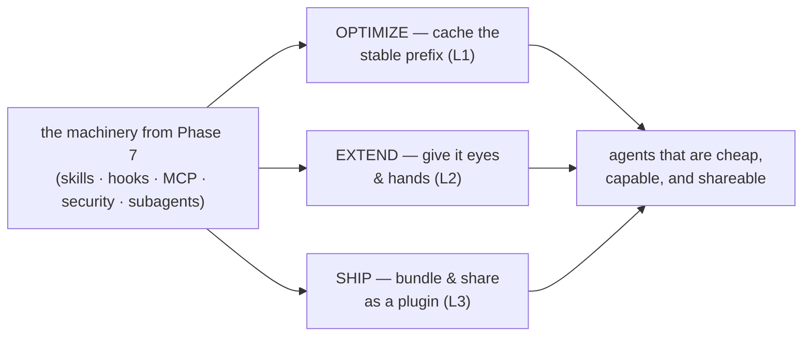

# Phase 8 — Production Patterns: optimize, extend & ship

> **From "it works" to production.** Phase 7 gave you the building blocks. This phase **operationalizes**
> them — make the loop cheap, give it new senses, and package it so a whole team can install it.

## Executive summary
_What this phase makes you able to do, and why it matters._

Once you can *build* the machinery (Phase 7), three production concerns decide whether it's actually
usable at scale: **cost**, **capability**, and **distribution**. This phase covers the cheapest token
optimization there is — **prompt caching** (reuse the stable prefix; reads cost ~0.1×) [^1]; how to
give an agent **eyes and hands** to verify work no unit test can — **computer use & browser agents**,
with the safety caveats that come with reading untrusted screens [^2]; and how to **bundle** your
skills, hooks, and subagents into one installable, versioned **plugin** a team shares via a
marketplace [^3]. The throughline: **a setup that works locally isn't done until it's cheap, capable, and shippable.**

**Prerequisite:** [Phase 7 — Advanced Patterns](../07-advanced-patterns/index.md) (the building blocks this phase operationalizes), plus Phase 2 (context as scarce) and Phase 3 (oracles).

### Learning objectives
By the end of this phase you can:
- **Cut cost & latency with caching** — structure prompts so the stable prefix is reused, and know what invalidates it.
- **Use a browser/UI agent as an oracle** — drive visual self-verification for work with no unit test — safely.
- **Package & distribute a plugin** — bundle skills + hooks + subagents into one versioned unit, shared via a marketplace.

---

## The big idea (in one sentence)

> A working agent setup isn't finished until it's **cheap to run, able to see its own work, and easy for your team to install**.

## Lessons (one concept each)

| # | Lesson | The one idea |
|---|---|---|
| 1 | [Prompt & context caching](01-prompt-and-context-caching.md) | Cache the stable prefix (tools→system→context); reads cost ~0.1×. Keep volatile content last. |
| 2 | [Computer use & browser agents](02-computer-use-and-browser-agents.md) | Eyes + hands: screenshot→act loop; a browser as a visual oracle — but untrusted screen = injection. |
| 3 | [Plugins & marketplaces](03-plugins-and-marketplaces.md) | Bundle skills+hooks+subagents+MCP into one installable, versioned unit; share via a marketplace. |

---

## Phase diagram

---

## Cheatsheet

### Key terms

| Term | What people say | What it actually means |
|---|---|---|
| **Prompt caching** | "saving answers" | Reusing the processed *prefix* (tools→system→context); reads cost ~0.1×, output unchanged [^1]. |
| **Computer use** | "it can use my PC" | A tool to screenshot + click/type a screen in a reason→act loop; untrusted screen content can inject it [^2]. |
| **Visual oracle** | "screenshot testing" | Using a browser snapshot as the correctness check for UI that has no unit-test assertion (Phase 3) [^2]. |
| **Plugin** | "an extension" | One installable unit bundling skills+commands+hooks+subagents+MCP/LSP; shared via a marketplace [^3]. |
| **Marketplace** | "an app store" | A git-hosted catalog of plugins — add it, then `/plugin install name@marketplace` [^3]. |

### Agent translation (same idea, different homes)

| Concept | Claude Code | Codex | Cursor |
|---|---|---|---|
| Prompt caching | automatic | automatic | automatic |
| Browser control | computer use · Playwright MCP | computer-use tool · Playwright MCP | Playwright MCP |
| Bundle & distribute | plugins + marketplaces | `AGENTS.md` in git | `.cursor/rules` in git |

---

→ **[Check your understanding](quiz.md)**

---
← [Phase 7 — Advanced Patterns](../07-advanced-patterns/index.md) · [Curriculum home](../index.md) · more topics → [Roadmap](../../roadmap.md)

[^1]: [Prompt caching](https://platform.claude.com/docs/en/build-with-claude/prompt-caching) — Anthropic
[^2]: [Computer use tool](https://platform.claude.com/docs/en/agents-and-tools/tool-use/computer-use-tool) — Anthropic
[^3]: [Create plugins](https://code.claude.com/docs/en/plugins) — Anthropic (Claude Code docs)
