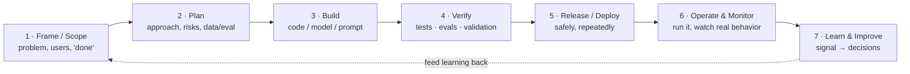

# Lesson 9.1 — The lifecycle is a loop

> _You don't build a wall and walk away — you tend a garden that keeps growing after you plant it._

_TL;DR: Every technical project runs as a **closed feedback loop**, not a one-way line that ends at "ship." Release, operation/monitoring, and improvement are stages **inside** the loop [^1][^2]. "Done" spans creation **and** operation — and AI/ML systems can rot with **zero code changes** because the data (the world) moves under them [^3][^6]._

## Wall vs. garden: the line mindset is the bug
_A wall is "done" when you lay the last brick; a garden is never done — what you observe this season changes what you plant next [^1]._

The most expensive misconception in engineering is **"done = shipped."** That's the *wall* mindset: a one-way line ending at release. Real systems are *gardens* — you plant (deploy), watch (monitor), and what you see decides next season's planting (improve). Release is the **midpoint** of the loop, not its end; most of a system's lifetime cost lives in the operate/monitor/improve stages, not in the visible "build" box [^6]. The improvement engine is old and well-named — Shewhart/Deming's **Plan-Do-Check-Act** and Ries's **Build-Measure-Learn** are the same closed cycle: the unit of progress is *validated learning*, fed back into the next iteration [^1][^2].

## The universal loop
_Seven stages, and the last one feeds the first — the feedback arrow is the lesson, not the boxes [^4]._

Each stage carries WHAT it does, WHY it matters (what breaks without it), and HOW you do it:

| Stage | WHAT | WHY (what breaks without it) | HOW |
|---|---|---|---|
| **1 · Frame / Scope** | Define problem, users, success criteria. | Build the wrong thing fast; no "done". | Problem statements, success metrics; CRISP-DM "Business Understanding" [^3]. |
| **2 · Plan** | Decompose approach, risks, data/eval needs. | Hidden deps surface late; rework. | Specs, RFCs, risk register, task breakdown. |
| **3 · Build** | Produce the artifact. | (The visible work — but the *smallest* box [^6].) | Version control, modular design, MVP-first [^2]. |
| **4 · Verify** | Prove it meets criteria before users see it. | Defects/bad outputs reach production. | Tests/CI (software); **offline eval + validation** (ML) [^3]; **eval suites** (LLM) [^8]. |
| **5 · Release / Deploy** | Get it into production safely, repeatedly. | "Big-bang" releases, rare scary deploys. | CI/CD, canary/blue-green, A/B; DORA [^7]. |
| **6 · Operate & Monitor** | Run it and observe real behavior. | You're blind; silent degradation. | SLOs/error budgets, **four golden signals** [^5]; ML/LLM add **drift** monitoring [^4]. |
| **7 · Learn & Improve** | Turn production signal into decisions. | One-shot project; drift untreated. | Postmortems, **validated learning** [^2], retraining triggers [^4]. |
| **→ back to Frame** | Feed learning into the next iteration. | The loop never closes — the "line" trap. | Reframe scope; PDCA "Act → re-Plan" [^1]. |

> 🧠 **Test Yourself:** A teammate says, "We deployed Friday — the project is done." What's wrong with that sentence?
> 

Answer
"Deployed" is the loop's **midpoint**, not its end. Operate, monitor, and improve are first-class stages where most of the lifetime value and cost live [^5][^6]; the loop only "ends" by feeding learning back into the next Frame [^1].

## Three variants: same loop, divergent stages
_Software, AI/LLM apps, and ML/data all loop — but AI and ML add **data + evaluation + drift** that classic software lacks [^3][^4][^6]._

The skeleton (frame→plan→build→verify→release→operate→learn→reframe) is shared. The divergence is where it matters:

| Concern | Classic Software | AI / LLM Apps | ML / Data Science |
|---|---|---|---|
| Primary artifact | Code | Prompt + retrieval + model behavior | Trained model from data |
| Extra input | — | Data (RAG corpora) + eval sets [^8] | **Data is the product**; pipelines [^3] |
| Verify means | Tests (deterministic) | **Evaluation** (judges, scorers — noisy) [^8] | **Offline eval + validation** [^3] |
| Decay mode | Bugs (static until changed) | Prompt/vendor-model drift [^8] | **Data & concept drift** [^4] |
| Loop-closer | Bugfix/feature → deploy | Re-eval + prompt/data update [^8] | **Continuous Training** — retrain [^4] |

The one insight to carry forward: **classic software fails when *you* change it; AI/ML systems can fail when the *world* changes and you change nothing** [^3][^6]. That's *why* monitoring and retraining are mandatory loop stages, not optional ops. Microsoft's LLMOps model makes this explicit — an **inner loop** (data curation, experimentation, evaluation) wrapped by an **outer loop** (validate & deploy, inference, monitor, feedback & data collection) [^8].

> 🧠 **Test Yourself:** A deployed fraud model that nobody has touched in six months starts missing fraud. No code changed. What happened — and which loop stages should have caught it?
> 

Answer
**Data/concept drift** — fraud patterns (the world) shifted under a static model [^4][^6]. **Operate & Monitor** should detect the quality drop; **Learn & Improve** triggers **Continuous Training** (retrain on fresh data) to close the loop [^4].

## Your turn (exercise)
Pick one real system you've touched (an app, a model, a script). Draw the seven-stage loop for it on paper and, **for each stage**, write one line: what you actually do there — and one line for any stage you currently *skip*. Then circle the decay mode: does it fail only when **you** change it, or can the **world** change it under you? If the latter, name the monitor that would catch the drift and the trigger that would close the loop.

## Where agents fit (teaser)
_Naming the opportunity — not building it. That comes later._

Every stage in the loop is a candidate to wrap in an **agent or loop**: an eval-runner at Verify, a drift-watcher at Monitor, a triage agent at Learn that reframes the next iteration. This module only *maps* the lifecycles so you can see those seams clearly — later phases turn each named stage into automation. For now: map first, automate second.

---
← [Phase 8 — Production Patterns](../08-production-patterns/index.md) · [Phase 9 home](index.md) · next → [Lesson 9.2 — The software lifecycle](02-software-lifecycle.md)

[^1]: [Plan, Do, Check, Act (PDCA)](https://www.lean.org/lexicon-terms/pdca/) — Lean Enterprise Institute
[^2]: [The Lean Startup — Principles (Build-Measure-Learn, validated learning)](https://theleanstartup.com/principles) — Eric Ries
[^3]: [CRISP-DM 1.0: Step-by-step data mining guide](https://public.dhe.ibm.com/software/analytics/spss/documentation/modeler/14.2/es/CRISP-DM.pdf) — Chapman et al., CRISP-DM Consortium (2000), hosted by IBM/SPSS
[^4]: [MLOps: Continuous Delivery and Automation Pipelines in Machine Learning](https://docs.cloud.google.com/architecture/mlops-continuous-delivery-and-automation-pipelines-in-machine-learning) — Google Cloud
[^5]: [Site Reliability Engineering — Monitoring Distributed Systems (four golden signals)](https://sre.google/sre-book/monitoring-distributed-systems/) — Google / O'Reilly
[^6]: [Hidden Technical Debt in Machine Learning Systems](https://proceedings.neurips.cc/paper_files/paper/2015/file/86df7dcfd896fcaf2674f757a2463eba-Paper.pdf) — Sculley et al., NeurIPS 2015
[^7]: [Capabilities: Continuous Delivery](https://dora.dev/capabilities/continuous-delivery/) — DORA (Google Cloud)
[^8]: [LLMOps — Operational management of LLMs (inner/outer loop)](https://learn.microsoft.com/en-us/ai/playbook/technology-guidance/generative-ai/mlops-in-openai/) — Microsoft Learn
