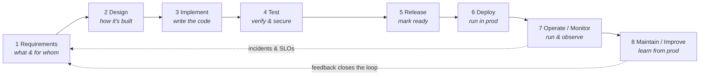
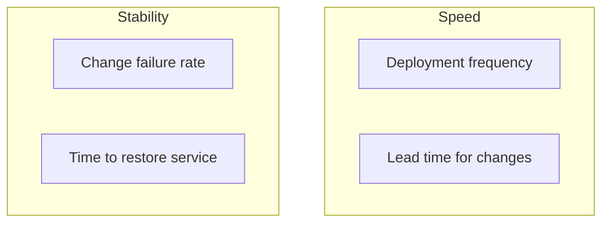

# Lesson 9.2 — The software lifecycle

> _Shipping isn't the finish line — it's the halfway mark of a loop that never closes._

_TL;DR: The software lifecycle is a **continuous loop** — requirements → design → implement → test → release → deploy → operate/monitor → maintain — whose last stage feeds the first. Agile made the loop **iterative** [^1]; DevOps + CI/CD **fused dev and ops** and automated the path to production [^2][^7]; SRE made **operations an engineering discipline** with measurable reliability [^4]. This lesson **maps** that loop so a later phase can automate each stage._

## The loop, not the line
_Most diagrams draw the stages left-to-right and *mention* "it's iterative." The load-bearing truth is the back-arrow: production feeds the next round of requirements [^1]._

Three movements reshaped the old waterfall into this loop:

| Movement | Year(s) | What it changed |
|---|---|---|
| **Agile** | 2001 | Made the loop *iterative* — small increments, *"welcome changing requirements, even late"* [^1] |
| **DevOps + CI/CD** | c. 2009–2018 | *Fused* dev and ops; automated commit → production so deploys are continuous and boring [^2][^7] |
| **SRE** | 2016 | Made *operations engineering* — reliability targets and budgets, not heroics [^4] |

## The eight stages — WHAT / WHY / HOW
_Each stage answers what it produces, why it can't be skipped, and how it's done in modern practice. Security is woven through **all** of them, not bolted on at the end [^6]._

| # | Stage | WHAT | WHY (skip it and…) | HOW |
|---|---|---|---|---|
| 1 | **Requirements** | Decide what to build & for whom | …you build the wrong thing correctly — the costliest defect | User stories, acceptance criteria, prioritized backlog; *don't freeze them* [^1] |
| 2 | **Design** | Decide *how* — architecture, data, security posture | …structural debt; security can't be retrofitted | ADRs, threat modeling, API contracts [^6] |
| 3 | **Implement** | Write the code | …quality is set here, not at a later QA gate | Version control, code review/PRs, **CI** — merge daily, automated build [^3] |
| 4 | **Test** | Verify it works & is safe | …every change risks regression; deploys become terrifying | **Shift-left** testing, test pyramid, SAST — defects are cheapest to fix early [^3] |
| 5 | **Release** | Mark a tested build *ready* for prod | …shipping becomes a rare, high-stakes event | Versioned artifacts, tags, **Continuous Delivery** pipelines [^2] |
| 6 | **Deploy** | Put the release *into* production | …risk concentrates; bad deploys cause outages | CI/CD, IaC, **deployment gates** (change approval + automated smoke tests), **progressive delivery** (blue-green [^9], canary [^13], feature flags [^12]), **rollback *or* roll-forward** — but stateful/schema changes often can't be trivially rolled back, so migrations are expand-then-contract and decoupled from code [^9] |
| 7 | **Operate / Monitor** | Run reliably & observe behavior | …you're blind until users complain; "ops isn't real eng" | **SLIs/SLOs/error budgets** [^4], observability via logs/metrics/traces [^5], on-call, **incident response** (detect→triage→mitigate→resolve, measured by MTTR), kill **toil** [^8] |
| 8 | **Maintain / Improve** | Learn from prod, feed it back | …velocity grinds down under accruing tech debt | **Dependency & supply-chain upkeep** (patch CVEs, dependency/EOL upgrades) [^6], **blameless postmortems** [^10], refactor down **tech debt** [^11], retros — *reflect & adjust* [^1] |

> 🧠 **Test Yourself:** Why are **Release** and **Deploy** drawn as two separate stages?
> 

Answer
Because modern practice **decouples** them. *Deploy* = the code is running in production; *release* = users are actually exposed to it. Separating them (via **feature flags** [^12], canaries [^13], blue-green, and dark launches [^9]) is what lets elite teams ship safely and on-demand — if "deploy = release," you can't explain a canary rollout. The decoupling is also what gives you a clean **rollback**: flip the flag or switch the router back to the old environment [^9]. The catch is **state** — a database schema change can't be flipped off, so migrations are sequenced (expand → migrate → contract) and deployed *ahead of* the code that needs them.

## Why it's a loop: the three load-bearing reframes
_Iterative (Agile), fused (DevOps), and measured (SRE) — together they turn "ship and forget" into a feedback engine._

**Agile makes it iterative.** You don't make one big pass; you go around the loop in small increments and *reflect and adjust* each time [^1]. Requirements are never frozen.

**DevOps + CI/CD fuses dev and ops.** The wall between "people who build" and "people who run" is exactly what DevOps demolishes. *Accelerate*'s research across 2,000+ orgs showed delivery performance is **measurable**, and that speed and stability **rise together** — they are not a trade-off [^7]. The canonical **Four Keys** [^7][^14]:

Two speed + two stability is deliberate — a balanced scorecard so you **can't game velocity by sacrificing reliability** (or vice-versa). They're *team-level diagnostics*, not individual KPIs — the moment "deployment frequency" becomes a personal target, it gets gamed [^7].

The Four Keys are the historical *Accelerate* result, but **DORA has since extended the model** — adding a fifth key metric, the **deployment rework rate** (unplanned work caused by failed deployments) [^14]. (DORA has also relabeled the originals — e.g. "time to restore service" is now "failed deployment recovery time" [^14].) Treat "four keys" as the foundation, not the final word.

**Where MTTR lives.** *Time-to-restore* isn't measured in a vacuum — it's the output of the **operate → incident → maintain** path. When monitoring (stage 7) fires, you run the incident loop — **detect → triage → mitigate → resolve** — and MTTR is the clock on it. The resolved incident then feeds a **postmortem** (stage 8) and a new **requirement** (the back-arrow). That chain is exactly why a stability metric ties the operate and maintain stages together.

**SRE makes operations engineering.** Reliability gets a number: an **SLO** (target), measured by **SLIs**, with an **error budget** = the allowed gap below 100%. The budget is the point — if you're *not* spending it, you're shipping too slowly; SRE deliberately targets **less than 100%** [^4]. **Toil** (manual, repetitive, automatable ops work with no enduring value) is something you *engineer away*, not endure [^8]. And when things break, you run a **blameless postmortem** — *you can't fix people, but you can fix systems* [^10].

> 🧠 **Test Yourself:** A team boasts "100% uptime is our goal." What would an SRE say?
> 

Answer
That 100% is the wrong target. SRE picks an SLO *below* 100% on purpose; the resulting **error budget** is what *funds* feature velocity. Spend none of it and you're being too cautious — shipping too slowly [^4].

## Your turn (exercise)
Pick one feature you've shipped (or a release of any app you use). **Walk it around all eight stages** and write one sentence per stage: what happened at requirements, design, implement, test, release, deploy, operate/monitor, maintain. Then find the **back-arrow**: name one thing you learned in *operate/monitor* (a slow page, an error spike, a confusing flow) that should become a *requirement* in the next iteration. If you can't fill in operate/monitor or the back-arrow, that's the gap modern lifecycles exist to close.

## Where agents fit (teaser)
Every stage in that loop is a place a future module will put an **agent in a loop** — drafting acceptance criteria from a request, proposing an ADR, writing code behind tests, triaging a failing deploy, summarizing a postmortem into the next backlog item. The lifecycle is the *map*; the automation comes later. For now, just notice that the loop's feedback edges — the back-arrows — are exactly where agents earn their keep.

---
← [Lesson 9.1](01-the-lifecycle-is-a-loop.md) · [Phase 9 home](index.md) · next → [Lesson 9.3 — The ML / data-science lifecycle](03-ml-data-science-lifecycle.md)

[^1]: [Manifesto for Agile Software Development & the Twelve Principles](https://agilemanifesto.org/principles.html) — Beck, Cunningham, Fowler, et al. (2001)
[^2]: [Continuous Delivery / DevOps — *Accelerate*](https://itrevolution.com/product/accelerate/) — Forsgren, Humble, Kim, IT Revolution (2018)
[^3]: [Continuous Integration](https://martinfowler.com/articles/continuousIntegration.html) — Martin Fowler
[^4]: [Service Level Objectives](https://sre.google/sre-book/service-level-objectives/) — Google SRE Book (O'Reilly)
[^5]: [What is OpenTelemetry? (observability: logs, metrics, traces)](https://opentelemetry.io/docs/what-is-opentelemetry/) — CNCF
[^6]: [Secure Software Development Framework (SSDF), SP 800-218](https://csrc.nist.gov/pubs/sp/800/218/final) — NIST (2022)
[^7]: [The Four Keys & balanced delivery performance — *Accelerate*](https://itrevolution.com/product/accelerate/) — Forsgren, Humble, Kim, IT Revolution (2018)
[^8]: [Eliminating Toil](https://sre.google/sre-book/eliminating-toil/) — Google SRE Book (O'Reilly)
[^9]: [Blue-Green Deployment](https://martinfowler.com/bliki/BlueGreenDeployment.html) — Martin Fowler (deploy/release decoupling, rapid rollback by switching the router back)
[^10]: [Postmortem Culture: Learning from Failure](https://sre.google/sre-book/postmortem-culture/) — Google SRE Book (O'Reilly)
[^11]: [Technical Debt](https://martinfowler.com/bliki/TechnicalDebt.html) — Martin Fowler (citing Ward Cunningham)
[^12]: [Feature Toggles (aka Feature Flags)](https://martinfowler.com/articles/feature-toggles.html) — Pete Hodgson / Martin Fowler (decoupling deploy from release; release toggles)
[^13]: [Canary Release](https://martinfowler.com/bliki/CanaryRelease.html) — Danilo Sato / Martin Fowler (roll a change out to a subset before full rollout)
[^14]: [DORA metrics](https://dora.dev/guides/dora-metrics/) — DORA / Google Cloud (the Four Keys, the added deployment rework rate, and metric relabels)
