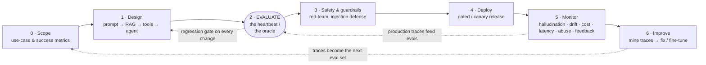
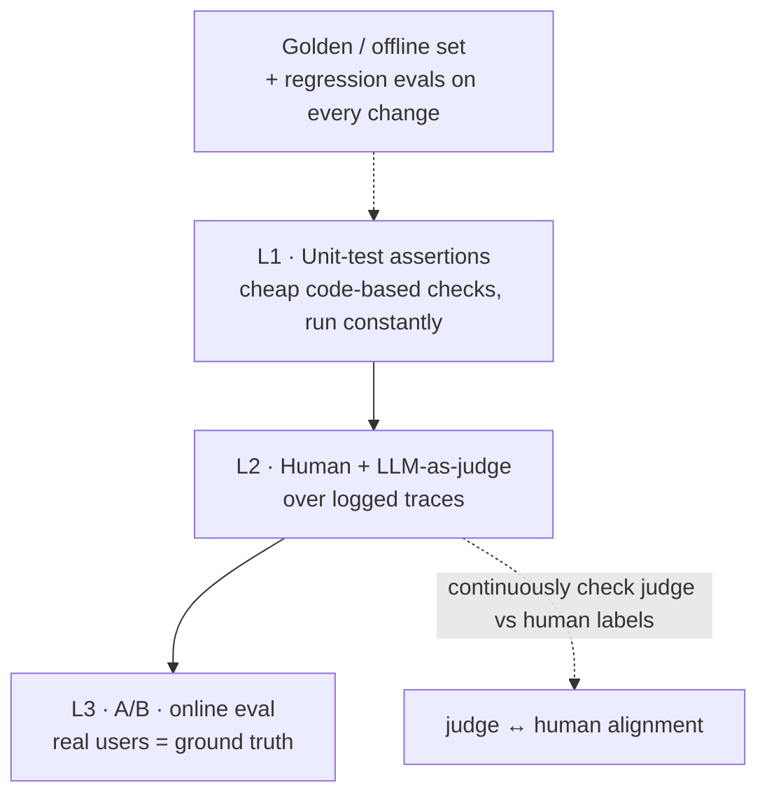

# Lesson 9.3 — The AI application lifecycle

> _The recipe is not the dish — the taste test is. For an LLM app, evals are the taste test._

_TL;DR: Building **on top of** a foundation model is the normal software lifecycle plus two new properties it was never designed for — **non-determinism** (same input, different output) and a **data feedback loop** (production traces become tomorrow's eval set). Because you can't `assertEqual` a probabilistic system, **evals are the oracle** — the heartbeat that tells you whether a change is an improvement or a regression [^1]. Teams that fail almost always fail for the same reason: no robust evaluation system [^1]._

> This lesson **maps** the lifecycle you'll later automate with agents. We explain the loop here; we don't build automation. This is also *not* about training models — that's [Lesson 9.4](04-ml-data-science-lifecycle.md). This is about apps built **on** models you don't train.

## ELI5: the improvisational kitchen
_A brilliant chef who never cooks a dish the same way twice forces you to taste-test continuously instead of trusting the recipe._

You hire a genius chef who improvises — every plate is a little different (**non-determinism**). You can't hand them a rigid recipe and walk away. So you **taste-test constantly**: a few standard dishes you re-taste after every change (**regression / golden-set evals**), trained tasters who agree with your head chef (**human ↔ LLM-judge alignment**) [^2], and comment cards from real diners (**online A/B + user feedback**). Health-and-safety rules stop a prankster slipping a fake order to the chef (**prompt-injection defense**) [^5]. Each night you read the comment cards and adjust tomorrow's prep (**the improvement loop**) [^1]. The taste test — not the recipe — keeps the food good.

## The lifecycle as a loop
_It's the software loop with an eval heartbeat in the middle and a trace-mining feedback edge that turns production back into the next iteration._

The classic SDLC ([Lesson 9.2](02-software-lifecycle.md)) runs scope → build → test → deploy → maintain. This lifecycle keeps all of that and adds the dashed edges: **evals gate every change** (not a one-time benchmark) and **production traces flow back** into both the eval set and the next design pass [^1][^7]. The loop never "finishes" — it's a flywheel.

> 🧠 **Test Yourself:** Name the two properties an LLM app has that the classic software lifecycle never had to model.
> 

Answer
<b>Non-determinism</b> (same input can yield different output, so you can't unit-test with <code>assertEqual</code>) and a <b>data feedback loop</b> (production traces become the next eval set / fine-tune data). Together they're why evals must act as CI and trace-mining is a first-class stage, not just bug-fixing [^1][^7].

## Each stage: WHAT / WHY / HOW
_Seven stages; the early ones decide complexity, evaluation is the oracle that makes the rest measurable, and the back half (monitor → improve) is where most of the real cost lives._

| # | Stage | WHAT | WHY | HOW |
|---|---|---|---|---|
| 0 | **Scope** | Decide if it needs an LLM at all; define measurable "good" | Without a measurable target, every later eval is ungrounded; over-scoping to agents is the most common waste [^3] | Start with the simplest thing that works; reserve agents for open-ended tasks you can't hardcode [^3][^4] |
| 1 | **Design** | Pick the least-complex architecture: prompt → augmented LLM (retrieval/tools/memory) → workflow → agent | Complexity compounds errors, cost, and latency; agents *amplify* failures [^3] | Build on the "augmented LLM"; add complexity only when it *demonstrably* helps; invest in the tool interface as much as the prompt [^3]; mirror RAG/agent failure modes [^7] |
| 2 | **Evaluate** | A measurement harness built **before** you scale | The only oracle for a non-deterministic system; powers debugging, regression detection, and the data flywheel [^1] | Three levels (below) + golden/offline sets + regression evals on every change [^1] |
| 3 | **Safety** | Defend against prompt injection, leakage, excessive agency | RAG and tool-use open injection paths; **neither RAG nor fine-tuning fully fixes injection** [^5] | Defense-in-depth: least-privilege tools, output handling, human approval for high-risk actions, adversarial red-teaming [^5][^6] |
| 4 | **Deploy** | Ship behind controls | Non-determinism makes staged exposure essential | Sandboxed testing + guardrails before autonomy [^3]; canary/gated rollout tied to eval gates |
| 5 | **Monitor** | Observe quality, hallucination, drift, cost, latency, abuse, feedback in prod | Offline evals never cover the real input distribution; quality silently drifts as models/data change [^7] | Trace-level observability, online metrics, capture implicit + explicit user feedback [^7]; track confabulation/hallucination and integrity risks [^6] |
| 6 | **Improve** | Mine traces → fix prompts/RAG/tools or fine-tune → re-run regression evals | Closes the loop; production data is the highest-value eval **and** training data [^1] | The "eval flywheel" — eval infra is reused for data curation and fine-tuning [^1] |

> 🧠 **Test Yourself:** Anthropic and OpenAI both open their agent guides with the same advice. What is it, and why?
> 

Answer
"Start simple" — use the least-complex pattern (a plain prompt or an augmented LLM) and only reach for agents on open-ended tasks you can't hardcode. Agents compound errors, cost, and latency, so the flashiest pattern is usually the wrong first move [^3][^4].

## The heartbeat: eval-driven development
_Evals are the oracle for a system with no deterministic right answer; they come in three levels and run continuously, not once._

Evals convert "vibes-based" prompt tweaking into engineering — without a harness you literally cannot tell whether a change helped [^1]. Husain's three levels [^1]:

- **L1 — assertions.** Cheap, code-based unit tests (does it return valid JSON? call the right tool? avoid a banned phrase?), run on every change [^1].
- **L2 — human + LLM-as-judge over traces.** A judge model scores logged traces. GPT-4-class judges reach **>80% agreement with humans** [^2] — credible, *but* they carry **position, verbosity, and self-enhancement bias** [^2], so the judge needs **its own** eval against human labels, checked continuously [^1][^2]. "Remove all friction from looking at data" — error analysis on real traces is the actual work [^1].
- **L3 — A/B / online.** Real-user comparison; the only ground truth for user-facing quality [^1].

Around all three: a pinned **golden set** and **regression evals** so an edit can't silently break untouched cases — the LLM-app equivalent of shipping without tests [^1].

> 🧠 **Test Yourself:** Your LLM-as-judge agrees with your gold set 92% of the time. Safe to trust it blindly?
> 

Answer
No. Judges carry position/verbosity/self-enhancement bias [^2]; an unvalidated judge launders vibes into fake rigor. You must keep validating it against fresh human labels — the judge needs its own ongoing eval, and offline agreement ≠ online ground truth [^1][^2].

## What curricula get wrong
_The common failures cluster at the eval and the back half of the loop — the parts tutorials skip._

| Pitfall | The reality |
|---|---|
| Eval as a one-time benchmark | It's a living system; the hard work is ongoing error analysis on real traces + judge↔human alignment [^1] |
| Teaching only the build phase | The cost center is monitoring, drift, and the improvement loop — the back half [^7] |
| Worshipping LLM-as-judge | It's a biased instrument that needs its own validation against human labels [^2] |
| No regression / eval CI gate | Prompt edits silently regress untouched cases without pinned golden sets [^1] |
| Security as "add a guardrail" | RAG and fine-tuning don't fully fix injection; the fix is architectural — least privilege, output handling, human-in-the-loop [^5] |
| Jumping straight to agents | Both labs say start simple; agents compound errors, cost, latency [^3][^4] |
| Ignoring cost/latency/quality | Quality is rarely free, and offline distributions never match production traffic [^7] |

## Your turn (exercise)
Take any LLM feature you've used or built (a support bot, a summarizer, a code helper). On one page, **map it through all seven stages**. For the **Evaluate** stage specifically: write 5 **L1 assertions** (concrete, code-checkable — e.g. "output is valid JSON", "never returns an empty answer", "cites at least one source"), then pick **one** that an LLM-as-judge would handle better than code (e.g. "answer is faithful to the retrieved context") and describe how you'd validate that judge against human labels [^1][^2]. Finally, draw the feedback edge: which production signal from **Monitor** would you mine to grow your eval set [^7]?

## Where agents fit (teaser)
_Every stage in the loop is a job a future module hands to agents — but mapping comes before automating._

Each box in the lifecycle diagram is something a later phase will automate: an agent that drafts eval cases from production traces, a judge-agent that scores them, a red-team agent that probes for injection, a monitor that opens an issue on quality drift. The point of **Phase 9** is to *map* these loops first — you can only safely put an agent on a stage once you know what "good" looks like and have the eval gate to catch it when the agent gets it wrong.

---
← [Lesson 9.2](02-software-lifecycle.md) · [Phase 9 home](index.md) · next → [Lesson 9.4 — The ML / data-science lifecycle](04-ml-data-science-lifecycle.md)

[^1]: [Your AI Product Needs Evals](https://hamel.dev/blog/posts/evals/) — Hamel Husain
[^2]: [Judging LLM-as-a-Judge with MT-Bench and Chatbot Arena](https://arxiv.org/abs/2306.05685) — Zheng et al., NeurIPS 2023
[^3]: [Building Effective Agents](https://www.anthropic.com/research/building-effective-agents) — Anthropic
[^4]: [A Practical Guide to Building Agents](https://cdn.openai.com/business-guides-and-resources/a-practical-guide-to-building-agents.pdf) — OpenAI
[^5]: [OWASP Top 10 for LLM Applications 2025](https://genai.owasp.org/resource/owasp-top-10-for-llm-applications-2025/) — OWASP GenAI Security Project (LLM01 Prompt Injection, LLM06 Excessive Agency)
[^6]: [Artificial Intelligence Risk Management Framework: Generative AI Profile (NIST AI 600-1)](https://nvlpubs.nist.gov/nistpubs/ai/NIST.AI.600-1.pdf) — NIST
[^7]: [AI Engineering: Building Applications with Foundation Models](https://www.oreilly.com/library/view/ai-engineering/9781098166298/) — Chip Huyen, O'Reilly
